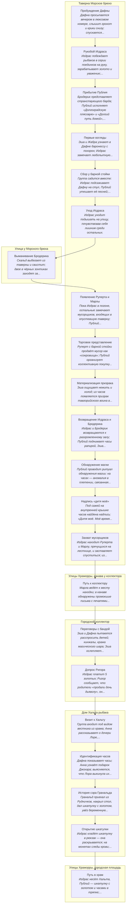

# Эпизод 1 — Незнакомцы: диаграмма событий

```mermaid
graph TD

    subgraph ep1_l1 [Таверна Морское брюхо]
        ep1E01["Пробуждение Дафны<br/><i>Дафна просыпается вечером в люксовом номере, слышит грохот и крики снизу; спускается...</i>"]
        ep1E02["Рукобой Игдраса<br/><i>Игдрас побеждает рыбаков в серии поединков на руку, зарабатывает золото и уважение;...</i>"]
        ep1E03["Прибытие Публия<br/><i>Бродерик представляет странствующего барда; Публий исполняет «Долгоградскую плясовую» и «Долгий путь домой»,...</i>"]
        ep1E04["Первые взгляды<br/><i>Эша и Жабра узнают в Дафне баронессу с похорон; Игдрас замечает любопытную...</i>"]
        ep1E05["Сбор у барной стойки<br/><i>Группа садится вместе: Игдрас подсаживает Дафну на стул, Публий утешает её песней;...</i>"]
        ep1E06["Уход Игдраса<br/><i>Игдрас уходит подышать на улицу, почувствовав себя лишним среди остальных.</i>"]
        ep1E08["Появление Руперта и Марлы<br/><i>Пока Игдрас в погоне, остальные замечают мусорщиков, входящих в опустевшую таверну; Публий...</i>"]
        ep1E09["Торговое представление<br/><i>Руперт с барной стойки продаёт мусор как «сокровища»; Публий организует коллективную покупку...</i>"]
        ep1E10["Материализация призрака<br/><i>Эша ощущает нежить и холод; из часов появляется призрак тавгорийского воина в...</i>"]
        ep1E11["Возвращение Игдраса и Бродерика<br/><i>Игдрас и Бродерик возвращаются к разгромленному залу; Публий поднимает часы рапирой, Эша...</i>"]
        ep1E12["Обнаружение магии<br/><i>Публий проводит ритуал обнаружения магии: на часах — аномалия в плетении, связанная...</i>"]
        ep1E13["Надпись «дитя моё»<br/><i>Под сажей на внутренней крышке часов найдена надпись: «Дитя моё. Моё время...</i>"]
        ep1E14["Захват мусорщиков<br/><i>Игдрас находит Руперта и Марлу, прячущихся на лестнице, и заставляет спуститься; из...</i>"]
    end

    subgraph ep1_l2 [Улица у Морского брюха]
        ep1E07["Выманивание Бродерика<br/><i>Скальд выбегает из таверны и свистит; двое в чёрных зонтиках заходят за...</i>"]
    end

    subgraph ep1_l3 [Улицы Храморры, канава у коллектора]
        ep1E15["Путь к коллектору<br/><i>Марла ведёт к месту находки; в канаве обнаружены промокшие письма с печатями...</i>"]
    end

    subgraph ep1_l4 [Городской коллектор]
        ep1E16["Переговоры с бандой<br/><i>Эша и Дафна пытаются расспросить детей; кинжалы, кража магического шара; Эша ослепляет...</i>"]
        ep1E17["Допрос Ригора<br/><i>Игдрас платит 5 золотых; Ригор сообщает, что родители «продали дочь дьяволу», он...</i>"]
    end

    subgraph ep1_l5 [Дом Хальта рыбака]
        ep1E18["Визит к Хальту<br/><i>Группа входит под видом вестника из храма; Анна рассказывает о дочери Лоре,...</i>"]
        ep1E19["Идентификация часов<br/><i>Дафна показывает часы; Анна узнаёт подарок Джохара; выясняется, что Лора выкинула их...</i>"]
        ep1E20["История сэра Гранальда<br/><i>Гранальд приехал из Рудничков, накрыл стол, дал шкатулку с золотом, увёз беременную...</i>"]
        ep1E21["Открытие шкатулки<br/><i>Игдрас кладёт шкатулку в рюкзак — она раскрывается; на монетах следы крови;...</i>"]
    end

    subgraph ep1_l6 [Улицы Храморры, городская площадь]
        ep1E22["Путь в храм<br/><i>Игдрас несёт Хальта, Публий — шкатулку с золотом и часами в тряпке;...</i>"]
    end

    ep1E01 --> ep1E02 --> ep1E03 --> ep1E04 --> ep1E05 --> ep1E06 --> ep1E07 --> ep1E08 --> ep1E09 --> ep1E10 --> ep1E11 --> ep1E12 --> ep1E13 --> ep1E14 --> ep1E15 --> ep1E16 --> ep1E17 --> ep1E18 --> ep1E19 --> ep1E20 --> ep1E21 --> ep1E22

```