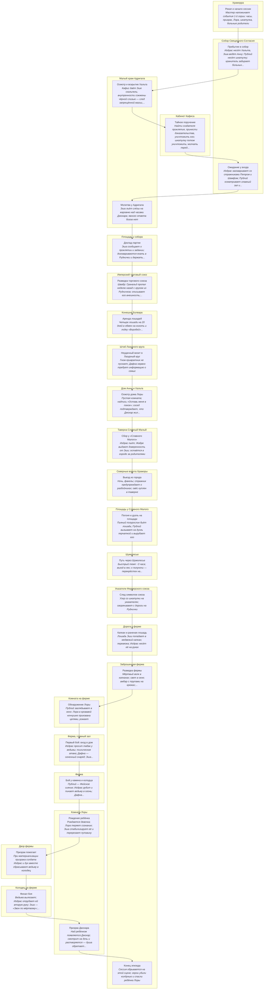

# Эпизод 2 — Дитя: диаграмма событий

```mermaid
graph TD

    subgraph ep2_l1 [Храморра]
        ep2E01["Рекап и начало сессии<br/><i>Мастер напоминает события 1-й серии: часы, призрак, Лора, шкатулка, больные родители</i>"]
    end

    subgraph ep2_l2 [Собор Священного Согласия]
        ep2E02["Прибытие в собор<br/><i>Игдрас несёт Хальта, Эша ведёт Анну; Публий несёт шкатулку; хранитель забирает больных...</i>"]
        ep2E05["Ожидание у входа<br/><i>Игдрас заговаривает со стражниками Петром и Шамфом; Публий осматривает главный зал и...</i>"]
    end

    subgraph ep2_l3 [Малый храм Адригала]
        ep2E03["Осмотр и вскрытие Хальта<br/><i>Кафис даёт Эше скальпель; внутренности сожжены чёрной слизью — след запрещённой магии,...</i>"]
        ep2E06["Молитва у Адригала<br/><i>Эша льёт слёзы на жаровню над часами Джохара; явного ответа богов нет</i>"]
    end

    subgraph ep2_l4 [Кабинет Кафиса]
        ep2E04["Тайное поручение<br/><i>Найти создателя проклятия, принести доказательства, уничтожить его; шкатулку потом уничтожить; молчать перед...</i>"]
    end

    subgraph ep2_l5 [Площадь у собора]
        ep2E07["Доклад партии<br/><i>Эша сообщает о проклятии и задании; договариваются ехать в Руднички и держать...</i>"]
    end

    subgraph ep2_l6 [Имперский торговый союз]
        ep2E08["Разведка торгового союза<br/><i>Швабр: Гранальд пропал неделю назад с грузом из Рудничков; описывает его внешность;...</i>"]
    end

    subgraph ep2_l7 [Конюшня Болвара]
        ep2E09["Аренда лошадей<br/><i>Четыре лошади на 20 дней в обмен на коготь и лодку «Воробей»...</i>"]
    end

    subgraph ep2_l8 [Штаб Лазурного круга]
        ep2E10["Неудачный визит в Лазурный круг<br/><i>Гном-привратник не пускает; Дафна нервно требует информацию о семье</i>"]
    end

    subgraph ep2_l9 [Дом Анны и Хальта]
        ep2E11["Осмотр дома Лоры<br/><i>Пустая комната; надпись «Оставь меня в покое»; сосед подтверждает, что Джохар жил...</i>"]
    end

    subgraph ep2_l10 [Таверна Славный Малый]
        ep2E12["Сбор у «Славного Малого»<br/><i>Игдрас пьёт; Жабре выдают доверенность от Эши; остаётся в городе за родителями</i>"]
    end

    subgraph ep2_l11 [Северные ворота Храморы]
        ep2E13["Выезд из города<br/><i>Ночь, факелы; стражник предупреждает о разбойниках; овёс куплен в таверне</i>"]
    end

    subgraph ep2_l12 [Площадь у Славного Малого]
        ep2E14["Погоня и дуэль на площади<br/><i>Пьяный полурослик бьёт лошадь; Публий вызывает на дуэль перчаткой и вырубает его</i>"]
    end

    subgraph ep2_l13 [Шумолесье]
        ep2E15["Путь через Шумолесье<br/><i>Быстрый темп ~3 часа; въезд в лес; к полуночи — перекрёсток на...</i>"]
    end

    subgraph ep2_l14 [Указатели Фермерского союза]
        ep2E16["След символов союза<br/><i>Узор со шкатулки на указателях; сворачивают с дороги на Руднички</i>"]
    end

    subgraph ep2_l15 [Дорога к ферме]
        ep2E17["Капкан и раненая лошадь<br/><i>Лошадь Эши попадает в медвежий капкан; перевязка; Игдрас несёт её на руках</i>"]
    end

    subgraph ep2_l16 [Заброшенная ферма]
        ep2E18["Разведка фермы<br/><i>Мёртвый волк в капканах; свет в окне; амбар с трупами на крюках;...</i>"]
        ep2E26["Конец эпизода<br/><i>Сессия обрывается на этой сцене; герои убили колдунью и спасли ребёнка Лоры</i>"]
    end

    subgraph ep2_l17 [Комната на ферме]
        ep2E19["Обнаружение Лоры<br/><i>Публий заглядывает в окно: Лора в кровавой ночнушке прикована цепями, рожает</i>"]
    end

    subgraph ep2_l18 [Ферма, главный зал]
        ep2E20["Первый бой: вход в дом<br/><i>Игдрас просит табак у ведьмы; психическая атака; Дафна — огненный снаряд; Эша...</i>"]
    end

    subgraph ep2_l19 [Ферма]
        ep2E21["Бой у камина и колодца<br/><i>Публий — Фейское сияние; Игдрас рубит и пинает ведьму в огонь; Дафна...</i>"]
    end

    subgraph ep2_l20 [Комната Лоры]
        ep2E22["Рождение ребёнка<br/><i>Рождается девочка; Лора теряет сознание; Эша стабилизирует её и перерезает пуповину</i>"]
        ep2E25["Призрак Джохара<br/><i>Над ребёнком появляется Джохар; смотрит на дочь и растворяется — душа обретает...</i>"]
    end

    subgraph ep2_l21 [Двор фермы]
        ep2E23["Призрак помогает<br/><i>При материализации призрака солдата Игдрас и дух вместе сбрасывают ведьму в колодец</i>"]
    end

    subgraph ep2_l22 [Колодец на ферме]
        ep2E24["Финал боя<br/><i>Ведьма вылезает; Игдрас отрубает ей вторую руку; Эша — «Звон по мёртвому»;...</i>"]
    end

    ep2E01 --> ep2E02 --> ep2E03 --> ep2E04 --> ep2E05 --> ep2E06 --> ep2E07 --> ep2E08 --> ep2E09 --> ep2E10 --> ep2E11 --> ep2E12 --> ep2E13 --> ep2E14 --> ep2E15 --> ep2E16 --> ep2E17 --> ep2E18 --> ep2E19 --> ep2E20 --> ep2E21 --> ep2E22 --> ep2E23 --> ep2E24 --> ep2E25 --> ep2E26

```