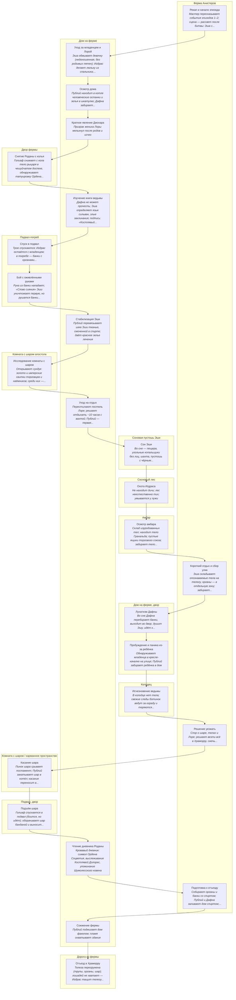

# Эпизод 3 — Ферма: диаграмма событий

```mermaid
graph TD

    subgraph ep3_l1 [Ферма Анистеров]
        ep3E01["Рекап и начало эпизода<br/><i>Мастер пересказывает события эпизодов 1–2; сцена — рассвет после битвы: Эша с...</i>"]
        ep3E15["Короткий отдых и сбор улик<br/><i>Эша складывает опознаваемые тела на телегу, органы — в отдельную зону; забирает...</i>"]
        ep3E19["Решение уезжать<br/><i>Спор о шаре, телах и Лоре; решают везти всё в Храморру, сжечь...</i>"]
        ep3E23["Подготовка к отъезду<br/><i>Собирают органы и банки со спиртом; Публий и Дафна заливают дом спиртом;...</i>"]
    end

    subgraph ep3_l2 [Дом на ферме]
        ep3E02["Уход за младенцем и Лорой<br/><i>Эша обмывает девочку (недоношенная, без родимых пятен); Игдрас делает люльку из спальника;...</i>"]
        ep3E03["Осмотр дома<br/><i>Публий находит в котле человеческие останки и зелья в шкатулке; Дафна забирает...</i>"]
        ep3E04["Краткое явление Джохара<br/><i>Призрак жениха Лоры мелькнул после родов и исчез</i>"]
        ep3E06["Изучение книги ведьмы<br/><i>Дафна не может прочесть; Эша определяет язык сильван, злые заклинания; подпись: «Костлявый...</i>"]
        ep3E09["Стабилизация Эши<br/><i>Публий перевязывает шею Эши тканью, смоченной в спирте; даёт красное зелье лечения</i>"]
        ep3E11["Уход на отдых<br/><i>Перестилают постель Лоре; решают отдыхать ~10 часов с вахтой; Публий — первая...</i>"]
        ep3E22["Чтение дневника Роданы<br/><i>Кровавый дневник: символ Ордена Соцветия, выслеживание Костлявой Долорес, упоминание Шумолесского ковена</i>"]
        ep3E24["Сожжение фермы<br/><i>Публий поджигает дом факелом; пламя охватывает здание</i>"]
    end

    subgraph ep3_l3 [Двор фермы]
        ep3E05["Снятие Роданы с колья<br/><i>Голиаф снимает с кола тело рыцаря в чешуйчатом доспехе, обнаруживает татуировку Ордена...</i>"]
    end

    subgraph ep3_l4 [Подвал-погреб]
        ep3E07["Спуск в подвал<br/><i>Трое спускаются; Игдрас остаётся с младенцем; в погребе — банки с органами...</i>"]
        ep3E08["Бой с оживлёнными руками<br/><i>Рука из банки нападает; «Слово сияния» Эши уничтожает первую, но рушатся банки...</i>"]
    end

    subgraph ep3_l5 [Комната с шаром апостола]
        ep3E10["Исследование комнаты с шаром<br/><i>Открывают сундук: золото и имперские свитки торговцев и наёмников; среди них —...</i>"]
    end

    subgraph ep3_l6 [Соновая пустошь Эши]
        ep3E12["Сон Эши<br/><i>Во сне — пещера, угольные копальщики без лиц, шахта, пустошь с чёрным...</i>"]
    end

    subgraph ep3_l7 [Сосновый лес]
        ep3E13["Охота Игдраса<br/><i>Не находит дичи; лес неестественно тих; умывается у лужи</i>"]
    end

    subgraph ep3_l8 [Амбар]
        ep3E14["Осмотр амбара<br/><i>Склад изуродованных тел; находит тело Гранальда; пустые ящики торгового союза; забирает тело...</i>"]
    end

    subgraph ep3_l9 [Дом на ферме, двор]
        ep3E16["Лунатизм Дафны<br/><i>Во сне Дафна перебирает банки, выходит во двор, душит Эшу, идёт к...</i>"]
        ep3E17["Пробуждение и паника из-за ребёнка<br/><i>Обнаруживают младенца в кресле-качалке на улице; Публий забирает ребёнка в дом</i>"]
    end

    subgraph ep3_l10 [Колодец]
        ep3E18["Исчезновение ведьмы<br/><i>В колодце нет тела; свежие следы ботинок ведут за ограду и теряются...</i>"]
    end

    subgraph ep3_l11 [Комната с шаром / карманное пространство]
        ep3E20["Касание шара<br/><i>Пинок шара срывает постамент; Публий закатывает шар в котёл; касание переносит в...</i>"]
    end

    subgraph ep3_l12 [Подвал, двор]
        ep3E21["Подъём шара<br/><i>Голиаф спускается в подвал (боится, но идёт); оборачивает шар банданой и выносит...</i>"]
    end

    subgraph ep3_l13 [Дорога из фермы]
        ep3E25["Отъезд в Храморру<br/><i>Телега перегружена (трупы, органы, шар); лошадей не хватает — Игдрас тащит телегу...</i>"]
    end

    ep3E01 --> ep3E02 --> ep3E03 --> ep3E04 --> ep3E05 --> ep3E06 --> ep3E07 --> ep3E08 --> ep3E09 --> ep3E10 --> ep3E11 --> ep3E12 --> ep3E13 --> ep3E14 --> ep3E15 --> ep3E16 --> ep3E17 --> ep3E18 --> ep3E19 --> ep3E20 --> ep3E21 --> ep3E22 --> ep3E23 --> ep3E24 --> ep3E25

```