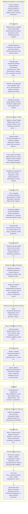

# Эпизод 4 — Искатели приключений: диаграмма событий

```mermaid
graph TD

    subgraph ep4_l1 [Заброшенная ферма / лесная дорога]
        ep4E01["Отъезд с фермы<br/><i>Отряд покидает горящую ферму на телеге с трупами; Игдрас тащит повозку, остальные...</i>"]
    end

    subgraph ep4_l2 [Лесная дорога]
        ep4E02["Размышления о подвале<br/><i>В пути обсуждают заспиртованные органы, магический шар и отрубленную руку старухи.</i>"]
        ep4E03["Зажжение факела<br/><i>В темноте Эша магией поджигает факел; Публий объясняет своё тёмное зрение.</i>"]
        ep4E04["Остановка для кормления ребёнка<br/><i>Плач младенца заставляет остановиться; Лора просыпается, кормит дочь, называет её Эшей; Эша...</i>"]
        ep4E05["Возврат часов Джохара<br/><i>Эша передаёт Лоре часы и рассказывает о явлении призрака Джохара при родах.</i>"]
        ep4E06["Перевязка лошади<br/><i>Осматривают копыто «Зелёной»; Дафна рвёт кусок мантии для повязки.</i>"]
    end

    subgraph ep4_l3 [Дорожный алтарь Подора]
        ep4E07["Привал у алтаря Подора<br/><i>Игдрас ищет место отдыха; Публий и Эша замечают огонёк на скале —...</i>"]
        ep4E08["Засада упырей<br/><i>Три упыря нападают из темноты; Дафну парализует, Публий ранен; Эша изгоняет нежить,...</i>"]
        ep4E09["Бой с крупным упырём<br/><i>Крупная нежить с скалы; Дафна сжигает дерево огненным снарядом хаоса, добивает врагов...</i>"]
        ep4E10["Перевязка и знакомство<br/><i>Эша лечит Пугля; Персиваль и Пузо представляются, предлагают ночлег в пещере.</i>"]
    end

    subgraph ep4_l4 [Пещера у холма]
        ep4E11["Ночь в пещере<br/><i>У костра Персиваль рассказывает о гибели Рудольфа и Гарольда; барды поют; Игдрас...</i>"]
        ep4E12["Связывание Дафны<br/><i>По просьбе Дафны Публий незаметно связывает её, опасаясь неконтролируемой магии.</i>"]
        ep4E13["Утренний сбор<br/><i>Пузо готовит кроличий суп; Публий дарит ему специи с фермы; отряд выезжает...</i>"]
    end

    subgraph ep4_l5 [Пещера / дорога]
        ep4E14["Погрузка трупов упырей<br/><i>Эша хочет упокоить убитых упырей; при погрузке Публий и Персиваль срываются на...</i>"]
    end

    subgraph ep4_l6 [Северные ворота Храморры]
        ep4E15["Прибытие к воротам<br/><i>К полудню процессия с телегой трупов подходит к городу; Эша надевает шлем,...</i>"]
        ep4E16["Досмотр и тревога<br/><i>Стражники осматривают имперские свитки и телегу; звучит горн Серебряного Легиона, собирается толпа.</i>"]
    end

    subgraph ep4_l7 [Северные ворота / башня Легиона]
        ep4E17["Арест<br/><i>Инспектор Архар Горн задерживает всех и уводит телегу в крепость; Лору с...</i>"]
    end

    subgraph ep4_l8 [Башня Серебряного Легиона]
        ep4E18["Досмотр вещей<br/><i>Архар изымает улики: книги, дневник, шар, имперские свитки погибших; Дафна узнаёт голос...</i>"]
    end

    subgraph ep4_l9 [Кабинет Архара]
        ep4E19["Допрос у Архара<br/><i>Эша рассказывает о ведьме и ковене; приносят шар — он уже не...</i>"]
        ep4E20["Допрос Дафны<br/><i>Архар расспрашивает о магическом пожаре замка, странном поведении отца и учителе Эльве...</i>"]
    end

    subgraph ep4_l10 [Храморра]
        ep4E21["Освобождение и разделение<br/><i>Герои забирают личные вещи (кроме улик); Публий делит ~750 золотых и учреждает...</i>"]
    end

    subgraph ep4_l11 [Кладбище Пепельного братства]
        ep4E22["Работа на кладбище<br/><i>Эша помогает опознавать трупы; жабра находит её и эмоционально обнимает.</i>"]
    end

    subgraph ep4_l12 [Лазурный круг]
        ep4E23["Визит в Лазурный круг<br/><i>Дафна не может попасть к Эльве из-за совета магистров; оставляет сообщение, что...</i>"]
    end

    subgraph ep4_l13 [Таверна Морское брюхо]
        ep4E24["Пьянство в таверне<br/><i>Игдрас и Публий устраивают попойку; Персиваль и Пузо присоединяются; Публий расспрашивает Дафну...</i>"]
        ep4E25["Речь Эши<br/><i>Эша с помощью света в щите и жабры обращается к залу с...</i>"]
        ep4E26["Финальная песня<br/><i>Барды исполняют печальную песню о погибших товарищах и о новой команде искателей...</i>"]
    end

    ep4E01 --> ep4E02 --> ep4E03 --> ep4E04 --> ep4E05 --> ep4E06 --> ep4E07 --> ep4E08 --> ep4E09 --> ep4E10 --> ep4E11 --> ep4E12 --> ep4E13 --> ep4E14 --> ep4E15 --> ep4E16 --> ep4E17 --> ep4E18 --> ep4E19 --> ep4E20 --> ep4E21 --> ep4E22 --> ep4E23 --> ep4E24 --> ep4E25 --> ep4E26

```