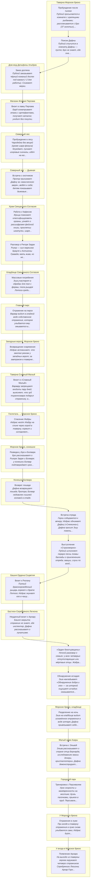

# Эпизод 5 — Отражения: диаграмма событий

```mermaid
graph TD

    subgraph ep5_l1 [Таверна Морское брюхо]
        ep5E01["Пробуждение после пьянки<br/><i>Публий просыпается в комнате с храпящими рыбаками; расплачивается с Бро (37 золотых),...</i>"]
        ep5E02["Поиски Дафны<br/><i>Публий стучится в комнату Дафны — пусто; Бро не знает, где она....</i>"]
        ep5E16["Встреча отряда<br/><i>Герои собираются к вечеру; Игдрас обнимает Дафну («Снежинка»), Дафна просит Эшу помочь...</i>"]
        ep5E17["Выступление «Страхоморно»<br/><i>Публий исполняет первую песнь поэмы-баллады о приключениях отряда; овации, слухи по всей...</i>"]
        ep5E20["«Орден безотцовщины»<br/><i>Ночной разговор о семьях: у всех четверых отсутствующие или мёртвые отцы. Жабра...</i>"]
        ep5E21["Обнаружение исчадия<br/><i>Эша накладывает «Обнаружение добра и зла» — за шторкой ощущает исчадие; оказывается...</i>"]
    end

    subgraph ep5_l2 [Дом мод Дельфины Альбрик]
        ep5E03["Заказ доспеха<br/><i>Публий заказывает чёрный кожаный доспех под камзол (~2 дня работы). Снимают мерки.</i>"]
    end

    subgraph ep5_l3 [Магазин Флавия Пергама]
        ep5E04["Визит в лавку Пергама<br/><i>Бард осматривает этажи с артефактами, получает каталог; уходит без покупки.</i>"]
    end

    subgraph ep5_l4 [Северный лес]
        ep5E05["Пробуждение в лесу<br/><i>Чародейка без вещей (кроме шара-фокуса) блуждает, пускает искровые сигналы, идёт на юг...</i>"]
    end

    subgraph ep5_l5 [Северный лес → Дымная]
        ep5E06["Встреча с охотником<br/><i>Пропор принимает Дафну за «магического зверя», ведёт к себе; детям показывает дымовые...</i>"]
    end

    subgraph ep5_l6 [Храм Священного Согласия]
        ep5E07["Работа с Кафисом<br/><i>Жрица помогает классифицировать органы, узнаёт о расшифровке фейской книги, проклятии шкатулки, шаре...</i>"]
        ep5E08["Разговор о Ригоре Зарре<br/><i>Ригор — сын маркизов Брауля и Антигоны Гравада; мать жива, но не...</i>"]
    end

    subgraph ep5_l7 [Кладбище Священного Согласия]
        ep5E09["Массовые погребения<br/><i>Эша участвует в обрядах для тел с фермы; тела рыцаря Лотоса среди...</i>"]
    end

    subgraph ep5_l8 [Главный пирс]
        ep5E10["Отражение на пирсе<br/><i>Варвар видит в гладкой воде собственное отражение, которое улыбается ему; омывается в...</i>"]
    end

    subgraph ep5_l9 [Западные ворота, Морское брюхо]
        ep5E11["Возвращение снаряжения<br/><i>Игдрас вспоминает, что закопал рюкзак у западных ворот; за завтраком в таверне...</i>"]
    end

    subgraph ep5_l10 [Таверна Славный Малый]
        ep5E12["Визит в «Славный Малый»<br/><i>Варвару запрещают входить пару дней; выясняет, что зуб тираннозавра подарил стражнику, а...</i>"]
    end

    subgraph ep5_l11 [Госпиталь → Морское брюхо]
        ep5E13["Спасение Жабры<br/><i>Игдрас несёт Жабру на спине через город в таверну, кормит и оставляет...</i>"]
    end

    subgraph ep5_l12 [Морское брюхо, конюшни]
        ep5E14["Разведка у Бро и Болвара<br/><i>Бро рассказывает о Ригоре Зарре и Болваре; у конюшни Болвар подтверждает срок...</i>"]
    end

    subgraph ep5_l13 [Конюшни Болвара]
        ep5E15["Возврат лошади<br/><i>Дафна возвращает лошадь Пропора; Болвар недоволен лишней головой в стаде.</i>"]
    end

    subgraph ep5_l14 [Башня Ордена Соцветия]
        ep5E18["Визит к Ризгану<br/><i>Пьяный драконорождённый рыцарь горюет о брате Лотосе; Игдрас окунает его в чашу...</i>"]
    end

    subgraph ep5_l15 [Бастион Серебряного Легиона]
        ep5E19["Неудачный визит к Архару<br/><i>Башня закрыта; стражник не знает, где инспектор. Дафна рассказывает о лунатизме.</i>"]
    end

    subgraph ep5_l16 [Морское брюхо, кладбище]
        ep5E22["Разделение на ночь<br/><i>Эша на кладбище видит искажённое отражение в воде алтаря; Дафна привязывает себя...</i>"]
    end

    subgraph ep5_l17 [Малый храм Азары]
        ep5E23["Встреча с Эльвой<br/><i>Эльва рассказывает о страхе отца Бернарда, исследованиях магии дочери, кристаллотерии. Дафна демонстрирует...</i>"]
    end

    subgraph ep5_l18 [Городской парк]
        ep5E24["Тренировка с Персивалем<br/><i>Урок скорости и манёвренности на мостике; дуэль палочками, прыжок в пруд. Персиваль...</i>"]
    end

    subgraph ep5_l19 [У Морского брюха]
        ep5E25["Отражения в луже<br/><i>При входе в таверну отражения в луже снова улыбаются сами; Игдрас бьёт...</i>"]
    end

    subgraph ep5_l20 [У входа в Морское брюхо]
        ep5E26["Появление Архара<br/><i>На выходе из таверны героев окружают четверо стражников Серебряного Легиона; Архар Горн...</i>"]
    end

    ep5E01 --> ep5E02 --> ep5E03 --> ep5E04 --> ep5E05 --> ep5E06 --> ep5E07 --> ep5E08 --> ep5E09 --> ep5E10 --> ep5E11 --> ep5E12 --> ep5E13 --> ep5E14 --> ep5E15 --> ep5E16 --> ep5E17 --> ep5E18 --> ep5E19 --> ep5E20 --> ep5E21 --> ep5E22 --> ep5E23 --> ep5E24 --> ep5E25 --> ep5E26

```