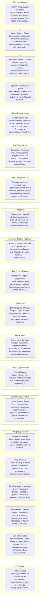

# Эпизод 6 — Форум: диаграмма событий

```mermaid
graph TD

    subgraph ep6_l1 [Морское брюхо]
        ep6E01["Рекапл предыдущих эпизодов<br/><i>Публий пересказывает путь отряда: часы и призрак, ферма, Лора, арест в Храморре,...</i>"]
        ep6E02["Визит Архара Горна<br/><i>Инспектор устраивает приватный завтрак; обсуждает закон, платит 400 золотых (по 100 каждому),...</i>"]
        ep6E03["Решение принять сделку<br/><i>Отряд голосует (включая Жабру) за согласие; договариваются не бежать к Архару сразу,...</i>"]
        ep6E04["Странное отражение у Публия<br/><i>В отражении окна на миг появляется кривая улыбка, не совпадающая с лицом...</i>"]
    end

    subgraph ep6_l2 [Лавка Пимпа, город]
        ep6E05["Сбор снаряжения<br/><i>Покупка пайков, факелов, кирки, медкомплекта; разговор о семье Пергамов и предстоящем корабле...</i>"]
    end

    subgraph ep6_l3 [Кладбище / храм]
        ep6E06["Разговор с Кафисом<br/><i>Эша спрашивает о форуме, фракциях Империи и просьбе Архара; Кафис советует соблюдать...</i>"]
    end

    subgraph ep6_l4 [Банк, дом модистки]
        ep6E07["Поиск Дельфины и ячейка в банке<br/><i>Портниха недоступна; в банке не удаётся узнать её расписание; Публий снимает сейфовую...</i>"]
    end

    subgraph ep6_l5 [Кладбище]
        ep6E08["Отжимания с Жаброй<br/><i>Игдрас проигрывает спор (78 отжиманий с Жаброй на спине) и должен поцеловать...</i>"]
    end

    subgraph ep6_l6 [Особняк Флавия Пергама]
        ep6E09["Визит к Флавию Пергаму<br/><i>Ворота закрыты; дворецкий сообщает, что Флавий в отъезде, по Эльзе — обращаться...</i>"]
    end

    subgraph ep6_l7 [Дом Анны и Хальта]
        ep6E10["Навещение Лоры и родителей<br/><i>Семья здорова; Анна рассказывает о банде, Халдуре, проклятии его рода и лечении...</i>"]
    end

    subgraph ep6_l8 [Коллектор]
        ep6E11["Драка Игдраса с бандой<br/><i>Игдрас ищет Ригора, конфликтует с детьми, ранен кинжалами, разоружён и избит; теряет...</i>"]
    end

    subgraph ep6_l9 [Замок тепла]
        ep6E12["Пленение у Халдура<br/><i>Старик связывает Игдраса цепями, требует «обещания не быть зверем», надевает медвежий коготь;...</i>"]
    end

    subgraph ep6_l10 [Улицы у коллектора]
        ep6E13["Поиск Игдраса<br/><i>Отряд не находит варвара; стражник видел его уход налево; след теряется у...</i>"]
    end

    subgraph ep6_l11 [Башня Архара Горна]
        ep6E14["Соглашение в башне<br/><i>Герои формально принимают условия и просят искать пропавшего Игдраса; Архар снаряжает стражников,...</i>"]
    end

    subgraph ep6_l12 [Площадь Согласия]
        ep6E15["Открытие форума<br/><i>Речи о войне, надежде и телеге с трупами; героев приглашают на помост.</i>"]
        ep6E16["Речь Публия<br/><i>Бард с помощью гнома громко объявляет: чудовище мертво, Храморра в безопасности; толпа...</i>"]
        ep6E17["Разоблачение «Игдраса»<br/><i>На сцену выходит фигура Игдраса и кричит, что город обманули; ведьма жива.</i>"]
        ep6E18["Появление Халдура<br/><i>Морок сменяется стариком в мехах; апокалиптическая проповедь о чёрном пламени и гибели...</i>"]
        ep6E19["Бой на площади<br/><i>Публий подсвечивает сцену «Огнём фей» и ранит Ригора «Диссонирующим шёпотом»; Эша накладывает...</i>"]
    end

    subgraph ep6_l13 [Набережная]
        ep6E20["Побег по воде<br/><i>Халдур уплывает на лодке с двумя связанными легионерами; отряд с набережной концентрированно...</i>"]
    end

    ep6E01 --> ep6E02 --> ep6E03 --> ep6E04 --> ep6E05 --> ep6E06 --> ep6E07 --> ep6E08 --> ep6E09 --> ep6E10 --> ep6E11 --> ep6E12 --> ep6E13 --> ep6E14 --> ep6E15 --> ep6E16 --> ep6E17 --> ep6E18 --> ep6E19 --> ep6E20

```