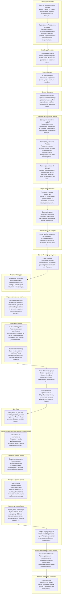

# Эпизод 7 — Осада: диаграмма событий

```mermaid
graph TD

    subgraph ep7_l1 [Площадь Согласия]
        ep7E01["Хаос на площади после форума<br/><i>Закат, суматоха, драки; герои у воды втроём. Эша в панике из-за Халдура...</i>"]
        ep7E02["Переговоры с Архаром на площади<br/><i>Пуголь помогает задержать буянящего мужчину, спорит с Архаром о приоритетах; договорённость встретиться...</i>"]
    end

    subgraph ep7_l2 [Кладбище Храморы]
        ep7E03["Поход на кладбище<br/><i>Герои бегут по городу; Жабры нет. Послушник братства не видел ни его,...</i>"]
    end

    subgraph ep7_l3 [Башня Архара]
        ep7E04["Вызов к верфям<br/><i>Стражники передают приказ Архара явиться к верфям.</i>"]
    end

    subgraph ep7_l4 [Верфи Храморы]
        ep7E05["Оцепление особняка<br/><i>Герои убеждают стражу пропустить их; видят оцеплённый особняк Халдура, куда приплыла банда.</i>"]
    end

    subgraph ep7_l5 [Контора верфей штаб осады]
        ep7E06["Совещание в конторе верфей<br/><i>Архар объясняет: похищенные стражники в особняке. Появляются Рида Пергам и Кортезий Принцип....</i>"]
        ep7E07["Тайное предложение Архара<br/><i>Архар предлагает Публию стать личным помощником с перспективой трибунства (~60 зол./мес.); Пуголь...</i>"]
        ep7E08["Разговор с Антигоной Гравада<br/><i>Маркиза рассказывает о сыне без ног, муже-адмирале, острове Грааль; холодеет, когда Эша...</i>"]
    end

    subgraph ep7_l6 [Подземелье особняка]
        ep7E09["Пленение Игдраса (флешбэк)<br/><i>Игдрас ~2 часа скован цепями в жаре и темноте; снимает мешок, вспоминает...</i>"]
        ep7E10["Допрос Игдраса<br/><i>Ригор бьёт пленника, требует знать цели «вестника» и целителя; Игдрас смеётся и...</i>"]
    end

    subgraph ep7_l7 [Особняк Халдура у ворот]
        ep7E11["Ригор требует целителя<br/><i>Ригор у ворот в истерике кричит «Вестник!»; согласен впустить только Эшу в...</i>"]
    end

    subgraph ep7_l8 [Верфи Храморы у кордона]
        ep7E12["Совет Кафиса<br/><i>Хранитель просит спасти детей от гибели при штурме и намекает, что Халдур...</i>"]
        ep7E17["Срыв Пуголя на Архара<br/><i>Пуголь в ярости на обмен «детей на взрослых»; Архар прекращает отношения и...</i>"]
        ep7E18["Планирование проникновения<br/><i>Обсуждают трубочки, коллектор, штурм; Дафну не пускают к Лорану.</i>"]
        ep7E24["Дафна ждёт у кордона<br/><i>Около часа безуспешно ищет Архара; пытается подать сигнал дымом — не выходит.</i>"]
    end

    subgraph ep7_l9 [Особняк Халдура]
        ep7E13["Эша входит в особняк<br/><i>Эшу обыскивают, надевают мешок на голову и ведут через лабиринт в подземную...</i>"]
    end

    subgraph ep7_l10 [Подземная кузница особняка]
        ep7E14["Исцеление Халдура<br/><i>Эша во сне-операции исправляет артерию, повреждённую зельем лечения, промывает лёгкие, зашивает грудь;...</i>"]
    end

    subgraph ep7_l11 [Камера в особняке]
        ep7E15["Встреча с Игдрасом<br/><i>Ригор показывает пленённого, истощённого Игдраса на цепях; отказывается отпускать его. Игдрас рассказывает,...</i>"]
        ep7E16["Эша остаётся в плену<br/><i>Эша отказывается уходить; Ригор запирает её вместе с Игдрасом в жаркой темнице.</i>"]
    end

    subgraph ep7_l12 [Дом Лоры]
        ep7E19["Нападение на дом Лоры<br/><i>У дома разгром; раненый стражник; Анна и Хальт внутри. Стража отдаёт посох...</i>"]
    end

    subgraph ep7_l13 [Коллектор у дома Лоры, коллектор восточный]
        ep7E20["Исследование коллекторов<br/><i>В первом — следы Игдраса и кровь, запертая дверь; Пуголь чувствует разряд...</i>"]
    end

    subgraph ep7_l14 [Таверна Славный Малый]
        ep7E21["Задание канцелярии<br/><i>Через заговор сообщения Пуголь получает приказ проникнуть в особняк, найти агента «Телега»...</i>"]
    end

    subgraph ep7_l15 [Таверна Морское брюхо]
        ep7E22["Подготовка к проникновению<br/><i>Пуголь забирает бутылку-баловник и свиток, убедительно притворяется пьяным; уходит к коллектору.</i>"]
    end

    subgraph ep7_l16 [Коллектор у дома Лоры]
        ep7E23["Взрыв двери коллектора<br/><i>Пуголь сбрасывает маскировку «Облака», бросает взрывчатку в металлическую дверь и входит в...</i>"]
    end

    subgraph ep7_l17 [Контора верфей соседнее здание]
        ep7E25["Переговоры с Лораном<br/><i>Лоран пропускает её мимо кордона, показывает карты канализации. Предупреждает: особняк покрыт рунами,...</i>"]
    end

    subgraph ep7_l18 [Верфи / коллектор / особняк]
        ep7E26["Финал эпизода<br/><i>~21:00–21:30. Эша и Игдрас в темной камере; Пуголь в тоннелях без маскировки;...</i>"]
    end

    ep7E01 --> ep7E02 --> ep7E03 --> ep7E04 --> ep7E05 --> ep7E06 --> ep7E07 --> ep7E08 --> ep7E09 --> ep7E10 --> ep7E11 --> ep7E12 --> ep7E13 --> ep7E14 --> ep7E15 --> ep7E16 --> ep7E17 --> ep7E18 --> ep7E19 --> ep7E20 --> ep7E21 --> ep7E22 --> ep7E23 --> ep7E24 --> ep7E25 --> ep7E26

```