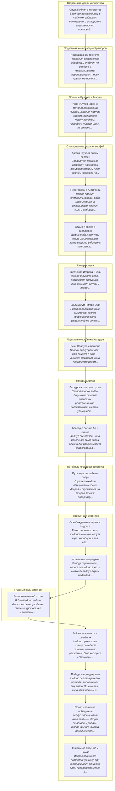

# Эпизод 8 — Пророк: диаграмма событий

```mermaid
graph TD

    subgraph ep8_l1 [Взорванная дверь коллектора]
        ep8E01["Спуск Публия в коллектор<br/><i>Бард оставляет виолу в тайнике, забирает колокольчик и осторожно спускается по винтовой...</i>"]
    end

    subgraph ep8_l2 [Подземная канализация Храморры]
        ep8E02["Исследование тоннелей<br/><i>Проходит извилистые коридоры, следует по верёвке с колокольчиками, перепрыгивает через «реку» нечистот,...</i>"]
    end

    subgraph ep8_l3 [Жилище Руперта и Марлы]
        ep8E03["Игра «Супер-игра» с металлоломщиками<br/><i>Публий находит пару по крикам, подкупает Марлу золотом, проводит «Супер-игру»: за ответы...</i>"]
    end

    subgraph ep8_l4 [Столярная мастерская верфей]
        ep8E04["Дафна изучает планы верфей<br/><i>Сортирует планы по возрасту, находит и забирает старый план здания, похожего на...</i>"]
        ep8E05["Переговоры с Антигоной<br/><i>Дафна просит отменить штурм ради Эши; Антигона отказывает, хвалит силу и амбиции,...</i>"]
        ep8E06["Отдых и выход к оцеплению<br/><i>Дафна отдыхает час; около 22:00 слышит крики снаружи и бежит к оцеплению...</i>"]
    end

    subgraph ep8_l5 [Камера-сауна]
        ep8E07["Заточение Игдраса и Эши<br/><i>В жаре и духоте герои обсуждают ситуацию; Эша снимает шкуры у двери,...</i>"]
        ep8E08["Ультиматум Ригора Эше<br/><i>Ригор предлагает Эше выйти как гостю пророка или быть утащенной на цепях;...</i>"]
    end

    subgraph ep8_l6 [Оцепление особняка Халдура]
        ep8E09["Речь Халдура с балкона<br/><i>Пророк предупреждает: кто войдёт в дом — выйдет мёртвым. Эша появляется рядом...</i>"]
    end

    subgraph ep8_l7 [Покои Халдура]
        ep8E10["Экскурсия по скульптурам<br/><i>Слепой пророк ведёт Эшу мимо статуй погибших родственников, рассказывает о семье; упоминает...</i>"]
        ep8E11["Беседа о богине Ао и сказке<br/><i>Халдур объясняет, что исцеление было волей богини Ао; рассказывает сказку отца о...</i>"]
    end

    subgraph ep8_l8 [Потайные коридоры особняка]
        ep8E12["Путь через потайные двери<br/><i>Группа проходит лабиринт меховых дверей и спускается на второй этаж к обзорному...</i>"]
    end

    subgraph ep8_l9 [Главный зал особняка]
        ep8E13["Освобождение и перенос Игдраса<br/><i>Ригор снимает цепи; Игдраса в мешке ведут через коридоры в зал, где...</i>"]
        ep8E14["Испытание медведями<br/><i>Халдур спрашивает, верит ли Игдрас в Ао, и выпускает двух бурых медведей....</i>"]
        ep8E16["Бой на монументе и решётках<br/><i>Игдрас прячется в кольце семейной статуи, лезет по решёткам; Эша кастует «Подмогу»,...</i>"]
        ep8E17["Победа над медведями<br/><i>Игдрас оседлав рыжего медведя, выдавливает ему глаза; Эша метит шею заклинанием и...</i>"]
        ep8E18["Провозглашение победителя<br/><i>Халдур спрашивает «кто ты?» — Игдрас отвечает «рыбак»; толпа кричит «Слава победителю!»...</i>"]
        ep8E19["Финальное видение и намаз<br/><i>Игдрас обнимает потрясённую Эшу; при касании видит отца без глаз, превращающегося в...</i>"]
    end

    subgraph ep8_l10 [Главный зал / видения]
        ep8E15["Воспоминания об охоте<br/><i>В бою Игдрас видит детские сцены: разделка тюленя, урок отца о «племени»,...</i>"]
    end

    ep8E01 --> ep8E02 --> ep8E03 --> ep8E04 --> ep8E05 --> ep8E06 --> ep8E07 --> ep8E08 --> ep8E09 --> ep8E10 --> ep8E11 --> ep8E12 --> ep8E13 --> ep8E14 --> ep8E15 --> ep8E16 --> ep8E17 --> ep8E18 --> ep8E19

```