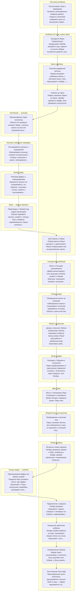

# Эпизод 9 — Штурм: диаграмма событий

```mermaid
graph TD

    subgraph ep9_l1 [Гостиная особняка]
        ep9E01["Послесловие к бою с медведями<br/><i>Решётки поднимаются; медведя уводят; старики в доспехах надевают цепи на выжившего зверя....</i>"]
    end

    subgraph ep9_l2 [Особняк 2-й этаж, кухня, баня]
        ep9E02["Экскурсия Левия<br/><i>Управляющий возвращает одежду, проводит тур, кормит из котла; Игдрас пытается украсть нож...</i>"]
    end

    subgraph ep9_l3 [Баня особняка]
        ep9E03["Лечение медвежьей жёлчью<br/><i>Героям втирают медвежью жёлчь и бинтуют раны; Эша спрашивает о Жабре —...</i>"]
        ep9E04["Схватка за горло<br/><i>Игдрас хватает Левия за горло, требуя привести Жабру; Эша убеждает отпустить.</i>"]
        ep9E09["Бой Публия и Левия<br/><i>Публий ранит Левия рапирой с «цветением»; Левий отбрасывает его на раскалённые камни...</i>"]
    end

    subgraph ep9_l4 [Коллектор → кузница]
        ep9E05["Проникновение через коллектор<br/><i>Публий (3-й уровень) снимает дверь с петель, лежит на ней под невидимостью;...</i>"]
    end

    subgraph ep9_l5 [Кузница, каменные коридоры]
        ep9E06["Исследование кузницы и подземелий<br/><i>Осматривает кузницу, следует за мальчиком к Ригору и женщине в маске, поднимается...</i>"]
    end

    subgraph ep9_l6 [Штаб осады]
        ep9E07["Разговор Дафны с командованием<br/><i>Баронесса просит не штурмовать и не убивать; получает отпор, узнаёт о неснимаемых...</i>"]
    end

    subgraph ep9_l7 [Баня → жилые комнаты]
        ep9E08["Переговоры с Левием под видом канцелярии<br/><i>Публий передаёт свиток, узнаёт о спящих Эше и Игдрасе, переодевается; Левий внезапно...</i>"]
    end

    subgraph ep9_l8 [Гильдия волшебников]
        ep9E10["Визит в Гильдию волшебников<br/><i>Дафна выпытывает, кто защищал особняк; узнаёт о Лагаде Фортуне, назначает встречу, получает...</i>"]
    end

    subgraph ep9_l9 [Улицы осады]
        ep9E11["Обнаружение магии на особняке<br/><i>«Обнаружение магии» показывает сплошное ограждение по всему зданию и купол над ним.</i>"]
    end

    subgraph ep9_l10 [Покой / допросная]
        ep9E12["Допрос пленного Публия<br/><i>Связанному Публию отрезают средний палец льдом; Левий признаётся в предательстве канцелярии ради...</i>"]
    end

    subgraph ep9_l11 [Штаб, верфи]
        ep9E13["Разговор с Лораном и Антигоной<br/><i>Лоран предупреждает о преступной «Девятой гильдии»; Антигона у воды говорит, что Халдур...</i>"]
    end

    subgraph ep9_l12 [Дом Лоры]
        ep9E14["Весть о похищении Лоры<br/><i>Сообщают о нападении банды Ригора; стражник ранен, Лоры нет.</i>"]
    end

    subgraph ep9_l13 [Второй этаж, зал молитвы]
        ep9E15["Пробуждение и молитва Аоа<br/><i>Герои снимают бинты; все собираются в зале со зеркалом и статуей Аоа;...</i>"]
    end

    subgraph ep9_l14 [Покой пророка]
        ep9E16["Встреча в покое пророка<br/><i>Халдур приводит героев к Лоре, младенцу и Жабре; вводят связанного «незнакомца» (Публий);...</i>"]
        ep9E18["Пророчество и зеркала<br/><i>Халдур срывает покрывала с зеркал, говорит о четверых на повозке с мертвецами;...</i>"]
        ep9E19["Раскрытие проклятия ребёнка<br/><i>Халдур кладёт ребёнка на шар, показывает чёрное пятно на спине; объясняет «зло»,...</i>"]
        ep9E20["Разоблачение Публия<br/><i>Игдрас бьёт «незнакомца» в челюсть; Эша исцеляет его; Игдрас и Эша узнают...</i>"]
        ep9E21["Уничтожение апостофа<br/><i>Левитирующий кулон Антигоны раскрывается, молния бьёт в шар — сфера взрывается; на...</i>"]
    end

    subgraph ep9_l15 [Улицы осады → особняк]
        ep9E17["Проникновение Дафны во время штурма<br/><i>Лазурный Круг снимает часть чар; Дафна применяет «Тьму», огненными снарядами пробивает окно,...</i>"]
    end

    ep9E01 --> ep9E02 --> ep9E03 --> ep9E04 --> ep9E05 --> ep9E06 --> ep9E07 --> ep9E08 --> ep9E09 --> ep9E10 --> ep9E11 --> ep9E12 --> ep9E13 --> ep9E14 --> ep9E15 --> ep9E16 --> ep9E17 --> ep9E18 --> ep9E19 --> ep9E20 --> ep9E21

```