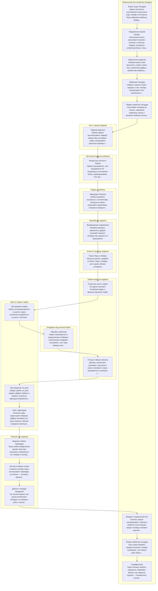

# Эпизод 10 — Судьба: диаграмма событий

```mermaid
graph TD

    subgraph ep10_l1 [Зеркальный зал особняка Халдура]
        ep10E01["Взрыв шара Халдура<br/><i>Шарик Антигоны уничтожает защитный шар; Халдур в отчаянии; Лора забирает ребёнка, Жабра...</i>"]
        ep10E02["Подавление героев<br/><i>Халдур телекинетически прижимает героев к стенам и потолку; Игдрас пытается сопротивляться, Эша...</i>"]
        ep10E03["Зеркальные видения<br/><i>Каждый видит своё прошлое и страх: мать Эши, родители Дафны, вождество Игдраса,...</i>"]
        ep10E04["Избиение Халдура<br/><i>Игдрас в ярости бьёт пророка о пол; Халдур провоцирует его, напоминая о...</i>"]
        ep10E05["Первое убийство Халдура<br/><i>Эша ведёт Халдура на колени, намекает отрезать палец и вонзает ледяной клинок...</i>"]
        ep10E20["Возврат в зеркальный зал<br/><i>Осколки зеркал «возвращают» героев в момент после взрыва зеркал; Халдур снимает амулет...</i>"]
        ep10E21["Второе убийство Халдура<br/><i>Эша снова убивает пророка клинком; Халдур сообщает, что Левий увёл Лору и...</i>"]
        ep10E22["Клиффхэнгер<br/><i>Герои должны пройти лабиринт, доверяясь богине; как закрыть портал — неизвестно; эпизод...</i>"]
    end

    subgraph ep10_l2 [Зал с чёрной сферой]
        ep10E06["Прорыв демонов<br/><i>Чёрная сфера выплёскивает тварей; Архар Горн погибает; герои открывают скрытый коридор и...</i>"]
    end

    subgraph ep10_l3 [Лестница подвала особняка]
        ep10E07["Раскрытие личности Публія<br/><i>Публий признаётся, что скрывается от канцелярии под именем Гвидо; предупреждает, что при...</i>"]
    end

    subgraph ep10_l4 [Подвал особняка]
        ep10E08["Эвакуация Легиона<br/><i>Публий выводит выживших к коллектору; женщина в маске указывает оружейную; стражник говорит:...</i>"]
    end

    subgraph ep10_l5 [Оружейная подвала]
        ep10E09["Возвращение снаряжения<br/><i>Находят рюкзаки, арбалеты; Дафна опознаёт амулет Халдура как защиту от прорицания.</i>"]
    end

    subgraph ep10_l6 [Клетки и кузница подвала]
        ep10E10["Поиск Лоры и Жабры<br/><i>Пустые клетки, медведь в одной; Лоры и Жабры нет; карта здания устарела.</i>"]
    end

    subgraph ep10_l7 [Тайная комната подвала]
        ep10E11["Открытие шахты лифта<br/><i>По карте находят потайную дверь и древний грузовой лифт.</i>"]
        ep10E14["Отход в тайную комнату<br/><i>Демоны заполняют коридоры; женщина в маске погибает; герои запираются в комнате с...</i>"]
    end

    subgraph ep10_l8 [Шахта старого лифта]
        ep10E12["Застревание лифта<br/><i>Лифт останавливается в шахте; герои пытаются выбраться по цепи и болтам.</i>"]
        ep10E15["Восхождение по цепи<br/><i>Игдрас ведёт по цепи наверх; Дафна падает и теряет сознание; барлгура появляется...</i>"]
        ep10E16["Бой с барлгурой<br/><i>Иллюзия лавы парализует Игдраса; Дафна погибает от укуса демона; Публий отравлен жёлтым...</i>"]
    end

    subgraph ep10_l9 [Кладовая над шахтой лифта]
        ep10E13["Подъём к демонам<br/><i>Лифт поднимается в разрушенную кладовую, заполненную тварями; понимают, что Лору наверху уже...</i>"]
    end

    subgraph ep10_l10 [Тёмный лес видение]
        ep10E17["Видение гибели Храморры<br/><i>Герои видят разрушение города, бегство жителей и удаляются от пожара к костру...</i>"]
        ep10E18["Костёр и чёрное пламя<br/><i>У малого костра герои вспоминают Храморру; на поляне — костёр с чёрным...</i>"]
        ep10E19["Дорога и Халдур-проводник<br/><i>На лесной дороге под луной встречают Халдура; он говорит идти к свету...</i>"]
    end

    ep10E01 --> ep10E02 --> ep10E03 --> ep10E04 --> ep10E05 --> ep10E06 --> ep10E07 --> ep10E08 --> ep10E09 --> ep10E10 --> ep10E11 --> ep10E12 --> ep10E13 --> ep10E14 --> ep10E15 --> ep10E16 --> ep10E17 --> ep10E18 --> ep10E19 --> ep10E20 --> ep10E21 --> ep10E22

```