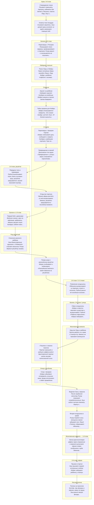

# Эпизод 11 — Наследие: диаграмма событий

```mermaid
graph TD

    subgraph ep11_l1 [Храм, 3-й этаж]
        ep11E01["Утверждение плана<br/><i>Решают помешать порталу, избежать боя детей и Легиона, спасти Лору, Эшу и...</i>"]
        ep11E02["Осмотр тела Халдура<br/><i>Снимают амулеты; Эша целует руку учителя; из груди извлекают тающий лёд.</i>"]
    end

    subgraph ep11_l2 [Балкон, 2-й этаж]
        ep11E03["Переговоры с Ригором<br/><i>Показывают тело пророка, предупреждают о портале; Ригор верит и соглашается не опускать...</i>"]
    end

    subgraph ep11_l3 [Лабиринт, спальня]
        ep11E04["Поиск Лоры и Жабры<br/><i>Через потайные двери находят Левия, Лору, Жабру и ребёнка; тифлинг и асимар...</i>"]
    end

    subgraph ep11_l4 [Спальня]
        ep11E05["Амулет на ребёнке<br/><i>Надевает амулет Халдура на младенца; Жабра сначала в панике, затем доверяет.</i>"]
        ep11E06["Тайна пророка для Жабры<br/><i>Жабра отказывается говорить, что сказал Халдур; шепчет Эше: «Я должен выжить».</i>"]
    end

    subgraph ep11_l5 [1-й этаж]
        ep11E07["Переговоры с Архаром Горном<br/><i>Игдрас поднимает руки, сообщает о смерти Халдура и грядущем портале; Горн не...</i>"]
        ep11E08["Превращение в свиней<br/><i>Заклинание 4-го круга «Превращение» с улицы; герои становятся поросятами.</i>"]
        ep11E10["Открытие портала<br/><i>Чёрная сфера растёт; из неё выпрыгивают демоны; решётки закрываются в последний момент.</i>"]
        ep11E13["Пожар шкур и раскалённые решётки<br/><i>Шкуры скидывают и поджигают; «Раскалённый металл» жжёт демонов на решётках.</i>"]
        ep11E17["«Тишина» и анализ портала<br/><i>Портал заглушён в радиусе; Дафна видит двусторонний портал школы вызова колоссальной силы.</i>"]
    end

    subgraph ep11_l6 [1-й этаж, решётки]
        ep11E09["Передача тела и перемирие<br/><i>Публий выкатывает тело; дети ссыпают муку; решётка закрывается; свиней впускают внутрь.</i>"]
    end

    subgraph ep11_l7 [Балкон и 1-й этаж]
        ep11E11["Первый бой с демонами<br/><i>Фейское сияние, звон по мёртвым, арбалеты; демоны грызут тело Халдура; гибнет один...</i>"]
    end

    subgraph ep11_l8 [Под решёткой]
        ep11E12["Спасение раненого ребёнка<br/><i>Эша божественным оружием и «Подмогой» спасает мальчика; Ригор держит решётку ногами.</i>"]
    end

    subgraph ep11_l9 [1-й этаж / 2–3 этажи]
        ep11E14["Появление колдузьяны<br/><i>Обезьяна выпрыгивает из портала, лезет в потолок; Публий ранит её холодным клинком...</i>"]
    end

    subgraph ep11_l10 [Балкон, 3-й этаж / улица]
        ep11E15["Сброс колдузьяны<br/><i>Игдрас в ярости хватает существо и выпрыгивает; Публий «Падение пёрышком»; Игдрас добивает...</i>"]
    end

    subgraph ep11_l11 [Молитвенная комната]
        ep11E16["Укрытие Лоры и ребёнка<br/><i>Группа уводит их в храм к статуе Ау; демоны не трогают молящихся.</i>"]
        ep11E19["Видение Эши у зеркала<br/><i>После неудачной молитвы Ригор помогает сосредоточиться; Эша видит пустую комнату, дорогу к...</i>"]
        ep11E20["Вторая колдузьяна в храме<br/><i>Ригор теряет ноги; женщина в маске забирает его; Левий «Телега» сдерживает обезьяну,...</i>"]
    end

    subgraph ep11_l12 [Улица у особняка]
        ep11E18["Спор с Архаром<br/><i>Игдрас убеждает отправить сильного мага; Архар отступает и даёт проводника.</i>"]
    end

    subgraph ep11_l13 [Молитвенная комната → 1-й этаж]
        ep11E21["Волна кристаллотерии<br/><i>Дафна через отражение в зеркале выпускает чёрное пламя; колдузьяна и орда демонов...</i>"]
    end

    subgraph ep11_l14 [2-й этаж, сфера]
        ep11E22["Прыжок в портал<br/><i>Эша прыгает первой; остальные следом; Игдрас забирает ребёнка у статуи.</i>"]
    end

    subgraph ep11_l15 [Лесная поляна]
        ep11E23["Поляна за порталом<br/><i>Костёр, три фигуры в чёрном, камни по кругу; Эша ранит малую фигуру...</i>"]
    end

    ep11E01 --> ep11E02 --> ep11E03 --> ep11E04 --> ep11E05 --> ep11E06 --> ep11E07 --> ep11E08 --> ep11E09 --> ep11E10 --> ep11E11 --> ep11E12 --> ep11E13 --> ep11E14 --> ep11E15 --> ep11E16 --> ep11E17 --> ep11E18 --> ep11E19 --> ep11E20 --> ep11E21 --> ep11E22 --> ep11E23

```