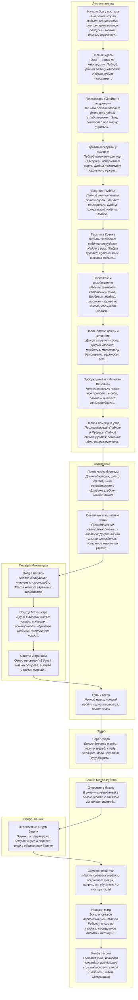

# Эпизод 12 — Смерть: диаграмма событий

```mermaid
graph TD

    subgraph ep12_l1 [Лунная поляна]
        ep12E01["Начало боя у портала<br/><i>Эша режет горло ведьме; инициатива; портал закрывается; болгуры и мелкие демоны окружают...</i>"]
        ep12E02["Первые удары<br/><i>Эша — «звон по мёртвому»; Публий ранит ведьму холодом; Игдрас рубит топорами;...</i>"]
        ep12E03["Переговоры «Отойдите от дочери»<br/><i>Ведьма останавливает демонов; Публий стабилизирует Эшу, снимает с неё маску; угрозы и...</i>"]
        ep12E04["Кровавые жертвы у жаровни<br/><i>Публий начинает ритуал Тавгарии и вспарывает горло; Дафна поджигает жаровню и режет...</i>"]
        ep12E05["Падение Публиа<br/><i>Публий окончательно режет горло и падает на жаровню; Дафна прикрывает ребёнка; Игдрас...</i>"]
        ep12E06["Расплата Ковена<br/><i>Ведьмы забирают ребёнка; отрубают Игдрасу руку; Жабра срезает Публию язык; высокая ведьма...</i>"]
        ep12E07["Проклятие и разоблачение<br/><i>Ведьмы снимают капюшоны (Эльва, Бродерик, Жабра); изгоняют героев из земель; обещают вечную...</i>"]
        ep12E08["После битвы: дождь и отчаяние<br/><i>Дождь смывает кровь; Дафна хоронит младенца, молится Ау без ответа; переносит всех...</i>"]
        ep12E09["Пробуждение и «Молебен Вечения»<br/><i>Через несколько часов все приходят в себя, слыша и видя всё произошедшее;...</i>"]
        ep12E10["Первая помощь и уход<br/><i>Прижигание ран Публию и Игдрасу; Публий гриммируется; решение идти на юго-восток к...</i>"]
    end

    subgraph ep12_l2 [Шумолесье]
        ep12E11["Поход через бурелом<br/><i>Длинный отдых; суп из грибов; Эша рассказывает о «Владыке глубин»; ночной поход</i>"]
        ep12E12["Светлячок и защитные линии<br/><i>Преследование светлячка; стена из листьев; Дафна видит магию ограждения; появление животных (дятел,...</i>"]
        ep12E16["Путь к озеру<br/><i>Ночной марш; ястреб ведёт; герои теряются, делят зелья</i>"]
    end

    subgraph ep12_l3 [Пещера Махашкура]
        ep12E13["Вход в пещеру<br/><i>Поляна с валунами; туннель к «гостиной»; Агата кормит вареньем; знакомство</i>"]
        ep12E14["Приход Махашкура<br/><i>Друид с лапами гиены; узнаёт о Ковене; осматривает мёртвого ребёнка; предлагает новое...</i>"]
        ep12E15["Советы и припасы<br/><i>Озеро на север (~1 день), маг на острове; ритуал у озера; Фархад...</i>"]
    end

    subgraph ep12_l4 [Озеро]
        ep12E17["Берег озера<br/><i>Белые деревья и вода; трупы зверей; следы человека; вода исцеляет руку Дафны;...</i>"]
    end

    subgraph ep12_l5 [Башня Матео Рубино]
        ep12E18["Открытие в башне<br/><i>В окне — повешенный в белом халате с гнездом на голове; ястреб...</i>"]
        ep12E20["Осмотр покойника<br/><i>Игдрас срезает верёвку; вскрывает сундук; смерть от удушения ~2 месяца назад</i>"]
        ep12E21["Находки мага<br/><i>Эскизы «Живое воспоминание» (Матео Рубино); книги из сундука; прощальное письмо к Летиции...</i>"]
        ep12E22["Конец сессии<br/><i>Очистка книг; разведка ястребом; над башней спускаются лучи света (~полдень, ждут Махашкура)</i>"]
    end

    subgraph ep12_l6 [Озеро, башня]
        ep12E19["Переправа и штурм башни<br/><i>Прыжки и плаванье на остров; кирка и верёвка; вход в обгаженную башню</i>"]
    end

    ep12E01 --> ep12E02 --> ep12E03 --> ep12E04 --> ep12E05 --> ep12E06 --> ep12E07 --> ep12E08 --> ep12E09 --> ep12E10 --> ep12E11 --> ep12E12 --> ep12E13 --> ep12E14 --> ep12E15 --> ep12E16 --> ep12E17 --> ep12E18 --> ep12E19 --> ep12E20 --> ep12E21 --> ep12E22

```