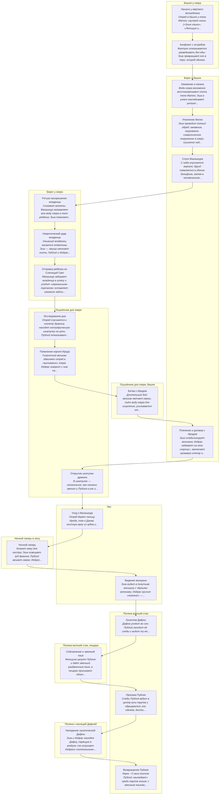

# Эпизод 13 — Возвращение: диаграмма событий

```mermaid
graph TD

    subgraph ep13_l1 [Башня у озера]
        ep13E01["Начало у мёртвого волшебника<br/><i>Отряд в башне у тела Матео; изучают книги («Злые языки», «Летиция и...</i>"]
        ep13E02["Конфликт с ястребом<br/><i>Фахтунг отказывается разведывать без еды; Эша превращает его в перо; ястреб обижен.</i>"]
    end

    subgraph ep13_l2 [Берег у башни]
        ep13E03["Омовение и паника<br/><i>Вода озера мгновенно восстанавливает плоть тела Матео; Эша в ужасе накладывает ритуал...</i>"]
        ep13E04["Упокоение Матео<br/><i>Эша проводит полный обряд: омовение, окуривание, символическое погружение в озеро, осушение над...</i>"]
        ep13E05["Спуск Махашкура<br/><i>С неба опускается зеркало; друид появляется в облике дельфина, затем в человеческом...</i>"]
        ep13E12["Пленение и договор с Иродом<br/><i>Эша стабилизирует великана; Игдрас надевает на него «корону», заключает кровавую клятву о...</i>"]
    end

    subgraph ep13_l3 [Берег у озера]
        ep13E06["Ритуал воскрешения младенца<br/><i>Снимают монеты; Махашкур направляет всю воду озера в тело ребёнка; Эша помогает...</i>"]
        ep13E07["Некротический удар младенца<br/><i>Оживший младенец касается отметины Эши — жрица начинает гнить; Публий и Игдрас...</i>"]
        ep13E08["Отправка ребёнка на Слепящий Свет<br/><i>Махашкур забирает младенца в шляпу и уходит «зеркальным» порталом; оставляет указание зайти...</i>"]
    end

    subgraph ep13_l4 [Осушённое дно озера]
        ep13E09["Исследование дна<br/><i>Отряд спускается к скелету дракона; находят октаэдрическую шкатулку на цепи; Публий откалывает...</i>"]
        ep13E10["Появление короля Ирода<br/><i>Гигантский великан обвиняет отряд в «выпивании» озера; Игдрас говорит с ним на...</i>"]
        ep13E13["Открытие шкатулки дракона<br/><i>В шкатулке — колокольчик; при касании звенит у Публия в ухе и...</i>"]
    end

    subgraph ep13_l5 [Осушённое дно озера, башня]
        ep13E11["Битва с Иродом<br/><i>Длительный бой: великан метает камни, пьёт воду озера для исцеления, усиливается от...</i>"]
    end

    subgraph ep13_l6 [Лес]
        ep13E14["Уход к Махашкуру<br/><i>Отряд берёт палицу Ирода, том о Данае, костную муку из зубов и...</i>"]
        ep13E16["Видение женщины<br/><i>Эша видит в полутьме женщину с чёрными волосами; Игдрас кричит «Агатка!» —...</i>"]
    end

    subgraph ep13_l7 [Ночной лагерь в лесу]
        ep13E15["Ночной лагерь<br/><i>Копают ямку для костра; Эша освещает зуб дракона; Публий вешает гамак; Игдрас...</i>"]
    end

    subgraph ep13_l8 [Поляна волчьей стаи]
        ep13E17["Лунатизм Дафны<br/><i>Дафна уходит во сне; Публий находит её следы и видит ту же...</i>"]
        ep13E19["Пропажа Публия<br/><i>Следы Публия ведут в центр кучи трупов и обрываются; его одежда, доспех,...</i>"]
        ep13E21["Возвращение Публия<br/><i>Через ~3 часа поисков Публий «выпадает» среди трупов голым, с змеиным языком;...</i>"]
    end

    subgraph ep13_l9 [Поляна волчьей стаи, пещера]
        ep13E18["Соблазнение и змеиный язык<br/><i>Женщина целует Публия и даёт змеиный раздвоенный язык; в пещере принимает облик...</i>"]
    end

    subgraph ep13_l10 [Поляна с висящей Дафной]
        ep13E20["Нападение лунатической Дафны<br/><i>Эша и Игдрас находят Дафну, парящую в воздухе; та оглушает Игдраса «колокольным»...</i>"]
    end

    ep13E01 --> ep13E02 --> ep13E03 --> ep13E04 --> ep13E05 --> ep13E06 --> ep13E07 --> ep13E08 --> ep13E09 --> ep13E10 --> ep13E11 --> ep13E12 --> ep13E13 --> ep13E14 --> ep13E15 --> ep13E16 --> ep13E17 --> ep13E18 --> ep13E19 --> ep13E20 --> ep13E21

```