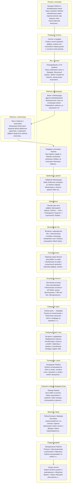

# Эпизод 14 — Дни минувшие: диаграмма событий

```mermaid
graph TD

    subgraph ep14_l1 [Поляна с волками]
        ep14E01["Находка Публия и возвращение языка<br/><i>Герои находят Публия обнажённым среди трупов волков; ему вернули язык таинственная женщина,...</i>"]
    end

    subgraph ep14_l2 [Пещера у поляны]
        ep14E02["Ночлег в пещере<br/><i>Отдых после привязки Дафны; утром она отгоняет падальщиков и чистит тела волков.</i>"]
    end

    subgraph ep14_l3 [Лес / поляна]
        ep14E03["Планирование и 5-й уровень<br/><i>Герои намечают путь в Храмуру: Мышиный король, Орден Соцветия, Светоч, монастырь; получают...</i>"]
    end

    subgraph ep14_l4 [Обитель Махашкура]
        ep14E04["Визит к Махашкуру<br/><i>Друид подтверждает безопасность Эши на Слепящем свете. Переводит надпись на шкатулке об...</i>"]
        ep14E06["Подарки и изгнание Публия<br/><i>Эше дарят шарф из бороды огненного великана; Игдрас не получает Фахтуна. Публий...</i>"]
    end

    subgraph ep14_l5 [Обитель / святилище]
        ep14E05["Урок о Ковене и лунатизме<br/><i>Махашкур объясняет природу ведьм (фейское царство) и советует Дафне приручить магию; молитва...</i>"]
    end

    subgraph ep14_l6 [Шумолесье дорога]
        ep14E07["Забвение Махашкура<br/><i>Вода Зиблиона стирает из памяти образы Махашкура и Агаты; группа идёт на...</i>"]
    end

    subgraph ep14_l7 [Шумолесье]
        ep14E08["Четыре дня пути<br/><i>Дафна тренирует магию; Публий — бой и «Планарную теорию» с спутницей; Игдрас...</i>"]
    end

    subgraph ep14_l8 [Волшебный лес]
        ep14E09["Встреча с единорогом<br/><i>Лес с магическими плодами; единорog объявляет зло в Публии, указывает обход через...</i>"]
    end

    subgraph ep14_l9 [Гнилая низина]
        ep14E10["Переход через болото<br/><i>Эша ведёт по воде «Хождением по воде»; гигантский крокодил хватает Дафну, затем...</i>"]
    end

    subgraph ep14_l10 [Островок в болоте]
        ep14E11["Нетленная останка<br/><i>Эша накладывает «Нетленную останку» (10 дней); нужны бриллианты (~300 зм) для «Воскрешения...</i>"]
    end

    subgraph ep14_l11 [Северный тракт]
        ep14E12["Смена цели — Храмура<br/><i>Отказ от монастыря и Рудничков; решение идти в Храмуру за камнями (~3...</i>"]
    end

    subgraph ep14_l12 [Северный тракт ночь]
        ep14E13["Встреча с караваном<br/><i>Квадратная повозка Алибастера; Алексис узнаёт «мёртвых» героев и пособников Халдура, берёт 400...</i>"]
    end

    subgraph ep14_l13 [Посмертие / река]
        ep14E14["Посмертие Публия<br/><i>Публий отказывается идти в лодку, читает стих, прыгает в «воду»; видит прощание...</i>"]
    end

    subgraph ep14_l14 [Указатель Ферма Бердара Блум]
        ep14E15["Приезд Лорана<br/><i>Эша ждёт в кустах; Лоран приезжает с охраной, даёт алмазы, соглашается укрыть...</i>"]
    end

    subgraph ep14_l15 [Ворота и город]
        ep14E16["Тайный въезд в Храмуру<br/><i>Листовки «разыскивается» на стенах; карета проезжает через толпу к форуму; герои переодеваются...</i>"]
    end

    subgraph ep14_l16 [Подвал верфей]
        ep14E17["Воскрешение Публия<br/><i>Ритуал с бриллиантами и молитвой к Адригалу; Публий выныривает из «воды» в...</i>"]
        ep14E18["Конец сессии<br/><i>Живой Публий узнаёт о самозванце в «Морском брюхе»; Лоран обещает рассказать о...</i>"]
    end

    ep14E01 --> ep14E02 --> ep14E03 --> ep14E04 --> ep14E05 --> ep14E06 --> ep14E07 --> ep14E08 --> ep14E09 --> ep14E10 --> ep14E11 --> ep14E12 --> ep14E13 --> ep14E14 --> ep14E15 --> ep14E16 --> ep14E17 --> ep14E18

```