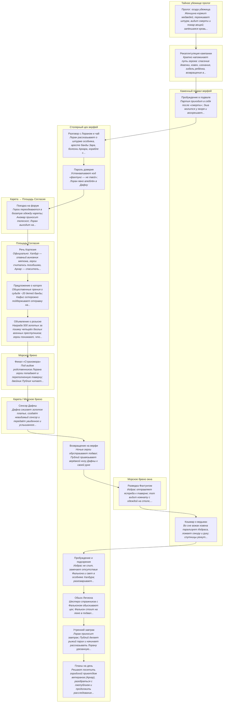

# Эпизод 15 — Осколки: диаграмма событий

```mermaid
graph TD

    subgraph ep15_l1 [Тайное убежище пролог]
        ep15E01["Пролог: осада убежища<br/><i>Женщина кормит медведей, переживает штурм, видит смерти и пожар вещей; запёкшаяся кровь...</i>"]
    end

    subgraph ep15_l2 [—]
        ep15E02["Рекаплитуляция кампании<br/><i>Кратко напоминает путь героев: спасение девочки, ковен, изгнание, гибель ребёнка, возвращение в...</i>"]
    end

    subgraph ep15_l3 [Каменный подвал верфей]
        ep15E03["Пробуждение в подвале<br/><i>Партия приходит в себя после «смерти»; Эша молится у якоря и воскрешает...</i>"]
        ep15E14["Кошмар о ведьмах<br/><i>Во сне вожак ковена парализует Игдраса, ломает секиру и руку; спутницы режут...</i>"]
    end

    subgraph ep15_l4 [Столярный цех верфей]
        ep15E04["Разговор с Лораном и чай<br/><i>Лоран рассказывает о штурме особняка, аресте банды Зара, болезни Архара, корабле с...</i>"]
        ep15E05["Пароль доверия<br/><i>Устанавливают код «фахтунг — не твой»; Лоран явно влюблён в Дафну</i>"]
        ep15E12["Возвращение на верфи<br/><i>Ночью герои обустраивают подвал; Публий привязывает верёвкой ногу Дафны к своей руке</i>"]
        ep15E15["Пробуждение и подозрения<br/><i>Игдрас не спит, замечает отсутствие Фалькона и свет в особняке Халдура; разговаривает...</i>"]
        ep15E16["Обыск Легиона<br/><i>Шестеро стражников с Фальконом обыскивают цех; Фалькон стоит на люке в подвал...</i>"]
        ep15E17["Утренний завтрак<br/><i>Лоран приносит завтрак; Публий делает рыжий парик и начинает рассказывать Лорану урезанную...</i>"]
        ep15E18["Планы на день<br/><i>Решают посетить городской приют/дом ветеранов (Архар), разобраться с лжепублием и продолжить расследование...</i>"]
    end

    subgraph ep15_l5 [Карета → Площадь Согласия]
        ep15E06["Поездка на форум<br/><i>Герои переодеваются в богатую одежду кареты; Ангмар приносит телескоп; Лоран выходит на...</i>"]
    end

    subgraph ep15_l6 [Площадь Согласия]
        ep15E07["Речь Кортезия<br/><i>Официально: Халдур — главный виновник мятежа, герои считались погибшими, Архар — спаситель...</i>"]
        ep15E08["Предложение о каторге<br/><i>Общественные прения о судьбе ~20 детей банды; Кафис осторожно поддерживает отправку на...</i>"]
        ep15E09["Объявление о розыске<br/><i>Награда 500 золотых за поимку четырёх беглых военных преступников; герои понимают, что...</i>"]
    end

    subgraph ep15_l7 [Морское брюхо]
        ep15E10["Финал «Страхомора»<br/><i>Под видом родственников Лорана герои попадают в переполненную таверну; двойник Публия читает...</i>"]
    end

    subgraph ep15_l8 [Карета / Морское брюхо]
        ep15E11["Сенсор Дафны<br/><i>Дафна сжигает золотое платье, создаёт невидимый сенсор и передаёт увиденное и услышанное...</i>"]
    end

    subgraph ep15_l9 [Морское брюхо окна]
        ep15E13["Разведка Фахтунгом<br/><i>Игдрас отправляет ястреба к таверне; тот видит комнату с одеждой на столе,...</i>"]
    end

    ep15E01 --> ep15E02 --> ep15E03 --> ep15E04 --> ep15E05 --> ep15E06 --> ep15E07 --> ep15E08 --> ep15E09 --> ep15E10 --> ep15E11 --> ep15E12 --> ep15E13 --> ep15E14 --> ep15E15 --> ep15E16 --> ep15E17 --> ep15E18

```