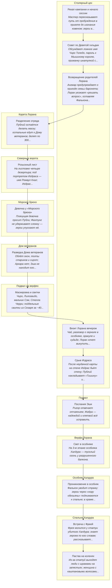

# Эпизод 16 — Переход: диаграмма событий

```mermaid
graph TD

    subgraph ep16_l1 [Столярный цех]
        ep16E01["Рекап кампании и начало сессии<br/><i>Мастер пересказывает путь от пробуждения в приюте до изгнания ковеном; герои в...</i>"]
        ep16E02["Совет по Девятой гильдии<br/><i>Обсуждают ложное имя Чиро Толедо, пароль к Мышиному королю, приманку шкатулкой с...</i>"]
        ep16E03["Возвращение родителей Лорана<br/><i>Ангмар предупреждает о приезде семьи баронета; Лоран уезжает «решать вопрос», оставляя Фалькона...</i>"]
        ep16E09["Визит Лорана вечером<br/><i>Чай, разговор о зеркале в особняке, оракуле и судьбе; Лоран хочет выкупить...</i>"]
        ep16E10["Срыв Игдраса<br/><i>После неудачной карты на стене Игдрас бьёт стену; Публий накладывает «Тишину» и...</i>"]
    end

    subgraph ep16_l2 [Карета Лорана]
        ep16E04["Разделение отряда<br/><i>Публий остаётся делать маску; остальные едут к Дому ветеранов; делят по 300...</i>"]
    end

    subgraph ep16_l3 [Северные ворота]
        ep16E05["Розыскный лист<br/><i>На листовке четыре дезертира; под портретом Игдраса — имя Ремвул Кхал; Игдрас...</i>"]
    end

    subgraph ep16_l4 [Морское брюхо]
        ep16E06["Девочка у «Морского брюха»<br/><i>Плачущая девочка просит Публи; Фахтунг не удерживает слежку — герои упускают её.</i>"]
    end

    subgraph ep16_l5 [Дом ветеранов]
        ep16E07["Разведка Дома ветеранов<br/><i>Облёт окон, толпы стариков и сирот; Архара нет; Эша не находит его...</i>"]
    end

    subgraph ep16_l6 [Подвал на верфях]
        ep16E08["Маскировка и свитки<br/><i>Чиро, Лилогвидо, мальчик Сэм, Стелла Черри; поддельные свитки из Сезаря за ~40...</i>"]
    end

    subgraph ep16_l7 [Подвал]
        ep16E11["Послания Эши<br/><i>Ригор отвечает отчаянием; Жабра — надеждой и клятвой всё исправить.</i>"]
    end

    subgraph ep16_l8 [Верфи Лорана]
        ep16E12["Свет в особняке<br/><i>На 3-м этаже особняка Халдура — тусклый огонь у разрушенного балкона.</i>"]
    end

    subgraph ep16_l9 [Особняк Халдура]
        ep16E13["Проникновение в особняк<br/><i>Фалькон уводит стражу; герои через «нору обезьяны» поднимаются к спальне; в храме...</i>"]
    end

    subgraph ep16_l10 [Спальня Халдура]
        ep16E14["Встреча с Фреей<br/><i>Фрея молится у статуи убитого Халдура; знает героев по его словам; рассказывает...</i>"]
        ep16E15["Паства на коленях<br/><i>Из-за статуй выходят люди с шрамами на запястьях; женщина с каштановыми волосами...</i>"]
    end

    ep16E01 --> ep16E02 --> ep16E03 --> ep16E04 --> ep16E05 --> ep16E06 --> ep16E07 --> ep16E08 --> ep16E09 --> ep16E10 --> ep16E11 --> ep16E12 --> ep16E13 --> ep16E14 --> ep16E15

```