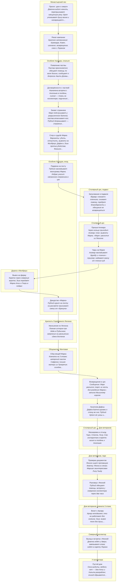

# Эпизод 17 — Паства: диаграмма событий

```mermaid
graph TD

    subgraph ep17_l1 [Монастырский лес]
        ep17E01["Пролог: урок о смерти<br/><i>Девочка видит нежить, перепрыгивает священную реку; брат упокаивает душу воина и «возвращает»...</i>"]
    end

    subgraph ep17_l2 [—]
        ep17E02["Рекап кампании<br/><i>Краткое напоминание: Храморра, Ковен, изгнание, возвращение, союз с Лораном</i>"]
    end

    subgraph ep17_l3 [Особняк Халдура, спальня]
        ep17E03["Появление паствы<br/><i>Паства преклоняется; обещает помощь по воле богини; сообщает о допросах Авити Догмы...</i>"]
        ep17E04["Договорённости с паствой<br/><i>Назначена встреча с Ансельмо в полдень; сигнал — ткань на коллекторе; поручения:...</i>"]
        ep17E05["Захват стражника<br/><i>Марк подслушивает у разрушенного балкона; паства втаскивает его; Публий допрашивает — стражник...</i>"]
        ep17E06["Спор о судьбе Марка<br/><i>Варианты: убить, отпустить, вывезти на Милброуз; Дафна и Эша против убийства; Фалькон...</i>"]
    end

    subgraph ep17_l4 [Особняк Халдура, вход]
        ep17E07["Подмена на посту<br/><i>Публий накладывает маскировку Марка; Игдрас уносит связанного стражника в цех</i>"]
        ep17E12["Дежурство «Марка»<br/><i>Публий курит на посту; на рассвете принимает смену от «Брехуна»</i>"]
    end

    subgraph ep17_l5 [Столярный цех, подвал]
        ep17E08["Запугивание в подвале<br/><i>Варвар «нюхает» пленника, снимает повязку, требует благодарности и обещания не возвращаться</i>"]
    end

    subgraph ep17_l6 [Столярный цех]
        ep17E09["Призыв Ангмара<br/><i>Через кольцо приходит Ангмар; план: вывезти Марка, «Марк» уволится из Легиона</i>"]
        ep17E10["Чары на Марке<br/><i>Ангмар накладывает дружбу и «пикник»-триггер; надевает маску от чтения губ</i>"]
        ep17E15["Возвращение в цех<br/><i>Сообщение: Марк уволился; торт «в честь дня рождения Марка»; записка Мышиному королю</i>"]
        ep17E16["Лунатизм Дафны<br/><i>Дафна бьётся руками о стену во сне; Публий будит её; розы и...</i>"]
    end

    subgraph ep17_l7 [Дорога к Милброуз]
        ep17E11["Вывоз на ферму<br/><i>Карета через северные ворота; Эша передаёт Марка Алии и Генри в подвал</i>"]
    end

    subgraph ep17_l8 [Крепость Серебряного Легиона]
        ep17E13["Увольнение из Легиона<br/><i>Ложная история про дядю в Рудничках; заявление на увольнение; сдача доспехов</i>"]
    end

    subgraph ep17_l9 [Общежитие, Мачтовая]
        ep17E14["Сбор вещей Марка<br/><i>Комната на 3 этаже; имперский свиток Сафрона; письмо матери из Троеречия; соседка...</i>"]
    end

    subgraph ep17_l10 [Столярный цех → Дом ветеранов]
        ep17E17["Маскировка и отъезд<br/><i>Чиро, Стелла, Лилу, Сэм; инструктаж в карете; визит в полдень к Ансельмо</i>"]
    end

    subgraph ep17_l11 [Дом ветеранов, парк]
        ep17E18["Проверка документов<br/><i>Легион ищет пропавшую девочку; Феона в слезах; Маршал заинтересован Лилу Гвиду</i>"]
        ep17E19["Разговор с Феоной<br/><i>Публий обещает помощь; встреча у северного коллектора через два часа</i>"]
    end

    subgraph ep17_l12 [Дом ветеранов, комната 3 этажа]
        ep17E20["Визит к Архару<br/><i>Архар неподвижен; очки не работают без хозяина; Эша: живое тело без души,...</i>"]
    end

    subgraph ep17_l13 [Северный коллектор]
        ep17E21["Выход и встреча с Феоной<br/><i>Девочка ждёт у двери; завязывают глаза; садят в карету Лорана</i>"]
    end

    subgraph ep17_l14 [У коллектора]
        ep17E22["Пустой дом<br/><i>Окна выбиты, мебели нет — дом Анны и Хальта разграблен; эпизод обрывается...</i>"]
    end

    ep17E01 --> ep17E02 --> ep17E03 --> ep17E04 --> ep17E05 --> ep17E06 --> ep17E07 --> ep17E08 --> ep17E09 --> ep17E10 --> ep17E11 --> ep17E12 --> ep17E13 --> ep17E14 --> ep17E15 --> ep17E16 --> ep17E17 --> ep17E18 --> ep17E19 --> ep17E20 --> ep17E21 --> ep17E22

```