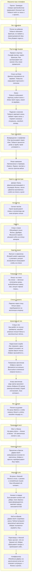

# Эпизод 18 — Кокон: диаграмма событий

```mermaid
graph TD

    subgraph ep18_l1 [Вершина горы голиафов]
        ep18E01["Пролог: Тримаури<br/><i>Семеро претендентов завершают длинный час; Тейвилл пьёт из чаши и с криком...</i>"]
    end

    subgraph ep18_l2 [Лес голиафов]
        ep18E02["Погоня за кабаном<br/><i>Тейвилл обгоняет братьев, но падает у замаскированной ямы; Рэм убивает паука в...</i>"]
    end

    subgraph ep18_l3 [Паутинная пещера]
        ep18E03["Провал в паутину<br/><i>Голиаф опутан, зовёт братьев; Рэм вытаскивает его палкой; Иль тоже провалился</i>"]
        ep18E04["Спуск за Илем<br/><i>Братья спускаются по верёвке; Тейвилла накрывает паутиной с потолка</i>"]
        ep18E05["Кокон<br/><i>Тейвилл поджигает паутину, видит кокон с Илем; бьёт паука, лезет по верёвке...</i>"]
        ep18E06["Падение с коконом<br/><i>Тейвилл хватает кокон, падает через огонь и теряет сознание; очнувшись, находит голову...</i>"]
    end

    subgraph ep18_l4 [Гора голиафов]
        ep18E07["Возвращение с трофеями<br/><i>Рэм приписывает паука Илю; Тейвилл приносит рыбу из пруда; трое успевают к...</i>"]
    end

    subgraph ep18_l5 [—]
        ep18E08["Рекап кампании<br/><i>Напоминание о Храморе, Ковене, Лоране, пастве и миссии против ведьм</i>"]
    end

    subgraph ep18_l6 [Карета у коллектора]
        ep18E09["Допрос Наэль<br/><i>Девочка рассказывает о кошмарах Фионы, песне «Девочка-припевочка», следе на стене и кукле</i>"]
    end

    subgraph ep18_l7 [Коллектор]
        ep18E10["Сигнал пастве<br/><i>Герой привязывает ткань к коллектору как знак встречи ночью</i>"]
    end

    subgraph ep18_l8 [Карета]
        ep18E11["Спор о плане<br/><i>Обсуждают поиск Фионы, Дурбара, Мышиного короля; решают идти за стену вечером</i>"]
    end

    subgraph ep18_l9 [Карета, приют]
        ep18E12["Фахтунг и наволочка<br/><i>Ястреб клюёт наволочку и улетает; ритуал ясновидения показывает следы на стене</i>"]
    end

    subgraph ep18_l10 [Городская стена]
        ep18E13["Лоскут на стене<br/><i>На стене — детские отпечатки крови, выдолбленные камни, люк; лоскут чёрной ткани...</i>"]
    end

    subgraph ep18_l11 [Стена у приюта]
        ep18E14["Перелаз через стену<br/><i>Ночью герои перебираются на восточную сторону</i>"]
    end

    subgraph ep18_l12 [Шумолесный лес]
        ep18E15["След в лес<br/><i>Эша ведёт по поиску предмета; находят влажный лоскут белья и маслянистые пятна...</i>"]
        ep18E16["Нарастание скорби<br/><i>Лес темнеет, звуки зверей стихают; на героев давит тоска; Игдрас признаётся в...</i>"]
        ep18E17["Появление светлячков<br/><i>Игдрас в ярости бросается на огоньки; Эша видит сплетение энергий жизни и...</i>"]
        ep18E18["Атака светлячков<br/><i>Шар света проходит сквозь Игдраса (15 урона электричеством); отряд отступает, Эша готовит...</i>"]
    end

    subgraph ep18_l13 [Лес к морю]
        ep18E19["Погоня за духами<br/><i>По крику девочки и следу энергии бегут к утёсу; находят пещеру со...</i>"]
    end

    subgraph ep18_l14 [Природный мост]
        ep18E20["Мост и Фиона<br/><i>На краю утёса — Фиона в белом; ~20 светлячков летят к ней...</i>"]
    end

    subgraph ep18_l15 [Каменный мост]
        ep18E21["Проклятие и бросок<br/><i>Дафна бьёт ведьмовским клинком по светлячку; Игдрас в ярости перебрасывает Эшу через...</i>"]
    end

    subgraph ep18_l16 [Морской утёс]
        ep18E22["Встреча с Фионой<br/><i>Фиона в слизи, с ранами и искажённым лицом; Эша обнимает её, читает...</i>"]
        ep18E23["Кинжал в сердце<br/><i>Эша вонзает кинжал под рёбра; тело девочки трансформируется, хватает жреца; начинается бой</i>"]
        ep18E24["Бой на обрыве<br/><i>Дафна бьёт снарядами хаоса; Публий атакует проклятый светлячок; Игдрас пытается вырвать Эшу...</i>"]
        ep18E25["Переговоры с Фионой<br/><i>Герои кричат, что не держат её; Игдрас сбрасывает секиры и предлагает себя...</i>"]
        ep18E26["Клиффхэнгер<br/><i>Убеждение Дафны на критический успех не спасает ситуацию — Фиона с куклой...</i>"]
    end

    ep18E01 --> ep18E02 --> ep18E03 --> ep18E04 --> ep18E05 --> ep18E06 --> ep18E07 --> ep18E08 --> ep18E09 --> ep18E10 --> ep18E11 --> ep18E12 --> ep18E13 --> ep18E14 --> ep18E15 --> ep18E16 --> ep18E17 --> ep18E18 --> ep18E19 --> ep18E20 --> ep18E21 --> ep18E22 --> ep18E23 --> ep18E24 --> ep18E25 --> ep18E26

```