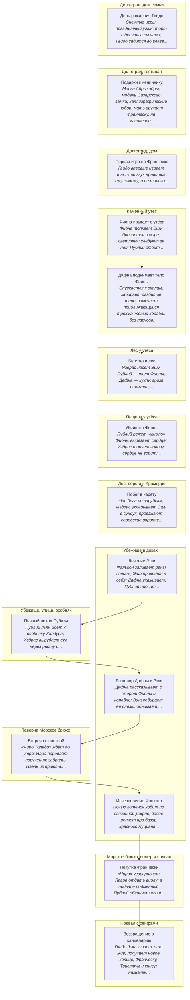

# Эпизод 19 — Королевство: диаграмма событий

```mermaid
graph TD

    subgraph ep19_l1 [Долгоград, дом семьи]
        ep19E01["День рождения Гвидо<br/><i>Снежные игры, праздничный ужин, торт с десятью свечами; Гвидо садится во главе...</i>"]
    end

    subgraph ep19_l2 [Долгоград, гостиная]
        ep19E02["Подарки имениннику<br/><i>Маска Абрыкабры, модель Сизарского замка, каллиграфический набор; мать вручает Франческу, на мгновение...</i>"]
    end

    subgraph ep19_l3 [Долгоград, дом]
        ep19E03["Первая игра на Франческе<br/><i>Гвидо впервые играет так, что звук нравится ему самому, а не только...</i>"]
    end

    subgraph ep19_l4 [Каменный утёс]
        ep19E04["Фиона прыгает с утёса<br/><i>Фиона толкает Эшу, бросается в море; светлячки следуют за ней; Публий стоит...</i>"]
        ep19E05["Дафна поднимает тело Фионы<br/><i>Спускается к скалам, забирает разбитое тело; замечает приближающийся трёхмачтовый корабль без парусов.</i>"]
    end

    subgraph ep19_l5 [Лес у утёса]
        ep19E06["Бегство в лес<br/><i>Игдрас несёт Эшу, Публий — тело Фионы, Дафна — куклу; гроза стихает,...</i>"]
    end

    subgraph ep19_l6 [Пещера у утёса]
        ep19E07["Убийство Фионы<br/><i>Публий режет «живую» Фиону, вырезает сердце; Игдрас топчет голову; сердце не горит;...</i>"]
    end

    subgraph ep19_l7 [Лес, дорога к Храморре]
        ep19E08["Побег в карету<br/><i>Час бега по зарубкам; Игдрас укладывает Эшу в сундук, проезжают городские ворота;...</i>"]
    end

    subgraph ep19_l8 [Убежище в доках]
        ep19E09["Лечение Эши<br/><i>Фалькон заливает раны зельем; Эша приходит в себя; Дафна ухаживает, Публий просит...</i>"]
        ep19E11["Разговор Дафны и Эши<br/><i>Дафна рассказывает о смерти Фионы и корабле; Эша собирает её слёзы, обнимает;...</i>"]
        ep19E13["Исчезновение Фантика<br/><i>Ночью котёнок ходит по связанной Дафне; голос шепчет про базар, красного Луциана...</i>"]
    end

    subgraph ep19_l9 [Убежище, улица, особняк]
        ep19E10["Пьяный поход Публия<br/><i>Публий пьян идёт к особняку Халдура; Игдрас вырубает его через рвоту и...</i>"]
    end

    subgraph ep19_l10 [Таверна Морское брюхо]
        ep19E12["Встреча с паствой<br/><i>«Чиро Толедо» ждёт до утра; Нара передаёт поручения: забрать Наэль из приюта,...</i>"]
    end

    subgraph ep19_l11 [Морское брюхо, номер и подвал]
        ep19E14["Покупка Франчески<br/><i>«Чиро» уговаривает Лавра отдать виолу; в подвале подменный Публий обвиняет его в...</i>"]
    end

    subgraph ep19_l12 [Подвал с сейфами]
        ep19E15["Возвращение в канцелярию<br/><i>Гвидо доказывает, что жив; получает новое кольцо, Франческу, Твиструм и книгу; назначен...</i>"]
    end

    ep19E01 --> ep19E02 --> ep19E03 --> ep19E04 --> ep19E05 --> ep19E06 --> ep19E07 --> ep19E08 --> ep19E09 --> ep19E10 --> ep19E11 --> ep19E12 --> ep19E13 --> ep19E14 --> ep19E15

```