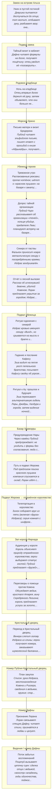

# Эпизод 20 — Всё, что было забыто: диаграмма событий

```mermaid
graph TD

    subgraph ep20_l1 [Замок на острове Альса]
        ep20E01["Ужин в пустой гостиной<br/><i>Девушка пытается достучаться до отца; тот молчит, отбивает руку, разбивает вазу; она...</i>"]
    end

    subgraph ep20_l2 [Подвал замка]
        ep20E02["Тайный визит в кабинет<br/><i>Дафна читает формулы на доске, получает пощёчину; отец уводит её «поговорить».</i>"]
    end

    subgraph ep20_l3 [Родовое кладбище]
        ep20E03["Ночь на кладбище<br/><i>Отец впервые долго держит её руку, затем объявляет, что они больше не...</i>"]
    end

    subgraph ep20_l4 [Морское брюхо]
        ep20E04["Письмо матери и визит Бродерика<br/><i>Публий читает эльфийское письмо, пишет ответ с просьбой о книге «Абрыкабры», получает...</i>"]
    end

    subgraph ep20_l5 [Убежище героев]
        ep20E05["Тревожное утро<br/><i>Распакованные рюкзаки; пропал котёнок; шёпот о «красном луциане» на базаре к закату;...</i>"]
        ep20E06["Допрос тайной организации<br/><i>Публий-Чиро рассказывает об организации «теней», кольце-убийце, предателе Леви; планируют встречу на базаре...</i>"]
        ep20E07["Секира от паствы<br/><i>Фалькон приносит новую металлическую секиру с посеребрёнными краями; Игдрас воодушевлён.</i>"]
        ep20E08["Отчёт о лесной вылазке<br/><i>Рассказ об исчезнувшей девочке, убитой Ковеном; Лоран предлагает укрытие за городом; Игдрас...</i>"]
    end

    subgraph ep20_l6 [Подвал убежища]
        ep20E09["Ритуал единения с секирой<br/><i>Игдрас кровью именует секиру «Винд», но срывается на мысли о брате и...</i>"]
        ep20E10["Гадание и послание Кафису<br/><i>Эша видит на пепле рост пепельного братства; посылает Кафису сводку об угрозе...</i>"]
        ep20E11["Ритуал к Ау: прошлое и будущее<br/><i>Эша переживает альтернативную гибель Лоры, Джабры, Халдура и города; затем видение ночной...</i>"]
    end

    subgraph ep20_l7 [Базар Храморры]
        ep20E12["Предупреждение Нары<br/><i>Через намёки Публий предупреждает: не уходить с фермы без согласования; люди с...</i>"]
        ep20E13["Путь в подвал Жерома<br/><i>Под предлогом поиска красного луциана компания спускается в склад; Лоран идёт с...</i>"]
    end

    subgraph ep20_l8 [Подвал Жерома → отражённое королевство]
        ep20E14["Телепортация в королевство<br/><i>Зинон собирает круг из пяти (включая «друга» Игдраса); серия комнат с шифром...</i>"]
    end

    subgraph ep20_l9 [Зал короля Фархада]
        ep20E15["Аудиенция у короля<br/><i>Король объясняет природу отражённого королевства; герои выбирают статус гостей; Публий предлагает «друзей»,...</i>"]
        ep20E16["Переговоры о помощи против Ковена<br/><i>Обсуждают ведьм, кристалл Атарея, вину Серебряного Легиона; король предлагает услуги за золото,...</i>"]
    end

    subgraph ep20_l10 [Кристальный дворец]
        ep20E17["Переезд в Кристальный дворец<br/><i>Венера слепит голову Игдраса из глины; герои получают номера, заказывают шумолесский баловник,...</i>"]
    end

    subgraph ep20_l11 [Номер Публия Кристальный дворец]
        ep20E18["План закупок<br/><i>Список: рука Игдраса, местонахождение Ковена и Риггера, сведения о ведьмах, оружие; спор...</i>"]
    end

    subgraph ep20_l12 [Номер Дафны]
        ep20E19["Признание Лорана<br/><i>Лоран связывает спящую Дафну, читает стихи, признаётся в любви и целует.</i>"]
    end

    subgraph ep20_l13 [Видения / номер Дафны]
        ep20E20["Поток забытых воспоминаний<br/><i>Поцелуй вызывает цепочку сцен: сделка отца с ведьмой, «монстр»-младенец, годы одиночества, поджог...</i>"]
    end

    ep20E01 --> ep20E02 --> ep20E03 --> ep20E04 --> ep20E05 --> ep20E06 --> ep20E07 --> ep20E08 --> ep20E09 --> ep20E10 --> ep20E11 --> ep20E12 --> ep20E13 --> ep20E14 --> ep20E15 --> ep20E16 --> ep20E17 --> ep20E18 --> ep20E19 --> ep20E20

```