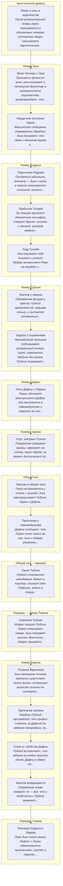

# Эпизод 21 — Фантом: диаграмма событий

```mermaid
graph TD

    subgraph ep21_l1 [Кристальный дворец]
        ep21E01["Рекап и ночь в королевстве<br/><i>После вступительной поэмы герои оказываются в одинаковых номерах постоялого двора; начинаются параллельные...</i>"]
    end

    subgraph ep21_l2 [Номер Эши]
        ep21E02["Визит Венеры к Эше<br/><i>Принцесса приносит вино, рассказывает о пепельном братстве и нейтралитете королевства; предупреждает, что...</i>"]
        ep21E03["Неудачное послание Наэль<br/><i>Магическое сообщение отражается обратно; Эша понимает, что связь с внешним миром и...</i>"]
    end

    subgraph ep21_l3 [Номер Игдраса]
        ep21E04["Подготовка Игдраса<br/><i>Пытается задымить комнату — дым и огонь в камине оказываются иллюзией; моется,...</i>"]
        ep21E05["Прибытие Тылайи<br/><i>За плащом приходит обнажённая голиафка; следует бурная «охота» с секирой, разгром мебели...</i>"]
        ep21E06["Уход Тылайи<br/><i>Она называет себя Тылайей и уходит; Игдрас вспоминает Рэма на корабле и...</i>"]
    end

    subgraph ep21_l4 [Номер Публия]
        ep21E07["Фантом у камина<br/><i>Обнажённая фигура у кресла; Публий прогоняет её, называя тенью, и пытается готовиться...</i>"]
        ep21E08["Борьба с отражением<br/><i>Чёрноволосая женщина подсовывает ритуальный кинжал, бьёт; появляется двойник без грима; Публий отвергает...</i>"]
    end

    subgraph ep21_l5 [Номер Дафны]
        ep21E09["Ночь Дафны и Лорана<br/><i>Лоран обнимает проснувшуюся Дафну; оба признаются в сомнамбулизме и смертях во сне;...</i>"]
    end

    subgraph ep21_l6 [Номера героев]
        ep21E10["Утро: завтраки Пузиля<br/><i>Полурослик собирает заказы; намекает на слежку через перлак; не может достучаться до...</i>"]
    end

    subgraph ep21_l7 [Общий зал]
        ep21E11["Завтрак в общем зале<br/><i>Герои встречаются у стола с вишней; Эша расспрашивает Публия; Лоран и Дафна...</i>"]
        ep21E12["Признание о сомнамбулизме<br/><i>Дафна сообщает, что Лоран тоже ходит во сне; Эша и Игдрас удивлены;...</i>"]
    end

    subgraph ep21_l8 [Общий зал → коридор]
        ep21E13["Срыв Публия<br/><i>Публий становится невидимым, бежит в коридор, слышит смех Габриэль, видит в плаще...</i>"]
    end

    subgraph ep21_l9 [Коридор → номер Лорана]
        ep21E14["Спасение Публия<br/><i>Игдрас тащит Публия, Лоран открывает номер; Эша собирает осколки Франчески; Игдрас приводит...</i>"]
    end

    subgraph ep21_l10 [Номер Лорана]
        ep21E15["Починка Франчески<br/><i>Эша заговором починки медленно срастляет части виолы; остальные выносят осколки на скатерти...</i>"]
        ep21E16["Признание шпиона<br/><i>Наедине Публий признаётся, что прибыл следить за Дафной по заданию канцелярии, но...</i>"]
        ep21E17["Отказ от убийства Дафны<br/><i>Публий вспоминает, что ведьма на утёсе просила убить Дафну в обмен на...</i>"]
        ep21E18["Фантом возвращается<br/><i>Отражение снова говорит «я — всё, что у тебя есть»; Публий заявляет,...</i>"]
    end

    subgraph ep21_l11 [Коридор / номер]
        ep21E19["Разговор Игдраса и Лорана<br/><i>Пока Эша чинит виолу, Игдрас и Лоран обмениваются признаниями, шутят о париках,...</i>"]
    end

    ep21E01 --> ep21E02 --> ep21E03 --> ep21E04 --> ep21E05 --> ep21E06 --> ep21E07 --> ep21E08 --> ep21E09 --> ep21E10 --> ep21E11 --> ep21E12 --> ep21E13 --> ep21E14 --> ep21E15 --> ep21E16 --> ep21E17 --> ep21E18 --> ep21E19

```