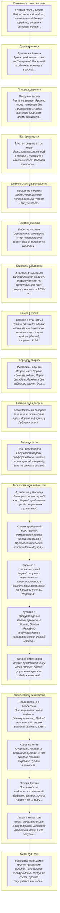

# Эпизод 22 — Трещина: диаграмма событий

```mermaid
graph TD

    subgraph ep22_l1 [Грозные острова, низины]
        ep22E01["Охота и флот у берега<br/><i>Игдрас не находит дичи; замечает ~10 боевых кораблей, идущих к острову; бежит...</i>"]
    end

    subgraph ep22_l2 [Деревня вождя]
        ep22E02["Делегация Аукана<br/><i>Аукан предлагает союз со Священной Империей в обмен на помощь в Великой...</i>"]
    end

    subgraph ep22_l3 [Площадь деревни]
        ep22E03["Поединок торма<br/><i>Мать вызывает Аукана; после тяжёлого боя проигрывает; чудом исцелена клириком; племя вступает...</i>"]
    end

    subgraph ep22_l4 [Шатёр вождихи]
        ep22E04["Миф о трещине и три имени<br/><i>Мать рассказывает миф о Лазаре и трещине в горе; называет Игдраса Иктросом,...</i>"]
    end

    subgraph ep22_l5 [Деревня, костёр, расщелина]
        ep22E05["Прощание с Рэмом<br/><i>Братья прощаются; ночная попойка; утром Рэм уплывает.</i>"]
    end

    subgraph ep22_l6 [Грозные острова]
        ep22E06["Побег на корабль<br/><i>Оставляет на дощечке «Иди, чтобы найти себя»; тайно садится на корабль к...</i>"]
    end

    subgraph ep22_l7 [Кристальный дворец]
        ep22E07["Утро после кошмаров<br/><i>Публий ломает скрипку; Дафна убегает по кровоточащей руке; сущность пишет «1288» и...</i>"]
    end

    subgraph ep22_l8 [Номер Публия]
        ep22E08["Договор с сущностью<br/><i>Публий признаёт сделку: отказ убить единорога, согласие «проткнуть сердце» (Фиона); получает 1288...</i>"]
    end

    subgraph ep22_l9 [Коридор дворца]
        ep22E09["Рукобой с Лораном<br/><i>Игдрас учит Лорана «бою взглядов»; Лоран дважды побеждает без видимого усилия; Эша...</i>"]
    end

    subgraph ep22_l10 [Главная зала дворца]
        ep22E10["Глаза Могилы на завтраке<br/><i>Эша видит одинаковую ауру у Лорана и Дафны; у Публия в этот...</i>"]
    end

    subgraph ep22_l11 [Главная зала]
        ep22E11["План переговоров<br/><i>Обсуждают перлак, предупреждение Венеры, список просьб к Фархаду; Эша не отдаст остров.</i>"]
    end

    subgraph ep22_l12 [Телепортационный остров]
        ep22E12["Аудиенция у Фархада<br/><i>Вино, разговор о первой ночи; Фархад предлагает торг без моральных ограничений.</i>"]
        ep22E13["Список требований<br/><i>Герои просят: помилование детей Ригора, сведения о Шумолесском ковене, освобождение друзей у...</i>"]
        ep22E14["Задание с кристаллотерией<br/><i>Фархад поручает перехватить кристаллотерию с корабля Торгового союза до Храморы (~50–60 стражей);...</i>"]
        ep22E15["Купание и предупреждение<br/><i>Игдрас прыгает с обрыва; Венера (дельфин) предупреждает о коварстве отца; Фархад магией...</i>"]
        ep22E16["Тайные переговоры<br/><i>Фархад предлагает силу через протез; сделка: улучшенная рука за победу в вечерней...</i>"]
    end

    subgraph ep22_l13 [Королевская библиотека]
        ep22E17["Исследование в библиотеке<br/><i>Эша ищет анатомию ведьм — безрезультатно; Публий находит «Историю правления Данаи»; 1288...</i>"]
        ep22E18["Кровь на книге<br/><i>Сущность пишет на странице о Данае: «Нам суждено править мирами»; Публий вырывает...</i>"]
        ep22E19["Потеря Дафны<br/><i>При выходе из лабиринта стеллажей Дафна отстаёт; группа теряет её из виду,...</i>"]
        ep22E20["Лоран и книга трав<br/><i>Лоран отдельно ищет книгу о травах Шевалиси (ботаника, связь с его недугом...</i>"]
    end

    subgraph ep22_l14 [Кузня Магнуса]
        ep22E21["Установка «Аверакма»<br/><i>Магнус прижигает культю, насаживает вольфрамовый гарпун на кость; протез ощущается как часть...</i>"]
    end

    ep22E01 --> ep22E02 --> ep22E03 --> ep22E04 --> ep22E05 --> ep22E06 --> ep22E07 --> ep22E08 --> ep22E09 --> ep22E10 --> ep22E11 --> ep22E12 --> ep22E13 --> ep22E14 --> ep22E15 --> ep22E16 --> ep22E17 --> ep22E18 --> ep22E19 --> ep22E20 --> ep22E21

```