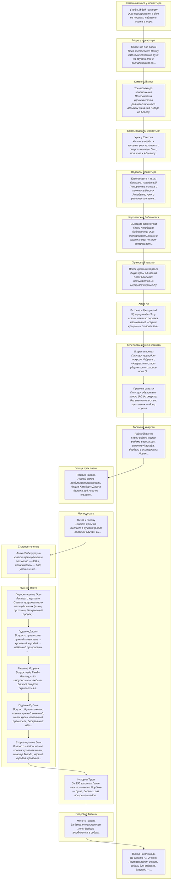

# Эпизод 23 — Равновесие: диаграмма событий

```mermaid
graph TD

    subgraph ep23_l1 [Каменный мост у монастыря]
        ep23E01["Учебный бой на мосту<br/><i>Эша проигрывает в бою на посохах, падает с моста в море.</i>"]
    end

    subgraph ep23_l2 [Море у монастыря]
        ep23E02["Спасение под водой<br/><i>Нога застревает между камнями; холодные руки на груди и спине выталкивают её...</i>"]
    end

    subgraph ep23_l3 [Каменный мост]
        ep23E03["Тренировка до изнеможения<br/><i>Вечером Эша упражняется в равновесии; видит вспышку лица Кая Юдора на берегу.</i>"]
    end

    subgraph ep23_l4 [Берег, подвалы монастыря]
        ep23E04["Урок у Светоча<br/><i>Учитель ведёт к засовам; рассказывает о смерти матери Эши, молитве к Адригалу...</i>"]
    end

    subgraph ep23_l5 [Подвалы монастыря]
        ep23E05["Юдоли света и тьмы<br/><i>Показаны пленённый Пожиратель солнца и проклятый посох Аннабета; урок о равновесии света...</i>"]
    end

    subgraph ep23_l6 [Королевская библиотека]
        ep23E06["Выход из библиотеки<br/><i>Герои покидают библиотеку; Эша подозревает Лорана в краже книги, но тот возвращает...</i>"]
    end

    subgraph ep23_l7 [Храмовый квартал]
        ep23E07["Поиск храма в квартале<br/><i>Ищут храм одного из пяти божеств; натыкаются на Церциллу в храме Ау.</i>"]
    end

    subgraph ep23_l8 [Храм Ау]
        ep23E08["Встреча с Церциллой<br/><i>Жрица узнаёт Эшу сквозь мантию перлака, называет её «серым жрецом» и отправляет...</i>"]
    end

    subgraph ep23_l9 [Телепортационная комната]
        ep23E09["Игдрас и протез<br/><i>Плутарх приводит мокрого Игдраса с «Аверакмом»; тот ударяется о силовое поле (9...</i>"]
        ep23E10["Правила схватки<br/><i>Плутарх объясняет: купол, бой до смерти, без вмешательства; противник — боец короля...</i>"]
    end

    subgraph ep23_l10 [Торговый квартал]
        ep23E11["Рабский рынок<br/><i>Герои видят торги рабами разных рас, статую Фархада, бордели с осимарками; Лоран...</i>"]
        ep23E22["Выход на площадь<br/><i>До заката ~1–2 часа; Плутарх ведёт искать собаку для Игдраса. Впереди —...</i>"]
    end

    subgraph ep23_l11 [Улица трёх лавок]
        ep23E12["Призыв Гавана<br/><i>Низкий голос предлагает воскресить «друга Казайсу»; Дафна делает вид, что не слышит.</i>"]
    end

    subgraph ep23_l12 [Час возврата]
        ep23E13["Визит к Гавану<br/><i>Узнают цены на контакт с душами (5 000 — простой случай, 15...</i>"]
        ep23E20["История Туши<br/><i>За 150 золотых Гаван рассказывает о Морбоке — душе, десятки раз воскрешавшейся...</i>"]
    end

    subgraph ep23_l13 [Сильное течение]
        ep23E14["Лавка Эмберкрауна<br/><i>Узнают цены (дыхание под водой — 300 з., невидимость — 500, уменьшение...</i>"]
    end

    subgraph ep23_l14 [Нужное место]
        ep23E15["Первое гадание Эши<br/><i>Ритуал с картами Сигила; пророчество о четырёх силах (агнец пустоты, бесцветный пророк,...</i>"]
        ep23E16["Гадание Дафны<br/><i>Вопрос о лунатизме: лунный правитель → кровавый чародей → небесный привратник →...</i>"]
        ep23E17["Гадание Игдраса<br/><i>Вопрос «где Рэм?»: беглец ушёл импульсивно с людьми, боится смерти, скрывается в...</i>"]
        ep23E18["Гадание Публия<br/><i>Вопрос об уничтожении ковена: лунный возничий, мать крови, пепельный правитель, бесцветный вор...</i>"]
        ep23E19["Второе гадание Эши<br/><i>Вопрос о слабом месте ковена: кровавая мать, монстр Тверди, чёрный чародей, кровавый...</i>"]
    end

    subgraph ep23_l15 [Подсобка Гавана]
        ep23E21["Монстр Гавана<br/><i>За дверью оказывается мопс; Игдрас влюбляется в собаку.</i>"]
    end

    ep23E01 --> ep23E02 --> ep23E03 --> ep23E04 --> ep23E05 --> ep23E06 --> ep23E07 --> ep23E08 --> ep23E09 --> ep23E10 --> ep23E11 --> ep23E12 --> ep23E13 --> ep23E14 --> ep23E15 --> ep23E16 --> ep23E17 --> ep23E18 --> ep23E19 --> ep23E20 --> ep23E21 --> ep23E22

```