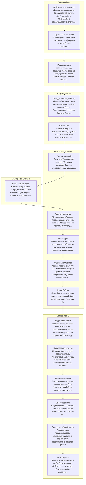

# Эпизод 24 — Зверь: диаграмма событий

```mermaid
graph TD

    subgraph ep24_l1 [Звёздный лес]
        ep24E01["Фейская пыль в пещере<br/><i>Друзья усыпляют друг друга фейской пылью; Гвидо остаётся сторожить и обнаруживает скелеты,...</i>"]
        ep24E02["Музыка против зверя<br/><i>Гвидо играет на скрипке в резонанс с вибрациями зверя ~2,5 часа, усыпляя...</i>"]
    end

    subgraph ep24_l2 [—]
        ep24E03["Река кампании<br/><i>Краткий пересказ событий с Храморри до текущего момента: ковен, пророк, Фархад, сделка...</i>"]
    end

    subgraph ep24_l3 [Звериная Яника]
        ep24E04["Поход в Звериную Янику<br/><i>Герои поднимаются по узкой лестнице; Игдрас ломает дверь. Осматривают вольеры, дарнинг Яники...</i>"]
        ep24E05["Щенок Пёс<br/><i>Игдрас выбирает избитого щенка, кормит его; Эша не может купить хомячка —...</i>"]
    end

    subgraph ep24_l4 [Кристальный дворец]
        ep24E06["Погоня за совой<br/><i>Сова крадёт ключ от номера 18; Игдрас гонится, Венера превращается из совы,...</i>"]
        ep24E08["Гадание на картах<br/><i>Три ритуала: «Рыцарь Крови» (опасность боя), карты о Жабре (миссия паствы, Светоч),...</i>"]
        ep24E09["Новая рука<br/><i>Магнус приносит боевую руку, уводит Игдраса на инструктаж; Лоран исчезает из комнаты.</i>"]
        ep24E10["Аудиенция Фархада<br/><i>Фархад предлагает 300 000 золотых за остров Дафны, угрожая конфискацией; Дафна отказывает....</i>"]
        ep24E11["Арест Публия<br/><i>Семь фигур в пурпурных мантиях уводят Публия на допрос по подозрению в...</i>"]
    end

    subgraph ep24_l5 [Мастерская Венеры]
        ep24E07["Встреча с Венерой<br/><i>Венера возвращает птицу, рассказывает о ягодах на трёх деревах арены, предупреждает о...</i>"]
    end

    subgraph ep24_l6 [Остров арены]
        ep24E12["Подготовка к бою<br/><i>Игдрас отказывается от шлема, пьёт обезболивающее зелье, телепортируется на остров; видит Венеру...</i>"]
        ep24E13["Королевская встреча<br/><i>Короли обмениваются любезностями, демонстрируют детей; Фархад магически заставляет Венеру встать.</i>"]
        ep24E14["Начало поединка<br/><i>Купол закрывает арену; из клетки выходит девушка в свадебном платье, при луне...</i>"]
        ep24E15["Бой с кабанихой<br/><i>Игдрас входит в ярость; кабаниха насаживает его на бивни, он слепит её,...</i>"]
        ep24E16["Проклятие чёрной крови<br/><i>Тело девушки превращается в изуродованный труп; чёрная кровь перетекает в Игдраса. Публий...</i>"]
        ep24E17["Уход с арены<br/><i>Венера превращается в медведицу и уносит Игдраса к телепорту; Плутарх несёт останки...</i>"]
    end

    ep24E01 --> ep24E02 --> ep24E03 --> ep24E04 --> ep24E05 --> ep24E06 --> ep24E07 --> ep24E08 --> ep24E09 --> ep24E10 --> ep24E11 --> ep24E12 --> ep24E13 --> ep24E14 --> ep24E15 --> ep24E16 --> ep24E17

```