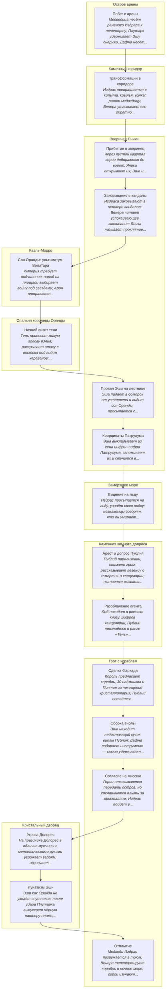

# Эпизод 25 — Каждый из нас: диаграмма событий

```mermaid
graph TD

    subgraph ep25_l1 [Остров арены]
        ep25E01["Побег с арены<br/><i>Медведица несёт раненого Игдраса к телепорту; Плутарх удерживает Эшу снаружи, Дафна несёт...</i>"]
    end

    subgraph ep25_l2 [Каменный коридор]
        ep25E02["Трансформации в коридоре<br/><i>Игдрас превращается в копыта, крылья, волка; ранит медведицу; Венера утаскивает его обратно...</i>"]
    end

    subgraph ep25_l3 [Зверинец Яники]
        ep25E03["Прибытие в зверинец<br/><i>Через пустой квартал герои добираются до ворот; Яника открывает их, Эша и...</i>"]
        ep25E04["Заковывание в кандалы<br/><i>Игдраса заковывают в четверо кандалов; Венера читает успокаивающее заклинание; Яника называет проклятие...</i>"]
        ep25E07["Провал Эши на лестнице<br/><i>Эша падает в обморок от усталости и видит сон Оранды; просыпается с...</i>"]
        ep25E08["Координаты Патрулума<br/><i>Эша выкладывает из сена цифры шифра Патрулума, запоминает их и стучится в...</i>"]
    end

    subgraph ep25_l4 [Каэль-Морро]
        ep25E05["Сон Оранды: ультиматум Волатара<br/><i>Империя требует подчинения; народ на площади выбирает войну под звёздами; Арон отправляет...</i>"]
    end

    subgraph ep25_l5 [Спальня королевы Оранды]
        ep25E06["Ночной визит тени<br/><i>Тень приносит живую голову Юлия; раскрывает атаку с востока под видом караванов;...</i>"]
    end

    subgraph ep25_l6 [Замёрзшее море]
        ep25E09["Видение на льду<br/><i>Игдрас просыпается на льду, узнаёт свою лодку; незнакомцы говорят, что он умирает...</i>"]
    end

    subgraph ep25_l7 [Каменная комната допроса]
        ep25E10["Арест и допрос Публия<br/><i>Публий парализован, снимает грим, рассказывает легенду о «смерти» и канцелярии; пытается вызвать...</i>"]
        ep25E11["Разоблачение агента<br/><i>Лоб находит в рюкзаке книгу шифров канцелярии; Публий признаётся в ранге «Тень»...</i>"]
    end

    subgraph ep25_l8 [Грот с кораблём]
        ep25E12["Сделка Фархада<br/><i>Король предлагает корабль, 30 наёмников и Понтия за похищение кристаллотария; Публий остаётся...</i>"]
        ep25E13["Сборка виолы<br/><i>Эша находит недостающий кусок виолы Публия; Дафна собирает инструмент — магия удерживает...</i>"]
        ep25E14["Согласие на миссию<br/><i>Герои отказываются передать остров, но соглашаются плыть за кристаллом; Игдрас пойдёт в...</i>"]
        ep25E17["Отплытие<br/><i>Медведь-Игдрас погружается в трюм; Венера телепортирует корабль в ночное море; герои изучают...</i>"]
    end

    subgraph ep25_l9 [Кристальный дворец]
        ep25E15["Угроза Долорес<br/><i>На празднике Долорес в обличье мужчины с металлическими руками угрожает героям; назначает...</i>"]
        ep25E16["Лунатизм Эши<br/><i>Эша как Оранда не узнаёт спутников; после удара Плутарха выпускает чёрную пантеру-пламя;...</i>"]
    end

    ep25E01 --> ep25E02 --> ep25E03 --> ep25E04 --> ep25E05 --> ep25E06 --> ep25E07 --> ep25E08 --> ep25E09 --> ep25E10 --> ep25E11 --> ep25E12 --> ep25E13 --> ep25E14 --> ep25E15 --> ep25E16 --> ep25E17

```