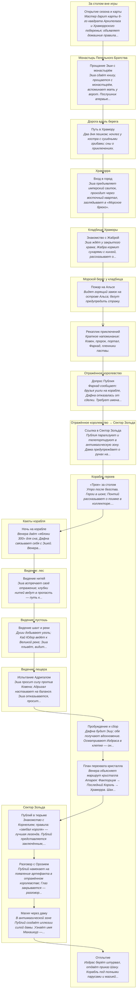

# Эпизод 26 — Трое: диаграмма событий

```mermaid
graph TD

    subgraph ep26_l1 [За столом вне игры]
        ep26E01["Открытие сезона и карты<br/><i>Мастер дарит карты 6-го квадрата Архипелага и Храморрского побережья; объявляет домашние правила...</i>"]
    end

    subgraph ep26_l2 [Монастырь Пепельного Братства]
        ep26E02["Прощание Эши с монастырём<br/><i>Эша сдаёт книгу, прощается с монастырём, вспоминает мать у ворот. Послушник впервые...</i>"]
    end

    subgraph ep26_l3 [Дорога вдоль берега]
        ep26E03["Путь в Храмору<br/><i>Два дня пешком; ночлег у костра с сушёными грибами; сны о приключениях.</i>"]
    end

    subgraph ep26_l4 [Храморра]
        ep26E04["Вход в город<br/><i>Эша предъявляет имперский свиток, проходит через восточный квартал, заглядывает в «Морское брюхо».</i>"]
    end

    subgraph ep26_l5 [Кладбище Храморы]
        ep26E05["Знакомство с Жаброй<br/><i>Эша ждёт у закрытого храма; Жабра кормит сухарями с кинзой, рассказывает о...</i>"]
    end

    subgraph ep26_l6 [Морской берег у кладбища]
        ep26E06["Пожар на Альсе<br/><i>Видят горящий замок на острове Альса; бегут предупредить стражу.</i>"]
    end

    subgraph ep26_l7 [—]
        ep26E07["Рекаплик приключений<br/><i>Краткое напоминание: Ковен, пророк, портал, Фархад, пленники паствы.</i>"]
    end

    subgraph ep26_l8 [Отражённое королевство]
        ep26E08["Допрос Публия<br/><i>Фархад сообщает: друзья ушли на корабле, Дафна отказалась от сделки. Требует имена...</i>"]
    end

    subgraph ep26_l9 [Отражённое королевство → Сектор Зольда]
        ep26E09["Ссылка в Сектор Зольда<br/><i>Публия парализуют и телепортируют в антимагическую зону. Дама предупреждает о рунах на...</i>"]
    end

    subgraph ep26_l10 [Корабль героев]
        ep26E10["«Трое» за столом<br/><i>Утро после бегства. Герои в шоке; Понтий рассказывает о поимке в коллекторе....</i>"]
        ep26E15["Пробуждение и сбор<br/><i>Дафна будит Эшу; обе получают вдохновение. Осматривают Игдраса в клетке — он...</i>"]
        ep26E16["План перехвата кристалла<br/><i>Венера объясняет маршрут кристалла Атарея: Факториум → Последний Король → Храморра. Шах...</i>"]
        ep26E20["Отплытие<br/><i>Игдрас берёт штурвал, отдаёт приказ Шаху. Корабль под полными парусами и магией...</i>"]
    end

    subgraph ep26_l11 [Каюты корабля]
        ep26E11["Ночь на корабле<br/><i>Венера даёт «яблоки 300» для сна; Дафна связывает себя с Эшей. Венера...</i>"]
    end

    subgraph ep26_l12 [Видение: лес]
        ep26E12["Видение нитей<br/><i>Эша встречает своё отражение; клубки нитей ведут в пропасть — путь к...</i>"]
    end

    subgraph ep26_l13 [Видение: пустошь]
        ep26E13["Видение шахт и реки<br/><i>Души добывают уголь; Кай Юдор ведёт к Великой реке; Эша плывёт, видит...</i>"]
    end

    subgraph ep26_l14 [Видение: пещера]
        ep26E14["Испытание Адригалом<br/><i>Эша просит силу против Ковена; Адригал настаивает на балансе. Эша отказывается, просит...</i>"]
    end

    subgraph ep26_l15 [Сектор Зольда]
        ep26E17["Публий в тюрьме<br/><i>Знакомство с Корнелием; правила: «заебал короля» — лучшая легенда. Публий представляется заключённым,...</i>"]
        ep26E18["Разговор с Орозием<br/><i>Публий намекает на появление артефакта в отражённом королевстве; Глаз закрывается — разговор...</i>"]
        ep26E19["Магия через даму<br/><i>В антимагической зоне Публий создаёт иллюзии силой дамы. Узнаёт имя Махашкур —...</i>"]
    end

    ep26E01 --> ep26E02 --> ep26E03 --> ep26E04 --> ep26E05 --> ep26E06 --> ep26E07 --> ep26E08 --> ep26E09 --> ep26E10 --> ep26E11 --> ep26E12 --> ep26E13 --> ep26E14 --> ep26E15 --> ep26E16 --> ep26E17 --> ep26E18 --> ep26E19 --> ep26E20

```