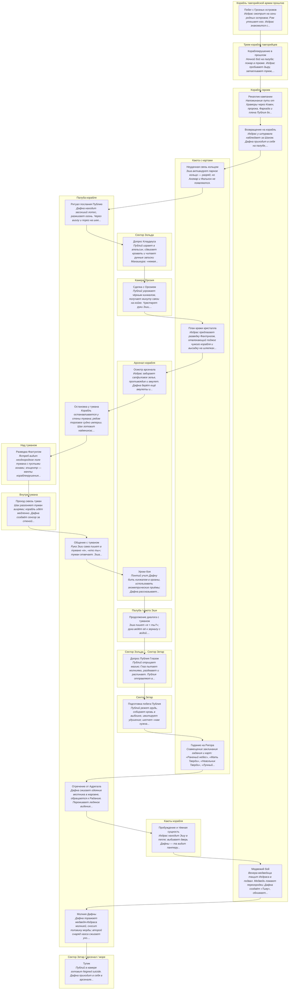

# Эпизод 27 — Тупик: диаграмма событий

```mermaid
graph TD

    subgraph ep27_l1 [Корабль тавгорийской армии прошлое]
        ep27E01["Побег с Грозных островов<br/><i>Игдрас смотрит на огни родных островов; Рэм утешает его. Игдрас знакомится с...</i>"]
    end

    subgraph ep27_l2 [Трюм корабля тавгорийцев]
        ep27E02["Кораблекрушение в прошлом<br/><i>Ночной бой на палубе; пожар в трюме. Игдрас пробивает дыру, затапливает трюм,...</i>"]
    end

    subgraph ep27_l3 [Корабль героев]
        ep27E03["Рекаплик кампании<br/><i>Напоминание пути от Храморы через Ковен, пророка, Фархада и плена Публия до...</i>"]
        ep27E04["Возвращение на корабль<br/><i>Игдрас у штурвала наблюдает за Шахом. Дафна приходит в себя на палубе,...</i>"]
        ep27E22["Медвежий бой<br/><i>Венера-медведица тащит Игдраса в подвал. Медведи ломают перегородки; Дафна создаёт «Тьму», обнимает...</i>"]
    end

    subgraph ep27_l4 [Каюта с картами]
        ep27E05["Неудачная связь кольцом<br/><i>Эша активирует парное кольцо — разряд, но Ангмар и Фалькон не появляются.</i>"]
        ep27E09["План кражи кристалла<br/><i>Игдрас предлагает разведку Фахтунгом, отвлекающий поджог чужого корабля и высадку на шлюпках...</i>"]
        ep27E19["Гадание на Ригора<br/><i>Совмещение заклинания гадания и карт: «Раненый небес», «Мать Тверди», «Невольник Тверди», «Лунный...</i>"]
    end

    subgraph ep27_l5 [Палуба корабля]
        ep27E06["Ритуал послания Публию<br/><i>Дафна находит засохший лотос, разжигает огонь. Через виолу и порез на шее...</i>"]
        ep27E11["Остановка у тумана<br/><i>Корабль останавливается у стены тумана; рядом торговое судно империи. Шах готовит наёмников;...</i>"]
        ep27E14["Общение с туманом<br/><i>Рука Эши сама пишет в тумане «я», «кто ты»; туман отвечает. Эша...</i>"]
        ep27E20["Отречение от Адрегала<br/><i>Дафна сжигает одеяние вестника в жаровне, обращается к Раданию. Переживает ледяное видение...</i>"]
        ep27E23["Молния Дафны<br/><i>Дафна поражает медведя-Игдраса молнией, сносит половину морды; второй снаряд хаоса сжигает ухо....</i>"]
    end

    subgraph ep27_l6 [Сектор Зольда]
        ep27E07["Допрос Клаудиуса<br/><i>Публий играет в апельсин, сдвигает кровать и читает рунные записки Махашкура: «немая...</i>"]
    end

    subgraph ep27_l7 [Камера Орозия]
        ep27E08["Сделка с Орозием<br/><i>Публий угрожает чёрным кинжалом, получает минуту связи на койке. Чувствует руки Эши,...</i>"]
    end

    subgraph ep27_l8 [Арсенал корабля]
        ep27E10["Осмотр арсенала<br/><i>Игдрас забирает сапфиловое зелье, противоядие и амулет. Дафна берёт ещё амулеты и...</i>"]
        ep27E15["Уроки боя<br/><i>Понтий учит Дафну бить кинжалом в органы, использовать геометрические приёмы; Дафна рассказывает...</i>"]
    end

    subgraph ep27_l9 [Над туманом]
        ep27E12["Разведка Фахтунгом<br/><i>Ястреб видит неоднородное поле тумана с пустыми зонами; эпицентр — мачты кораблекрушения...</i>"]
    end

    subgraph ep27_l10 [Внутри тумана]
        ep27E13["Проход сквозь туман<br/><i>Шах разгоняет туман вихрями; корабль идёт медленно. Дафна создаёт сенсор за стеной...</i>"]
    end

    subgraph ep27_l11 [Палуба / каюта Эши]
        ep27E16["Продолжение диалога с туманом<br/><i>Эша пишет «я = ты?»; рука ведёт её к зеркалу с водой....</i>"]
    end

    subgraph ep27_l12 [Сектор Зольда → Сектор Зетар]
        ep27E17["Допрос Публия Глазом<br/><i>Публий отрицает магию; Глаз пытает молниями, раздевает и распинает. Публия отправляют в...</i>"]
    end

    subgraph ep27_l13 [Сектор Зетар]
        ep27E18["Подготовка побега Публия<br/><i>Публий режет грудь, собирает кровь в выбоине, имитирует удушение; шепчет «нам нужна...</i>"]
    end

    subgraph ep27_l14 [Каюты корабля]
        ep27E21["Пробуждение и тёмная сущность<br/><i>Игдрас находит Эшу в пепле; выбивает дверь Дафны — та видит пантеру...</i>"]
    end

    subgraph ep27_l15 [Сектор Зетар / арсенал / море]
        ep27E24["Тупик<br/><i>Публий в камере готовит feigned suicide. Дафна приходит в себя в арсенале...</i>"]
    end

    ep27E01 --> ep27E02 --> ep27E03 --> ep27E04 --> ep27E05 --> ep27E06 --> ep27E07 --> ep27E08 --> ep27E09 --> ep27E10 --> ep27E11 --> ep27E12 --> ep27E13 --> ep27E14 --> ep27E15 --> ep27E16 --> ep27E17 --> ep27E18 --> ep27E19 --> ep27E20 --> ep27E21 --> ep27E22 --> ep27E23 --> ep27E24

```