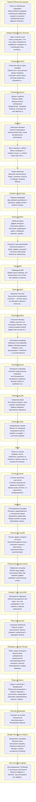

# Эпизод 28 — Мертвецы: диаграмма событий

```mermaid
graph TD

    subgraph ep28_l1 [Таверна Облачный коридор]
        ep28E01["Месть в «Облачном коридоре»<br/><i>Юный Публий избивает племянника префекта, играет на скрипке «предательство» девушке Ковиде и...</i>"]
    end

    subgraph ep28_l2 [Камера Серебряного Легиона]
        ep28E02["Арест и визит отца<br/><i>Отец сообщает, что сын избил племянника префекта; умирает на следующую ночь, пытаясь...</i>"]
    end

    subgraph ep28_l3 [Камера флешбек]
        ep28E03["Открытие магии через комаров<br/><i>Публий ест насыщенных кровью комаров, получает запас магии; женская сущность обнимает и...</i>"]
    end

    subgraph ep28_l4 [Комната допроса]
        ep28E04["Допрос трибуна<br/><i>Публий сдаёт вымышленных сообщников (Труфальдор, Тавгарий, Родана), получает 20 лет вместо 3.</i>"]
    end

    subgraph ep28_l5 [Камера]
        ep28E05["Имитация безумия<br/><i>Публий симулирует помешательство; глаза внимательно наблюдают.</i>"]
        ep28E06["Весть матери о побеге<br/><i>Мать сообщает о смерти отца и о побеге через три дня с...</i>"]
    end

    subgraph ep28_l6 [—]
        ep28E07["Рекап кампании<br/><i>Краткое напоминание: Ковен, изгнание, миссия к острову, тюрьма Публия.</i>"]
    end

    subgraph ep28_l7 [Корабль второй ярус]
        ep28E08["Падение медведей<br/><i>Два медведя выпадают в пробоину; Дафна видит только пузыри.</i>"]
    end

    subgraph ep28_l8 [Каюта корабля]
        ep28E09["Убийство Шаха<br/><i>Дафна атакует огненным шаром и молниями, разрывает грудь и забирает амулет; узнаёт...</i>"]
        ep28E10["Контроль над наёмниками<br/><i>Приложив амулет к груди, Дафна ощущает ~30 копий себя среди девянских наёмников...</i>"]
    end

    subgraph ep28_l9 [Под водой]
        ep28E11["Подводный бой<br/><i>Игдрас ранит Венеру, та втаскивает его на дно; оба теряют сознание.</i>"]
    end

    subgraph ep28_l10 [Трюм корабля]
        ep28E12["Видение тени Кая<br/><i>Эша видит призрачного учителя — осколок души; он обещает обучать, пока она...</i>"]
    end

    subgraph ep28_l11 [Палуба корабля]
        ep28E13["Спасение Венеры<br/><i>Игдрас выносит не дышащую Венеру; Эша стабилизирует водой; Дафна без сознания с...</i>"]
        ep28E14["Связывание медведя<br/><i>Наёмники под командой Дафны обездвиживают Игдраса; Эша приказывает «Лежать!» — он подчиняется.</i>"]
    end

    subgraph ep28_l12 [Палуба палатка]
        ep28E15["Операция на Венере<br/><i>Часовая хирургическая операция: восстановление внутренних органов; Венера уходит в глубокий сон.</i>"]
    end

    subgraph ep28_l13 [Нижняя палуба]
        ep28E16["Сожжение Шаха<br/><i>Тело Шаха сожжено; прах развеян перчатками; Дафна забирает магические перчатки.</i>"]
    end

    subgraph ep28_l14 [Открытое море]
        ep28E17["Развеивание тумана<br/><i>Ветер от перчаток открывает вид на корабль на рифах — источник тумана.</i>"]
    end

    subgraph ep28_l15 [Море]
        ep28E18["Побег из тумана<br/><i>Корабль чинит пробоины, выходит из тумана к закату; курс на остров Последний...</i>"]
    end

    subgraph ep28_l16 [Клетка в трюме]
        ep28E19["Снятие проклятия (частично)<br/><i>«Снятие проклятия» временно выводит чёрную кровь пеплом, но проклятие возвращается.</i>"]
    end

    subgraph ep28_l17 [Корабль]
        ep28E20["Планирование высадки<br/><i>Решают швартоваться у постоялого двора, переодеть наёмников, Игдрас выйдет утром; обсуждают кражу...</i>"]
    end

    subgraph ep28_l18 [Палатка на палубе]
        ep28E21["Чтение «Дома, которого не было»<br/><i>Эша дочитывает книгу и получает знания о магических пространствах и архитектуре.</i>"]
    end

    subgraph ep28_l19 [Остров Последний Король]
        ep28E22["Прибытие к острову<br/><i>Видят гору, верфь, постоялый двор, два корабля; Дафна надевает капитанскую шляпу.</i>"]
    end

    subgraph ep28_l20 [Камера / морг флешбек]
        ep28E23["Притворство мёртвым<br/><i>Публий маскируется под труп; луч глаз «проверяет» его; перенос в другое помещение.</i>"]
    end

    subgraph ep28_l21 [Морг-мастерская]
        ep28E24["Спасение Эгемоном<br/><i>Публий пугает служителей, Эгемон убивает свидетелей и забирает Публия.</i>"]
    end

    subgraph ep28_l22 [Коридоры сектора Зитара]
        ep28E25["Побег через телепорты<br/><i>Проход мимо следователя-полурослика к телепортационной комнате; цепочка телепортов в подвал Храморы.</i>"]
    end

    subgraph ep28_l23 [Морское брюхо]
        ep28E26["Отдых и разговор с Бродериком<br/><i>Публий рассказывает о Ковене, Фархаде и кристалле; канцелярия поручает предупредить агента «Шрам»...</i>"]
    end

    subgraph ep28_l24 [Телепорт Храморра]
        ep28E27["Телепорт на остров<br/><i>Ритуальная телепортация к Последнему Королю.</i>"]
    end

    subgraph ep28_l25 [Верфь Последнего Короля]
        ep28E28["Швартовка и высадка<br/><i>Паскаль Гросс принимает корабль; наёмники прячутся; Венера и щенок остаются на борту.</i>"]
    end

    subgraph ep28_l26 [Зал постоялого двора]
        ep28E29["Воссоединение с Публием<br/><i>С лестницы спускается Публий в берете и доспехе; Эша обнимает его; Дафна...</i>"]
    end

    ep28E01 --> ep28E02 --> ep28E03 --> ep28E04 --> ep28E05 --> ep28E06 --> ep28E07 --> ep28E08 --> ep28E09 --> ep28E10 --> ep28E11 --> ep28E12 --> ep28E13 --> ep28E14 --> ep28E15 --> ep28E16 --> ep28E17 --> ep28E18 --> ep28E19 --> ep28E20 --> ep28E21 --> ep28E22 --> ep28E23 --> ep28E24 --> ep28E25 --> ep28E26 --> ep28E27 --> ep28E28 --> ep28E29

```