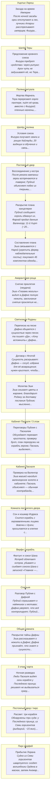

# Эпизод 29 — Последний король: диаграмма событий

```mermaid
graph TD

    subgraph ep29_l1 [Ущелье Ларош]
        ep29E01["Засада на армию Империи<br/><i>После ночной засады орки отступают в лес, лучники Атарии расстреливают имперцев; Фигура...</i>"]
    end

    subgraph ep29_l2 [Шатёр Теры]
        ep29E02["Предложение кровного союза<br/><i>Фигура требует «родства» через ритуал; Арон чуть не задушивает её, но Тера...</i>"]
    end

    subgraph ep29_l3 [Поляна ритуала]
        ep29E03["Жертва Марнель<br/><i>Тера перерезает горло пантере, пьёт её кровь вместе с Фигурой; пленные казнены,...</i>"]
    end

    subgraph ep29_l4 [Шатёр / поляна]
        ep29E04["Условия союза<br/><i>Фигура получает земли в рощах Кайлауды, 20 видящих в обучение и связь...</i>"]
    end

    subgraph ep29_l5 [Постоялый двор]
        ep29E05["Воссоединение у костра<br/><i>После рекапа кампании герои встречаются в таверне; Публий объясняет побег из тюрьмы,...</i>"]
        ep29E06["Раскрытие плана канцелярии<br/><i>Публий сообщает: король обманул их, Фархад продал данные Валенгору; 11-й Хирт (~20...</i>"]
        ep29E07["Составление плана<br/><i>Эша связывается с Нарой (укрепить ферму, наблюдательные посты); покупают 45 комплектов одежды...</i>"]
    end

    subgraph ep29_l6 [Амарантовая роща]
        ep29E08["Снятие проклятия (неудача)<br/><i>Эша «Глазами могилы» видит в Дафне полную нежить; заклинание снятия проклятия не...</i>"]
    end

    subgraph ep29_l7 [Святилище Роданы]
        ep29E09["Переписка на песке<br/><i>Дафна общается с сущностью через песок; та пишет «Да», «Хочу вспомнить»; Дафна...</i>"]
        ep29E10["Договор с Флэтой<br/><i>Сущность раскрывает: Дафна — сосуд, избрана для её возвращения; нужен кристалл, чтобы...</i>"]
        ep29E11["Молитва Эши<br/><i>Эша сжигает цветы в жаровне, благодарит Родану за доставку послания Публию; мысленно...</i>"]
    end

    subgraph ep29_l8 [Кабинет Паскаля / 3 этаж]
        ep29E12["Переговоры Публия с Паскалем<br/><i>Обсуждают перехват кристалла, проверку бухт, план перегрузки на корабль героев; Паскаль выделяет...</i>"]
    end

    subgraph ep29_l9 [Кабинет Паскаля]
        ep29E13["Проверка на Валенгор<br/><i>Эша магией находит валенгорское золото в кабинете; Паскаль объясняет — обычная контрабанда,...</i>"]
    end

    subgraph ep29_l10 [Комната постоялого двора]
        ep29E14["Сон и кошмар Игдраса<br/><i>Снится корабль с окровавленными лицами девочки с дуэли; просыпается в клетке с...</i>"]
    end

    subgraph ep29_l11 [Верфи / корабль]
        ep29E15["Фахтунг и сокол Шаха<br/><i>Ястреб облетает остров, убивает и съедает сокола Шаха с запиской «Главное —...</i>"]
    end

    subgraph ep29_l12 [Спальня]
        ep29E16["Разговор Публия с Дафной<br/><i>Публий спрашивает о наёмниках и мотивах; Дафна уверяет, что всё контролирует; Публий...</i>"]
    end

    subgraph ep29_l13 [Общая комната]
        ep29E17["Раскрытие тайны Дафны<br/><i>Эша рассказывает о нежити в Дафне; Дафна признаёт, что знает о сущности...</i>"]
    end

    subgraph ep29_l14 [3 этаж / карта]
        ep29E18["Ночная разведка<br/><i>Люди Паскаля видят огни корабля у Последнего принца; решают не выдвигаться сразу,...</i>"]
    end

    subgraph ep29_l15 [Постоялый двор / пирс]
        ep29E19["Рассвет: три корабля<br/><i>Обнаружены три суда: у Последнего принца, из Семи горизонтов (рыбацкий, ~15 мин),...</i>"]
    end

    subgraph ep29_l16 [Пирс верфей]
        ep29E20["Прибытие Лорана<br/><i>Судно из Семи горизонтов швартуется; сходят волшебники Ордена в масках, затем Ангмар...</i>"]
    end

    ep29E01 --> ep29E02 --> ep29E03 --> ep29E04 --> ep29E05 --> ep29E06 --> ep29E07 --> ep29E08 --> ep29E09 --> ep29E10 --> ep29E11 --> ep29E12 --> ep29E13 --> ep29E14 --> ep29E15 --> ep29E16 --> ep29E17 --> ep29E18 --> ep29E19 --> ep29E20

```