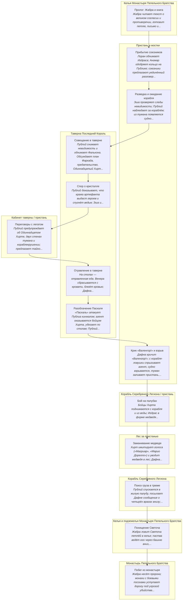

# Эпизод 30 — Моё великое противоречие: диаграмма событий

```mermaid
graph TD

    subgraph ep30_l1 [Келья Монастыря Пепельного Братства]
        ep30E01["Пролог: Жабра и книга<br/><i>Жабра читает текст о великом согласии и противоречии, готовит петлю, письмо и...</i>"]
    end

    subgraph ep30_l2 [Пристань и мостки]
        ep30E02["Прибытие союзников<br/><i>Лоран обнимает Игдраса; Ангмар одобряет кольцо на Публике; союзники предлагают уединённый разговор...</i>"]
        ep30E03["Разведка и ожидание корабля<br/><i>Эша проверяет следы невидимости; Публий наблюдает за кораблём; из тумана появляется судно...</i>"]
        ep30E09["Крик «Валенгор!» и взрыв<br/><i>Дафна кричит «Валенгор!»; с корабля-ловушки спрыгивает агент, судно взрывается, туман заливает пристань....</i>"]
    end

    subgraph ep30_l3 [Таверна Последний Король]
        ep30E04["Совещание в таверне<br/><i>Публий снимает невидимость и обнимает Фалькона. Обсуждают план Фархада, предательство, Одиннадцатый Хирт...</i>"]
        ep30E05["Спор о кристалле<br/><i>Публий доказывает, что кража артефакта выдаст героев и спугнёт ведьм; Эша и...</i>"]
        ep30E07["Отравление в таверне<br/><i>На столах — отравленная еда. Венера сбрасывается с кровати, блюёт кровью; Дафна...</i>"]
        ep30E08["Разоблачение Паскаля<br/><i>«Паскаль» атакует Публиа кинжалом; агент оказывается бойцом Хирта, убегает по столам; Публий...</i>"]
    end

    subgraph ep30_l4 [Кабинет таверны / пристань]
        ep30E06["Переговоры с легатом<br/><i>Публий предупреждает об Одиннадцатом Хирте, двух стенах тумана и кораблекрушении; предлагает тайно...</i>"]
    end

    subgraph ep30_l5 [Корабль Серебряного Легиона / пристань]
        ep30E10["Бой на палубах<br/><i>Бойцы Хирта поднимаются с корабля и из воды; Игдрас в форме медведя...</i>"]
    end

    subgraph ep30_l6 [Лес за пристанью]
        ep30E11["Заманивание медведя<br/><i>Хирт имитирует голоса («Магриар», «Марио Дорелло») и уводит медведя в лес; Дафна...</i>"]
    end

    subgraph ep30_l7 [Корабль Серебряного Легиона]
        ep30E12["Поиск груза в трюме<br/><i>Публий спускается в жилую палубу, посылает Дафне сообщение о четырёх врагах внизу;...</i>"]
    end

    subgraph ep30_l8 [Келья и подземелья Монастыря Пепельного Братства]
        ep30E13["Похищение Светоча<br/><i>Жабра ловит Светоча петлёй в келье; паства ведёт его через башню вниз,...</i>"]
    end

    subgraph ep30_l9 [Монастырь Пепельного Братства]
        ep30E14["Побег из монастыря<br/><i>Жабра несёт пророка; монахи с боевыми посохами уступают дорогу под угрозой убийства...</i>"]
    end

    ep30E01 --> ep30E02 --> ep30E03 --> ep30E04 --> ep30E05 --> ep30E06 --> ep30E07 --> ep30E08 --> ep30E09 --> ep30E10 --> ep30E11 --> ep30E12 --> ep30E13 --> ep30E14

```