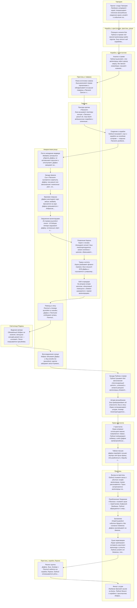

# Эпизод 31 — Туман: диаграмма событий

```mermaid
graph TD

    subgraph ep31_l1 [Тавгория]
        ep31E01["Пролог: осада Тавгории<br/><i>Лагданан штурмует город, допрашивает пленного волшебника лазурного круга; узнаёт о событиях на...</i>"]
    end

    subgraph ep31_l2 [Корабль с кристаллом, пристань, роща]
        ep31E02["Позиции в начале боя<br/><i>Публий в трюме под маской валенгорца среди трупов; Эша летит над кораблём;...</i>"]
    end

    subgraph ep31_l3 [Корабль с кристаллом]
        ep31E03["Анализ в трюме<br/><i>Публий выясняет, что валенгорцы ждут угрозу сверху, без явного командира; слушает нижнюю...</i>"]
        ep31E06["Озарение о корабле<br/><i>Публий понимает: слух о корабле на соседнем острове — ловушка Паскаля; рыбаков...</i>"]
        ep31E17["Засада Публиа в трюме<br/><i>Публий срывает бой заклинанием «диссонирующий шёпот», иллюзией и атакой рапирой; валенгорцы убивают...</i>"]
        ep31E18["Штурм волшебников<br/><i>Эша предупреждает об опасности Эши в лесу; Лоран останавливает штурм, Ангмар телепортируется...</i>"]
    end

    subgraph ep31_l4 [Пристань и таверна]
        ep31E04["Поиск источника тумана<br/><i>Эша разгоняет туман перчатками и обнаруживает на крыше таверны «Паскаля Гросса» с...</i>"]
    end

    subgraph ep31_l5 [Таверна]
        ep31E05["Пантера против «Паскаля»<br/><i>Эша вызывает пантеру-гончую; «Паскаль» ранит её, Эша бьёт ведьминским снарядом и огненным...</i>"]
        ep31E11["Появление Кирона<br/><i>Кирон с косами блокирует отход; Эша телепортируется, видит котёнка с щенком, сбрасывает...</i>"]
        ep31E12["Туман и котята<br/><i>Кирон разбивает флакон тумана; Эша слышит SOS Дафны и спускается к упавшему...</i>"]
        ep31E13["Бой в коридоре<br/><i>На втором этаже капитан, одноглазый помощник и Эгемон сражаются с тремя валенгорцами.</i>"]
    end

    subgraph ep31_l6 [Амарантовая роща]
        ep31E07["Почти нападение медведя<br/><i>Медведь готовится ударить Дафну, но вспоминает прошлое и отступает; Дафна замирает за...</i>"]
        ep31E08["Засада Арниса<br/><i>Сын «Паскаля» пытается схватить Дафну; она ранит его заклинанием «нанесение ран», он...</i>"]
        ep31E09["Звуковая ловушка<br/><i>Дафна имитирует звук ведьм; медведь бросается на звук. Дафна связывается с Игдрасом,...</i>"]
        ep31E10["Окружение валенгорцами<br/><i>Из тумана выходит линия ~10 бойцов; пятеро окружают Дафну, остальные идут к...</i>"]
        ep31E14["Помощь в лесу<br/><i>Понтий и Ангмар выходят из засады; Дафна с Понтием отбивают атаки, Понтий...</i>"]
        ep31E16["Воссоединение в роще<br/><i>Игдрас обнимает Дафну и Эшу (когда та приходит); группа забирает зелья тумана...</i>"]
    end

    subgraph ep31_l7 [Святилище Роданы]
        ep31E15["Видение матери<br/><i>Обнажённый Игдрас на коленях; женщина-голиаф целует его — исчезает. Песок покрывается орхидеями.</i>"]
    end

    subgraph ep31_l8 [Трюм кристалла]
        ep31E19["У кристалла<br/><i>Лоран впервые использует магию; появляется «дама». Публий подозревает подмену, шлёт Дафне предупреждение;...</i>"]
        ep31E20["Тайное письмо<br/><i>Дафна передаёт письмо: внутри неё душа Араны, для разделения и борьбы с...</i>"]
    end

    subgraph ep31_l9 [Пристань]
        ep31E21["Выход на пристань<br/><i>Публий снимает маску с убитого эльфа-валенгорца; туман рассеивается. Герои встречаются; валенгорцы на...</i>"]
        ep31E22["Разоблачение Лагданана<br/><i>«Паскаль» снимает грим — перед всеми Асфальдо Лагданан. Публий обращается к нему...</i>"]
        ep31E23["Заложники<br/><i>Отряд выводит избитых Брауля и без сознания Эгемона; Дафна накладывает на демона...</i>"]
        ep31E24["Срыв переговоров<br/><i>Лоран предлагает оставить кристалл валенгору и уплыть. Публий узнаёт от Эгемона, что...</i>"]
        ep31E26["Финал: штурм<br/><i>Лагданан бросает вызов на дуэль. Публий бежит к кораблю с кристаллом; Игдрас...</i>"]
    end

    subgraph ep31_l10 [Пристань, корабль Лорана]
        ep31E25["Раскол группы<br/><i>Дафна, Эша, Ангмар и Понтий садятся на корабль Лорана. Публий отказывается уйти;...</i>"]
    end

    ep31E01 --> ep31E02 --> ep31E03 --> ep31E04 --> ep31E05 --> ep31E06 --> ep31E07 --> ep31E08 --> ep31E09 --> ep31E10 --> ep31E11 --> ep31E12 --> ep31E13 --> ep31E14 --> ep31E15 --> ep31E16 --> ep31E17 --> ep31E18 --> ep31E19 --> ep31E20 --> ep31E21 --> ep31E22 --> ep31E23 --> ep31E24 --> ep31E25 --> ep31E26

```