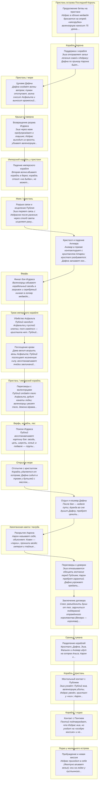

# Эпизод 32 — Корабли: диаграмма событий

```mermaid
graph TD

    subgraph ep32_l1 [Пристань острова Последний Король]
        ep32E01["Продолжение битвы на пристани<br/><i>Игдрас в облике медведя бросается на отряд; «мясорубка» валенгорцев наносит 75 урона....</i>"]
    end

    subgraph ep32_l2 [Корабль Аарона]
        ep32E02["Поддержка с корабля<br/><i>Эша отправляет зелье лечения совой к Игдрасу; Дафна по приказу Аарона бьёт...</i>"]
        ep32E07["Кристалл и падение Ангмара<br/><i>Ангмар в трюме контактирует с кристаллом Атареи; кристалл раздувается; Дафна заливает его...</i>"]
        ep32E14["Отдых и кошмар Дафны<br/><i>После боя — неделя пути; Аранда во сне душит Дафну, требует ценить...</i>"]
        ep32E16["Переговоры о доверии<br/><i>Эша отказывается обещать молчание перед Публием; Аарон требует гарантий. Дафна угрожает предать...</i>"]
        ep32E17["Заключение договора<br/><i>Союз: разъединить души от тел, заручиться поддержкой отражённого королевства (Венера — королева),...</i>"]
    end

    subgraph ep32_l3 [Пристань / море]
        ep32E03["Цунами Дафны<br/><i>Дафна создаёт волны ветром; туман отступает, волна сносит Асфальта и выносит вражеский...</i>"]
    end

    subgraph ep32_l4 [Крыши и таверна]
        ep32E04["Возвращение разума Игдраса<br/><i>Эша через маяк предупреждает о ловушке; Игдрас выходит из ярости, убивает валенгорцев...</i>"]
    end

    subgraph ep32_l5 [Имперский корабль у пристани]
        ep32E05["Падение имперского корабля<br/><i>Вторая волна вбивает корабль в берег; корабль стоит «на дыбах», не может...</i>"]
    end

    subgraph ep32_l6 [Маяк / пристань]
        ep32E06["Разрыв связи и исцеление Публия<br/><i>Эша теряет связь с Игдрасом после ранения; через столб света исцеляет рану...</i>"]
    end

    subgraph ep32_l7 [Верфь]
        ep32E08["Финал боя Игдраса<br/><i>Валенгорцы вбивают корабельный гвоздь в загривок и серебряный кинжал в голову медведя;...</i>"]
    end

    subgraph ep32_l8 [Трюм имперского корабля]
        ep32E09["Убийство Асфальта<br/><i>Публий находит Асфальта у пустой клетки; тот смеётся — кристалла нет. Публий...</i>"]
        ep32E10["Поглощение крови<br/><i>Дама велит вскрыть вены Асфальта; Публий поглощает жизненную силу, восстанавливает ячейки заклинаний...</i>"]
    end

    subgraph ep32_l9 [Пристань / имперский корабль]
        ep32E11["Переговоры с валенгорцами<br/><i>Публий отдаёт тело Асфальта, рубит канаты лодки; валенгорцы увозят тело, демона Шрама...</i>"]
    end

    subgraph ep32_l10 [Верфь, корабль, лес]
        ep32E12["Поиски Игдраса<br/><i>Публий восстанавливает картину боя: гвоздь, цепь, шерсть, копьё; в подвале — трупы...</i>"]
    end

    subgraph ep32_l11 [Открытое море]
        ep32E13["Отплытие с кристаллом<br/><i>Корабль удаляется от острова; Дафна сидит в трюме у бутылей с маслом,...</i>"]
    end

    subgraph ep32_l12 [Капитанская каюта / палуба]
        ep32E15["Раскрытие Аарона<br/><i>Аарон называет себя, объясняет: Ковен — «пауки», проникли везде; империя и тайные...</i>"]
    end

    subgraph ep32_l13 [Граница тумана]
        ep32E18["Разделение кораблей<br/><i>Кристалл, Дафна, Эша, Фалькон и Ангмар идут на остров Альса; Аарон с...</i>"]
    end

    subgraph ep32_l14 [Корабль / пристань]
        ep32E19["Ментальный контакт с Публием<br/><i>Эша узнаёт: Публий жив, валенгорцев убиты, Игдрас увезён, кристалл у «них»; Аарон...</i>"]
    end

    subgraph ep32_l15 [Корабль / лодка]
        ep32E20["Контакт с Понтием<br/><i>Понтий подтверждает, что Игдрас жив, но уходит на «особую миссию» и не...</i>"]
    end

    subgraph ep32_l16 [Лодка у маленького острова]
        ep32E21["Пробуждение и новая миссия<br/><i>Игдрас приходит в себя (Фахтунг вливает зелье); они на лодке у пустынного...</i>"]
    end

    ep32E01 --> ep32E02 --> ep32E03 --> ep32E04 --> ep32E05 --> ep32E06 --> ep32E07 --> ep32E08 --> ep32E09 --> ep32E10 --> ep32E11 --> ep32E12 --> ep32E13 --> ep32E14 --> ep32E15 --> ep32E16 --> ep32E17 --> ep32E18 --> ep32E19 --> ep32E20 --> ep32E21

```