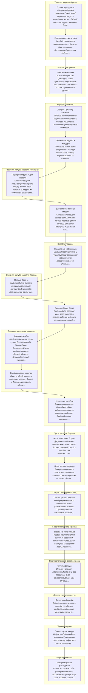

# Эпизод 33 — Гончие: диаграмма событий

```mermaid
graph TD

    subgraph ep33_l1 [Таверна Морское брюхо]
        ep33E01["Пролог: праздник в «Морском брюхе»<br/><i>Несколько декад назад герои празднуют спасённые жизни. Публий импровизирует на виоле, Эша...</i>"]
        ep33E02["Клятва продолжать путь<br/><i>Каждый озвучивает намерение идти дальше: Эша — по воле Пепельного Братства, Игдрас...</i>"]
    end

    subgraph ep33_l2 [Корабли у островов]
        ep33E03["Резюме кампании<br/><i>Краткий пересказ: Храморра, Ковен, кристалл, отражённое королевство, Последний Король и разделение группы...</i>"]
    end

    subgraph ep33_l3 [Корабль Антигоны]
        ep33E04["Допрос Публия у Антигоны<br/><i>Публий отчитывается об убийстве Асфальдо и потере кристалла. Антигона проверяет его компасом...</i>"]
        ep33E05["Обвинение друзей и Халдура<br/><i>Антигона показывает документы: Халдур отдал дочь Ковену, Лоран и Дафна — агенты...</i>"]
        ep33E07["Ультиматум и новая миссия<br/><i>Антигона требует готовности поднять оружие против друзей; Публий клянётся Империи. Назначает его...</i>"]
    end

    subgraph ep33_l4 [Верхняя палуба корабля Антигоны]
        ep33E06["Подзорная труба и два корабля<br/><i>Антигона дарит магическую подзорную трубу. Видно: один корабль с лазурным свечением кристалла...</i>"]
    end

    subgraph ep33_l5 [Корабль Лорана]
        ep33E08["Управление наёмниками<br/><i>Эша надевает амулет и чувствует 12 девианских наёмников как продолжение себя. Учится...</i>"]
        ep33E10["Видение Као у борта<br/><i>Эша создаёт водяной шар, переносится в лесное видение и бежит за камешком-копией...</i>"]
        ep33E13["Ускорение корабля<br/><i>Эша возвращается, благодарит Као; наёмники встают в молитвенной позе. Водяной поток ускоряет...</i>"]
    end

    subgraph ep33_l6 [Средняя палуба корабля Лорана]
        ep33E09["Письмо Дафны<br/><i>Эша находит в рюкзаке прощальное письмо: внутри Дафны живёт Аранда; отец заключил...</i>"]
    end

    subgraph ep33_l7 [Поляна с куколками видение]
        ep33E11["Куколки-судьбы<br/><i>На деревьях висят пары кукол: Дафна+Аранда, Лоран+Арон, Антигона+Ригор, ведьма+рыцарь, Фархад+Венера, Асфальдо+дварф; пустая...</i>"]
        ep33E12["Разбор куколок у костра<br/><i>Эша по одной заносит фигурки к костру: Дафна и Аранда «умирают» одним...</i>"]
    end

    subgraph ep33_l8 [Трюм корабля Лорана]
        ep33E14["Арон вытесняет Лорана<br/><i>Дафна накладывает магическую тьму, ранит Лорана огненной иглой и выводит на поверхность...</i>"]
        ep33E15["План против Фархада<br/><i>Венера раскрывает план: схватить отца живым и снять перчатку — иначе сделка...</i>"]
    end

    subgraph ep33_l9 [Остров Последний Принц]
        ep33E16["Понтий уводит Игдраса<br/><i>На берегу маленькой шлюпки Понтий (Эгемон) объясняет: Публий ушёл на имперский корабль,...</i>"]
    end

    subgraph ep33_l10 [Берег Последнего Принца]
        ep33E17["Засада на валенгорцев<br/><i>Игдрас притворяется раненым ребёнком; Понтий подбрасывает Фахтунга и швыряет лодку в одного...</i>"]
    end

    subgraph ep33_l11 [Противоположный берег острова]
        ep33E18["Труп Асфальдо<br/><i>В лодке находят мёртвого Лагданана без переднего зуба — доказательство, что Публий...</i>"]
    end

    subgraph ep33_l12 [Остров у торгового пути]
        ep33E19["Сигнальный костёр<br/><i>Обходя остров, строят костёр по обычаю рыбаков (срубленные деревья и огонь в...</i>"]
    end

    subgraph ep33_l13 [Торговое судно]
        ep33E20["Пьяная дуэль за курс<br/><i>Игдрас выдаёт себя за чемпиона Храморы по рукопашному и бросает вызов охраннику,...</i>"]
    end

    subgraph ep33_l14 [Море архипелага]
        ep33E21["Четыре корабля расходятся<br/><i>Финал: торговое судно разворачивается у Последнего Принца; ещё один корабль идёт к...</i>"]
    end

    ep33E01 --> ep33E02 --> ep33E03 --> ep33E04 --> ep33E05 --> ep33E06 --> ep33E07 --> ep33E08 --> ep33E09 --> ep33E10 --> ep33E11 --> ep33E12 --> ep33E13 --> ep33E14 --> ep33E15 --> ep33E16 --> ep33E17 --> ep33E18 --> ep33E19 --> ep33E20 --> ep33E21

```