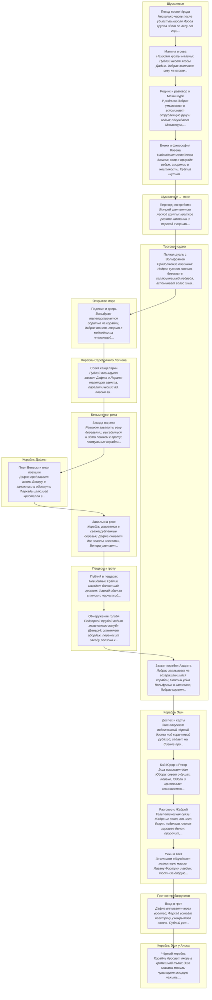

# Эпизод 34 — Водоворот: диаграмма событий

```mermaid
graph TD

    subgraph ep34_l1 [Шумолесье]
        ep34E01["Поход после Ирода<br/><i>Несколько часов после убийства короля Ирода группа идёт по лесу от гор;...</i>"]
        ep34E02["Малина и сова<br/><i>Находят кусты малины; Публий несёт ягоды Дафне. Игдрас замечает сову на охоте...</i>"]
        ep34E03["Родник и разговор о Махашкуре<br/><i>У родника Игдрас умывается и вспоминает отрубленную руку и ведьм; обсуждают Махашкура,...</i>"]
        ep34E04["Ёжики и философия Ковена<br/><i>Наблюдают семейство ёжиков; спор о природе ведьм, смирении и жестокости. Публий шутит...</i>"]
    end

    subgraph ep34_l2 [Шумолесье → море]
        ep34E05["Переход «ястребом»<br/><i>Ястреб улетает от лесной группы; краткое резюме кампании и переход к сценам...</i>"]
    end

    subgraph ep34_l3 [Торговое судно]
        ep34E06["Пьяная дуэль с Вольфрамом<br/><i>Продолжение поединка: Игдрас кусает стекло, борется с галлюцинацией медведя, вспоминает голос Эши...</i>"]
        ep34E14["Захват корабля Акарата<br/><i>Игдрас заплывает на возвращающийся корабль; Понтий убил Вольфрама и капитана; Игдрас играет...</i>"]
    end

    subgraph ep34_l4 [Открытое море]
        ep34E07["Падение и дверь<br/><i>Вольфрам телепортируется обратно на корабль; Игдрас тонет, спорит с медведем на плавающей...</i>"]
    end

    subgraph ep34_l5 [Корабль Серебряного Легиона]
        ep34E08["Совет канцелярии<br/><i>Публий планирует захват Дафны и Лорана: телепорт агента, паралитический яд, погоня за...</i>"]
    end

    subgraph ep34_l6 [Безымянная река]
        ep34E09["Засада на реке<br/><i>Решают завалить реку деревьями, высадиться и идти пешком к гроту; патрульные корабли...</i>"]
        ep34E11["Завалы на реке<br/><i>Корабль упирается в свежесрубленные деревья; Дафна сжигает две завалы «пеклом», Венера улетает...</i>"]
    end

    subgraph ep34_l7 [Корабль Дафны]
        ep34E10["Плен Венеры и план ловушки<br/><i>Дафна предлагает взять Венеру в заложники и обмануть Фархада иллюзией кристалла в...</i>"]
    end

    subgraph ep34_l8 [Пещеры к гроту]
        ep34E12["Публий в пещерах<br/><i>Невидимый Публий находит балкон над гротом: Фархад один за столом с перчаткой...</i>"]
        ep34E13["Обнаружение голубя<br/><i>Подзорной трубой видит магического голубя (Венеру); отменяет абордаж, переносит засаду легиона к...</i>"]
    end

    subgraph ep34_l9 [Корабль Эши]
        ep34E15["Доспех и карты<br/><i>Эша получает подогнанный чёрный доспех под коричневой рубахой; гадает на Сигиле про...</i>"]
        ep34E16["Кай Юдор и Ригор<br/><i>Эша вызывает Кая Юдора: совет о душах, Ковене, Юдоли и кристалле; связывается...</i>"]
        ep34E17["Разговор с Жаброй<br/><i>Телепатическая связь: Жабра не спит, от него бегут, «сделали плохое-хорошее дело»; пророчит,...</i>"]
        ep34E18["Ужин и тост<br/><i>За столом обсуждают магнитную магию, Лагану Фортуну и ведьм; тост «за добрую...</i>"]
    end

    subgraph ep34_l10 [Грот контрабандистов]
        ep34E19["Вход в грот<br/><i>Дафна вплывает через водопад; Фархад встаёт навстречу у накрытого стола. Публий уже...</i>"]
    end

    subgraph ep34_l11 [Корабль Эши у Альса]
        ep34E20["Чёрный корабль<br/><i>Корабль бросает якорь в кромешной тьме; Эша глазами могилы чувствует мощную нежить;...</i>"]
    end

    ep34E01 --> ep34E02 --> ep34E03 --> ep34E04 --> ep34E05 --> ep34E06 --> ep34E07 --> ep34E08 --> ep34E09 --> ep34E10 --> ep34E11 --> ep34E12 --> ep34E13 --> ep34E14 --> ep34E15 --> ep34E16 --> ep34E17 --> ep34E18 --> ep34E19 --> ep34E20

```