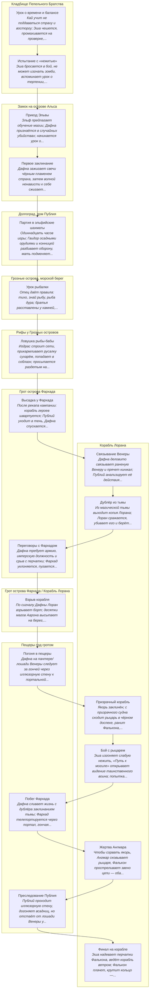

# Эпизод 35 — Тень пламени и света глубина: диаграмма событий

```mermaid
graph TD

    subgraph ep35_l1 [Кладбище Пепельного Братства]
        ep35E01["Урок о времени и балансе<br/><i>Кай учит не поддаваться страху и восторгу; Эша чешется, промахивается на проверке,...</i>"]
        ep35E02["Испытание с «нежитью»<br/><i>Эша бросается в бой, не может изгнать зомби, вспоминает урок о терпении,...</i>"]
    end

    subgraph ep35_l2 [Замок на острове Альса]
        ep35E03["Приезд Эльвы<br/><i>Эльф предлагает обучение магии; Дафна признаётся в случайных убийствах; начинается урок о...</i>"]
        ep35E04["Первое заклинание<br/><i>Дафна зажигает свечи чёрным пламенем страха, затем волной ненависти к себе сжигает...</i>"]
    end

    subgraph ep35_l3 [Долгоград, дом Публия]
        ep35E05["Партия в эльфийские шахматы<br/><i>Одиннадцать часов игры; Гвидор осадными орудиями и конницей разбивает оборону, мать подменяет...</i>"]
    end

    subgraph ep35_l4 [Грозные острова, морской берег]
        ep35E06["Урок рыбалки<br/><i>Отец даёт правила: тихо, знай рыбу, рыба дура; братья расставлены у камней,...</i>"]
    end

    subgraph ep35_l5 [Рифы у Грозных островов]
        ep35E07["Ловушка рыбы-бабы<br/><i>Игдрас строит сети, прикармливает русалку сухарём, попадает в соблазн; просыпается раздетым на...</i>"]
    end

    subgraph ep35_l6 [Грот острова Фархада]
        ep35E08["Высадка у Фархада<br/><i>После рекапа кампании: корабль героев швартуется; Публий уходит в тень, Дафна спускается...</i>"]
        ep35E11["Переговоры с Фархадом<br/><i>Дафна требует армию, имперскую должность и срыв с перчатки; Фархад уклоняется, пугается...</i>"]
    end

    subgraph ep35_l7 [Корабль Лорана]
        ep35E09["Связывание Венеры<br/><i>Дафна деловито связывает раненую Венеру и прячет кинжал; Публий анализирует её действия...</i>"]
        ep35E10["Дублёр из тьмы<br/><i>Из магической тьмы выходит копия Лорана; Лоран сражается, убивает его и берёт...</i>"]
        ep35E14["Призрачный корабль<br/><i>Якорь заклинён; с призрачного судна сходит рыцарь в чёрном доспехе, ранит Фалькона,...</i>"]
        ep35E15["Бой с рыцарем<br/><i>Эша изгоняет слабую нежить, «Путь к могиле» открывает видение таинственного воина; попытка...</i>"]
        ep35E17["Жертва Ангмара<br/><i>Чтобы сорвать якорь, Ангмар сковывает рыцаря, Фалькон простреливает звено цепи — оба...</i>"]
        ep35E19["Финал на корабле<br/><i>Эша надевает перчатки Фалькона, ведёт корабль ветром; Фалькон плачет, крутит кольцо —...</i>"]
    end

    subgraph ep35_l8 [Грот острова Фархада / Корабль Лорана]
        ep35E12["Взрыв корабля<br/><i>По сигналу Дафны Лоран взрывает борт; десятки магов Аарона высыпают на берег,...</i>"]
    end

    subgraph ep35_l9 [Пещеры под гротом]
        ep35E13["Погоня в пещеры<br/><i>Дафна на пантере/лошади Венеры следует за гончей через иллюзорную стену к портальной...</i>"]
        ep35E16["Побег Фархада<br/><i>Дафна сливает жизнь с дублёра заклинанием тьмы; Фархад телепортируется через портал, гончая...</i>"]
        ep35E18["Преследование Публия<br/><i>Публий проходит иллюзорную стену, догоняет всадниц, но отстаёт от лошади Венеры у...</i>"]
    end

    ep35E01 --> ep35E02 --> ep35E03 --> ep35E04 --> ep35E05 --> ep35E06 --> ep35E07 --> ep35E08 --> ep35E09 --> ep35E10 --> ep35E11 --> ep35E12 --> ep35E13 --> ep35E14 --> ep35E15 --> ep35E16 --> ep35E17 --> ep35E18 --> ep35E19

```