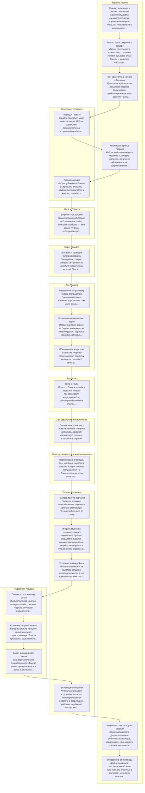

# Эпизод 36 — Тишина: диаграмма событий

```mermaid
graph TD

    subgraph ep36_l1 [Корабль героев]
        ep36E01["Смена у штурвала и рассказ Фалькона<br/><i>После боя Дафна снимает перчатки управления ветром; Фалькон утешает её и вспоминает,...</i>"]
        ep36E02["Анализ боя и открытие о рыцаре<br/><i>Дафна составляет хронологию сражения, узнаёт в рыцаре отца Ригора и молится Адригалу...</i>"]
        ep36E03["Рост кристалла и начало «Тишины»<br/><i>Бутылка с кристаллом лопается; мастер зачитывает предысторию кампании — пролог к новой...</i>"]
        ep36E05["Кошмары и бритьё Игдраса<br/><i>Игдрас видит кошмары о медведе и Халдуре, бреется, получает вдохновение на сопротивление...</i>"]
        ep36E22["Некромантская разгрузка корабля<br/><i>Кристалл растёт; Дафна оживляет девянских наёмников, сбрасывает груз за борт и уравновешивает...</i>"]
        ep36E23["Откровение стихии воды<br/><i>Дафна ощущает холодные невидимые руки (как при спасении в детстве), лёгкость власти...</i>"]
    end

    subgraph ep36_l2 [Окрестности Гравата]
        ep36E04["Подход к Гравату<br/><i>Корабль проходит мимо замка на скале; Игдрас замечает подозрительный торговый корабль и...</i>"]
        ep36E06["Тайная высадка<br/><i>Игдрас убеждает Понти выбросить алкоголь, спускается на шлюпке и скрытно плывёт к...</i>"]
    end

    subgraph ep36_l3 [Море у Гравата]
        ep36E07["Встреча с «рыцарем»<br/><i>Замаскированный Игдрас подплывает в лодке; снимает иллюзию — это агент Публия, подозревающий...</i>"]
    end

    subgraph ep36_l4 [Берег Гравата]
        ep36E08["Высадка и разведка<br/><i>Группа на морском дикотравье; Игдрас медвежьим чутьём не находит человеческих запахов, Понти...</i>"]
    end

    subgraph ep36_l5 [Лес Гравата]
        ep36E09["Разделение на разведку<br/><i>Игдрас отправляет Понти на дерево и Егемона к пристани; сам идёт вдоль...</i>"]
        ep36E10["Испытание механических ворон<br/><i>Игдрас находит ворону на дереве, отвечает на загадки (уголь, пружина, крокодил, иллюзия,...</i>"]
        ep36E11["Обнаружение водостока<br/><i>По цепочке «каркар» герои находят решётку в камне — потайной путь в...</i>"]
    end

    subgraph ep36_l6 [Водосток]
        ep36E12["Вход в трубу<br/><i>Понти и Егемон заходят первыми; Игдрас преодолевает клаустрофобию («златрах») и ползёт следом....</i>"]
    end

    subgraph ep36_l7 [Лес отражённого королевства]
        ep36E13["Погоня за отцом в лесу<br/><i>Эша на медведе следует за Гончей, находит иллюзорную поляну с шифропатронумом.</i>"]
    end

    subgraph ep36_l8 [Телепорт-комната иллюзорная поляна]
        ep36E14["Переговоры с Фархадом<br/><i>Эша требует передать власть дочери; Фархад соглашается, но сбегает телепортом, пока она...</i>"]
    end

    subgraph ep36_l9 [Телепорт-комната]
        ep36E15["Пантера против перчатки<br/><i>Пантера атакует Фархада; волна перчатки калечит фамильяра. Гончая уходит вниз по следу.</i>"]
        ep36E16["Интрига Публия в телепорт-комнате<br/><i>Невидимый Публий посылает видения, срывает отступление гвардии, маскируется под раненого Фархада и...</i>"]
        ep36E17["Телепорт за гвардейцем<br/><i>Публий хватается за золотое кольцо и телепортируется в лес королевства вместе с...</i>"]
        ep36E21["Возвращение Публия<br/><i>Публий изображает потрясённого отца, телепортируется обратно с гвардейцем, рвёт от неудачной маскировки;...</i>"]
    end

    subgraph ep36_l10 [Подземная пещера]
        ep36E18["Погоня по подземному мосту<br/><i>Эша летит над мостом, атакует огнём и хаосом; Фархад иллюзией обрушения и...</i>"]
        ep36E19["Спасение летучей мышью<br/><i>Венера в облике летучей мыши выносит парализованную Эшу из пропасти, исцеляет её;...</i>"]
        ep36E20["Завал входа и побег мыши<br/><i>Эша обрушает свод снарядом хаоса; Фархад ранен, превращается в мышь с обломком...</i>"]
    end

    ep36E01 --> ep36E02 --> ep36E03 --> ep36E04 --> ep36E05 --> ep36E06 --> ep36E07 --> ep36E08 --> ep36E09 --> ep36E10 --> ep36E11 --> ep36E12 --> ep36E13 --> ep36E14 --> ep36E15 --> ep36E16 --> ep36E17 --> ep36E18 --> ep36E19 --> ep36E20 --> ep36E21 --> ep36E22 --> ep36E23

```