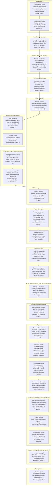

# Эпизод 37 — Союзник: диаграмма событий

```mermaid
graph TD

    subgraph ep37_l1 [Остров Альса]
        ep37E01["Прибытие на Альсу<br/><i>Корабль с кристаллом подплывает к пристани; заклинание управления водой истекает вовремя. Вдали...</i>"]
        ep37E02["Разведка и угрозы<br/><i>Тера видит руку в скалах, Каюдор находит пещеру для корабля; наверху —...</i>"]
    end

    subgraph ep37_l2 [Корабль с кристаллом]
        ep37E03["Нападение на Каюдора<br/><i>Во время отдыха Тера чувствует, что на духа напали; поднимает защитный купол...</i>"]
    end

    subgraph ep37_l3 [Каменный туннель Гровата]
        ep37E04["Туннель и «братан»<br/><i>Лаз сжимается; медвежий дух провоцирует частичную трансформацию. Игдрас с трудом сдерживает ярость,...</i>"]
    end

    subgraph ep37_l4 [Прихожая замка Гроват]
        ep37E05["Выход в прихожую<br/><i>Герои вылезают из тайного хода, закрывают двери, читают табличку Бравулю Граваду.</i>"]
    end

    subgraph ep37_l5 [Покои маркизы]
        ep37E06["Покои маркизы<br/><i>Взлом деревянной двери; осмотр портрета семьи Гравадов. Игдрас находит пустой шкаф и...</i>"]
        ep37E11["Бегство и весть<br/><i>Игдрас диктует Егемону записку о заговоре, отправляет ворона Фактунa в башню Ордена...</i>"]
    end

    subgraph ep37_l6 [Тайная круглая комната]
        ep37E07["Шар Апостола<br/><i>Обнаружен чёрный шар с мощным параличным заклинанием. Понтий едва не касается; Игдрас...</i>"]
        ep37E08["Касание шара<br/><i>Игдрас касается шара и переносится в сферическое пространство с дверью.</i>"]
    end

    subgraph ep37_l7 [Сферическое пространство видения]
        ep37E09["Подслушивание заговора<br/><i>За дверью — план: обвинить Фархада, использовать кристалл, вернуть «блудную чету» в...</i>"]
        ep37E10["Встреча с фигурой<br/><i>Игдрас открывает дверь; гигант в чёрном облачении разворачивается — «Измена!». Его вытаскивают...</i>"]
    end

    subgraph ep37_l8 [Торговый квартал]
        ep37E12["Телепорт в торговый квартал<br/><i>Дафна и Венера по кровавому следу телепортируются в Отражённое королевство; начинают погоню...</i>"]
        ep37E13["Пантера-следопыт<br/><i>Дафна призывает ослабленную пантеру, чтобы не потерять след «короля».</i>"]
    end

    subgraph ep37_l9 [Каменный мост]
        ep37E14["Проверка гвардейца<br/><i>Публий под видом раненого короля ведёт стражника; тот проверяет его личность над...</i>"]
        ep37E15["Внушение гвардейцу<br/><i>Публий уцепляется за сапог, направляет тень с приказом доставить его целым через...</i>"]
    end

    subgraph ep37_l10 [Телепортационная комната торговый квартал]
        ep37E16["Засада у телепорта<br/><i>Публий из невидимости критически ранит «Фархада» отравленной рапирой; тот падает в круг...</i>"]
    end

    subgraph ep37_l11 [Телепортационная комната]
        ep37E17["Разоблачение Публиия<br/><i>Дафна узнаёт голос «болотной жабы» из таверны; Публий снимает маскировку и ведёт...</i>"]
    end

    subgraph ep37_l12 [Библиотека]
        ep37E18["Погоня в библиотеку<br/><i>Огненный снаряд Дафны ранит Публиия; паралич спускается по телам. Дафна снимает перчатку...</i>"]
        ep37E19["Перчатка власти<br/><i>Дафна надевает перламутровую перчатку, получает знания иллюзий и паралича; прячет Фархада иллюзией...</i>"]
        ep37E20["Схватка в иллюзии<br/><i>Публий находит спрятанную Дафну, срывается с удара; Дафна кричит, привлекая стражу. Аранда...</i>"]
        ep37E21["Переговоры с Венерой<br/><i>Публий раскрывает себя имперским посланником; обменивает Фархада и Лорана на выход в...</i>"]
    end

    subgraph ep37_l13 [Подводная телепортационная комната]
        ep37E22["Предательство Венеры<br/><i>Венера телепортирует группу под воду; Публий бьёт волной грома из перчатки. Крокодил-Венера...</i>"]
        ep37E23["Побег Лорана<br/><i>Один волшебник убивает другого и телепортируется с Лораном, оставляя труп.</i>"]
        ep37E24["Ледяной луч Дафны<br/><i>Дафна замораживает Публиия лучом холода; он теряет сознание. Венера забирает перчатку.</i>"]
    end

    subgraph ep37_l14 [Пещера с кустарной телепорт-комнатой]
        ep37E25["Встреча с Лагадой<br/><i>Публий приходит в себя с изуродованной рукой; Лагада забирает Фархада и Лорана,...</i>"]
    end

    subgraph ep37_l15 [Тронный зал]
        ep37E26["Союз на троне<br/><i>Венера восседает на троне и спрашивает: «Заработал?» — приглашая Дафну на соседнее...</i>"]
    end

    ep37E01 --> ep37E02 --> ep37E03 --> ep37E04 --> ep37E05 --> ep37E06 --> ep37E07 --> ep37E08 --> ep37E09 --> ep37E10 --> ep37E11 --> ep37E12 --> ep37E13 --> ep37E14 --> ep37E15 --> ep37E16 --> ep37E17 --> ep37E18 --> ep37E19 --> ep37E20 --> ep37E21 --> ep37E22 --> ep37E23 --> ep37E24 --> ep37E25 --> ep37E26

```