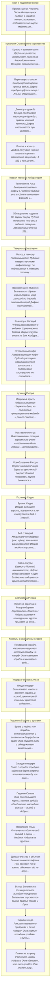

# Эпизод 38 — Безымянные: диаграмма событий

```mermaid
graph TD

    subgraph ep38_l1 [Грот и подземное озеро]
        ep38E01["Пролог: щенок Чернила<br/><i>После битвы щенок падает с корабля, тонет, выживает, отбивается от ворон медвежьим...</i>"]
    end

    subgraph ep38_l2 [Купальни Отражённого королевства]
        ep38E02["Купель и воспоминания<br/><i>Дафна исцеляется, вспоминает погоню за Фархадом и союз с Венерой; торопится на...</i>"]
        ep38E03["Переговоры о союзе<br/><i>Венера просит армию против ведьм; Дафна требует убрать отца с Альсы. Обсуждают...</i>"]
        ep38E04["Договор о дружбе<br/><i>Венера предлагает настоящую дружбу с правом честной критики; Дафна соглашается при условии...</i>"]
        ep38E05["Платье и кольцо<br/><i>Дафна получает чёрное платье-корсет с магической защитой (+1 КД) и кольцо от...</i>"]
    end

    subgraph ep38_l3 [Подвал таверны-лаборатории]
        ep38E06["Телепорт на Альс<br/><i>Венера отправляет Дафну с Лагадой; Публий уже в подвале связывает Фархада и...</i>"]
        ep38E07["Обнаружение подвала<br/><i>По звукам сверху Публий понимает, что они в подвале таверны-лаборатории (точка 22);...</i>"]
    end

    subgraph ep38_l4 [Таверна-лаборатория]
        ep38E08["Выход в таверну<br/><i>Лагада выводит Публиия наверх к пустому амфитеатру; он поднимается к тёмному столику...</i>"]
        ep38E09["Воспоминания Публиия<br/><i>Всплывают образы: взрыв Лорана, удар рапирой по Фархаду, огненный снаряд Дафны, могущество...</i>"]
        ep38E10["Разговор с Лагадой<br/><i>Публий рассказывает о ведьмах Шумалевского Ковена, ферме трупов, атаке на дом Халдура...</i>"]
        ep38E11["Отравленный кофе<br/><i>Лагада приносит кофе; Публий чувствует наваливающуюся усталость и подозревает снотворное, но остаётся...</i>"]
    end

    subgraph ep38_l5 [Кузница Ригора]
        ep38E12["Медвежья ярость<br/><i>Игдрас пытается сдержать духа, но полностью превращается в медведя и ранит Понтия;...</i>"]
        ep38E13["Наставление отца<br/><i>В воспоминании отец на горном пике учит: «когда-то мы были горами… вспоминайте...</i>"]
        ep38E14["Освобождение Ригора<br/><i>Отряд находит Ригора Зарра за рунической дверью; Понтий перевязан, группа движется к...</i>"]
    end

    subgraph ep38_l6 [Гостиная Хмуры]
        ep38E15["Врыв к Хмуре<br/><i>Игдрас выбивает ворота, врывается в зал и вступает в бой с Хмурой...</i>"]
        ep38E16["Бой с Хмурой<br/><i>Хмура калечит Игдраса (нос, щёки), заживляет раны рассолом; Игдрас входит в ярость,...</i>"]
        ep38E17["Казнь Хмуры<br/><i>Егемон и Понтий вмешиваются; Игдрас обезглавливает Хмуру. За дверями собирается армия металлических...</i>"]
    end

    subgraph ep38_l7 [Библиотека Ригора]
        ep38E18["Побег на аэроплане<br/><i>Ригор собирает деревянного «дракона»; Игдрас привязан к конструкции, группа прыгает из окна...</i>"]
    end

    subgraph ep38_l8 [Корабль с кристаллом Атарея]
        ep38E19["Посадка на корабль<br/><i>Аэроплан совершает жёсткую посадку на палубу; Эша освещает корабль и выливает воду...</i>"]
    end

    subgraph ep38_l9 [Пещера у острова Альса]
        ep38E20["Вход в пещеру<br/><i>Эша ломает мачты и вгоняет корабль в низкий рукотворный тоннель; кристалл задевает...</i>"]
    end

    subgraph ep38_l10 [Подземный залив с вратами]
        ep38E21["Врата с гербом «А»<br/><i>Корабль останавливается у гигантских дворфийских врат; Эша сдувает пыль и обнаруживает вензельную...</i>"]
        ep38E22["Засада в пещере<br/><i>Голос с корабля требует сойти на берег; стрела втыкается между ног Эши....</i>"]
        ep38E23["Гадание Сегила<br/><i>Эша раскладывает карты: паства, судьба, объединение, наследник солнца — вывод о добрых...</i>"]
        ep38E24["Появление Рэма<br/><i>Из тьмы выходит лысый голиаф с луком — двойник Игдраса из другого...</i>"]
        ep38E25["Доказательство и объятия<br/><i>Эша описывает Игдраса; Рэм бросает лук и крепко обнимает её, не веря,...</i>"]
        ep38E26["Выход Вильгельма<br/><i>Из-за кристалла выходит полурослик Вильгельм; спускаются рыжие братья Жанар и Лука.</i>"]
        ep38E27["Укрытие и еда<br/><i>Рэм рассказывает о призраках и резне наверху; Эша кормит голодных грибами. Группы...</i>"]
        ep38E28["Планы на встречу<br/><i>Рэм хочет найти Игдраса; Эша обещает, что тот придёт. Рэм кладёт руку...</i>"]
    end

    ep38E01 --> ep38E02 --> ep38E03 --> ep38E04 --> ep38E05 --> ep38E06 --> ep38E07 --> ep38E08 --> ep38E09 --> ep38E10 --> ep38E11 --> ep38E12 --> ep38E13 --> ep38E14 --> ep38E15 --> ep38E16 --> ep38E17 --> ep38E18 --> ep38E19 --> ep38E20 --> ep38E21 --> ep38E22 --> ep38E23 --> ep38E24 --> ep38E25 --> ep38E26 --> ep38E27 --> ep38E28

```