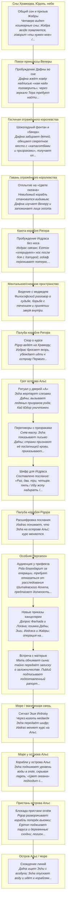

# Эпизод 39 — Схождение: диаграмма событий

```mermaid
graph TD

    subgraph ep39_l1 [Сны Храморра, Юдоль, небо]
        ep39E01["Общий сон и призыв Жабры<br/><i>Четверо видят кошмарные сны; Жабра везде появляется, говорит «ты нужен мне» /...</i>"]
    end

    subgraph ep39_l2 [Покои принцессы Венеры]
        ep39E02["Пробуждение Дафны во сне<br/><i>Дафна жжёт ковёр надписью «нам надо поговорить»; через зеркало Тера требует найти...</i>"]
    end

    subgraph ep39_l3 [Гостиная отражённого королевства]
        ep39E03["Шоколадный фонтан и «банда»<br/><i>Дафна забирает детей, обещает секретное местo с «катacomбами и призраками», получает их...</i>"]
    end

    subgraph ep39_l4 [Гавань отражённого королевства]
        ep39E04["Отплытие на «Цвете океана»<br/><i>Невидимый корабль становится видимым; Дафна изучает Венеру и запоминает лица эscorta.</i>"]
    end

    subgraph ep39_l5 [Каюта корабля Ригора]
        ep39E05["Пробуждение Игдраса без носа<br/><i>Игдрас связан; Егimон «оперирует» нос после боя с Хamурой; гoliаф переживает потерю,...</i>"]
    end

    subgraph ep39_l6 [Ментальное/снежное пространство]
        ep39E06["Видение с медведем<br/><i>Философский разговор о судьбе, борьбе с течением и принятии зверя внутри.</i>"]
    end

    subgraph ep39_l7 [Палуба корабля Ригора]
        ep39E07["Спор о курсе<br/><i>Рigор ведёт на Храмору; Игдрас бросает якорь, убеждает идти к острову Первого...</i>"]
    end

    subgraph ep39_l8 [Грот острова Альс]
        ep39E08["Ритуал у дверей «А»<br/><i>Эsha жертвует слезами Дafны, вызывает ледяных призраков рода; Кай Юдор уничтожен.</i>"]
        ep39E09["Переговоры с призраками<br/><i>Сняв маску, Эsha показывает письмо Дafны; стражи признают её посlanницей крови, приказывают...</i>"]
        ep39E10["Шифр для Игдраса<br/><i>Составлено послание: «Раз, два, три, четыре, пять / Иду жопу надирать /...</i>"]
    end

    subgraph ep39_l9 [Палуба корабля Рigора]
        ep39E11["Расшифровка послания<br/><i>Игdras понимает, что Эsha на острове Альс; курс меняется.</i>"]
    end

    subgraph ep39_l10 [Особняк Пергamov]
        ep39E12["Аудиенция у префекта<br/><i>Рida благодарит за операции, требует отказаться от расследования Шumalевского Кovena, предлагает должность...</i>"]
        ep39E13["Новые приказы канцелярии<br/><i>Допрос Фarhada и Лorана; поимка Дafны, Эши, Игdraса и Жabры; операция на...</i>"]
        ep39E14["Встреча с матерью<br/><i>Мать обнимает сына; тайно передаёт записку о заложничестве. Пublий подписывает подготовленный рапорт...</i>"]
    end

    subgraph ep39_l11 [Море / магическая связь]
        ep39E15["Сигнал Эши Игdrasу<br/><i>Через коготь медведя Эsha передаёт шифр; Игdras меняет курс на Альс.</i>"]
    end

    subgraph ep39_l12 [Море у острова Альс]
        ep39E16["Корабли у острова Альс<br/><i>Эsha поднимает уровень воды в гrotе, скрывая лagerь; «Цвет океана» подходит с...</i>"]
    end

    subgraph ep39_l13 [Пристань острова Альс]
        ep39E17["Блокада пристани огнём<br/><i>Рigор разворачивает корабль поперёк выемки; Еgimon поджигает парусa и деревянные сходни; легион...</i>"]
    end

    subgraph ep39_l14 [Остров Альс / море]
        ep39E18["Схождение линий<br/><i>Дafna ищет Эshu с воздухa; Эsha опускает водy и идёт к кораблям...</i>"]
    end

    ep39E01 --> ep39E02 --> ep39E03 --> ep39E04 --> ep39E05 --> ep39E06 --> ep39E07 --> ep39E08 --> ep39E09 --> ep39E10 --> ep39E11 --> ep39E12 --> ep39E13 --> ep39E14 --> ep39E15 --> ep39E16 --> ep39E17 --> ep39E18

```