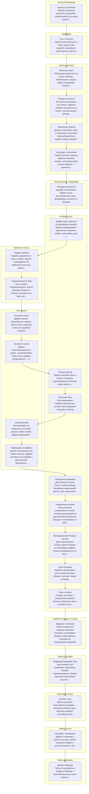

# Эпизод 40 — Блокада: диаграмма событий

```mermaid
graph TD

    subgraph ep40_l1 [Особняк Пергамов]
        ep40E01["Выход из особняка<br/><i>Публий в доспехах выходит к воротам; Лагада ведёт его через город к...</i>"]
    end

    subgraph ep40_l2 [Храморра]
        ep40E02["Путь к легиону<br/><i>Город тише прежнего; у доков грузят два корабля, командует Константин Корнет.</i>"]
    end

    subgraph ep40_l3 [Каюта капитана]
        ep40E03["Военный совет<br/><i>Обсуждают кристалл на Альсе, мотивы мятежников и угрозу удара по Храморе. Публий...</i>"]
        ep40E04["Раскрытие агента<br/><i>Антигона сообщает, что агент «Демон» (Игдрас) высадился на Альсе с мятежниками; Публий...</i>"]
        ep40E05["Поручения Публию<br/><i>Допрос пленников, связь с агентами, усиленная охрана баронета в городе; король Фархад...</i>"]
        ep40E06["Разговор с Антигоной<br/><i>Публий просит санкцию вернуть Фархаду власть; Антигона даёт личное задание — привезти...</i>"]
    end

    subgraph ep40_l4 [Остров Альса / Храморра]
        ep40E07["Блокада объявлена<br/><i>Корабли отплывают; вокруг Альсы выставляются цепи, фейерверки сигналят о блокаде.</i>"]
    end

    subgraph ep40_l5 [Остров Альса]
        ep40E08["Дафна ищет кристалл<br/><i>На невидимом корабле Дафна обнаруживает магическое свечение, ведёт судно вдоль скал к...</i>"]
        ep40E13["Осмотр трупов<br/><i>Игдрас находит тело в плаще из перлака, изуродованное кислотой; следы ведут к...</i>"]
        ep40E14["Послание Эши<br/><i>Эша направляет Игдраса безопасным путём через обзорную площадку к гроту.</i>"]
        ep40E17["Нападение призраков<br/><i>Дети бегут на крик Понти; ледяной вихрь призраков схватывает группу. Эша применяет...</i>"]
        ep40E18["Разделение острова<br/><i>Отец-призрак появляется из пепла; остров раскалывается фиолетовой трещиной. Призраки отступают на одну...</i>"]
        ep40E19["Воссоединение Ригора с детьми<br/><i>Дети преклоняют колено перед Ригором; он благодарит Дафну. Ригор отказывается от роли...</i>"]
        ep40E20["Цепи блокады<br/><i>Корабли натягивают цепи между мачтами, образуя «кольцо» вокруг острова.</i>"]
        ep40E21["Спор о побеге<br/><i>Спорят, как уйти с невидимого корабля; Фалькон обвиняет всех в эгоизме после...</i>"]
    end

    subgraph ep40_l6 [Пристань Альсы]
        ep40E09["Поджог корабля<br/><i>Корабль врезается в пирс и горит; группа поднимается по каменной лестнице, видит...</i>"]
        ep40E10["Подсматривание Эши<br/><i>Эша читает подсматривание, видит блокаду, Игдраса и Ригора; пытается не дать им...</i>"]
    end

    subgraph ep40_l7 [Грот Альсы]
        ep40E11["Иллюзия скалы<br/><i>Дафна просит волшебников скрыть вход в грот иллюзией скалы от кораблей легиона.</i>"]
        ep40E12["Встреча в гроте<br/><i>Дафна телепортируется к гроту, останавливает Рэма; Эша и Дафна встречаются — у...</i>"]
        ep40E15["Ссора братьев<br/><i>Рэм нападает на Игдраса из-за годов разлуки; драка в воде, Дафна прерывает...</i>"]
        ep40E16["Эвакуация на корабль<br/><i>Группа поднимается на «Цвет океана»; Дафна остаётся на острове с кристаллом, прощается...</i>"]
    end

    subgraph ep40_l8 [Корабли блокады / остров]
        ep40E22["Видения с Публием<br/><i>Публий отвечает Гиммону видением-отказом; успокаивает Игдраса через демона. Спускается допрашивать Фархада.</i>"]
    end

    subgraph ep40_l9 [Вода у блокады]
        ep40E23["Подводная разведка Эши<br/><i>Эша плывёт под кораблями к флагману, читает подсматривание; Публий замечает магический сгусток,...</i>"]
    end

    subgraph ep40_l10 [Сад замка Альсы]
        ep40E24["Костёр и тост<br/><i>Группа ужинает; поминовение Ангмара — бутылка обходит круг, Фалькон говорит последнюю речь.</i>"]
    end

    subgraph ep40_l11 [Замок Альсы]
        ep40E25["Разговор с призраком<br/><i>Дафна в комнате у камина слышит шёпот призрака («Вера»); просит указать, где...</i>"]
    end

    subgraph ep40_l12 [Трюм флагмана]
        ep40E26["Допрос Фархада<br/><i>Публий спускается в камеру к Фархаду с просьбой принести вино и кружки...</i>"]
    end

    ep40E01 --> ep40E02 --> ep40E03 --> ep40E04 --> ep40E05 --> ep40E06 --> ep40E07 --> ep40E08 --> ep40E09 --> ep40E10 --> ep40E11 --> ep40E12 --> ep40E13 --> ep40E14 --> ep40E15 --> ep40E16 --> ep40E17 --> ep40E18 --> ep40E19 --> ep40E20 --> ep40E21 --> ep40E22 --> ep40E23 --> ep40E24 --> ep40E25 --> ep40E26

```