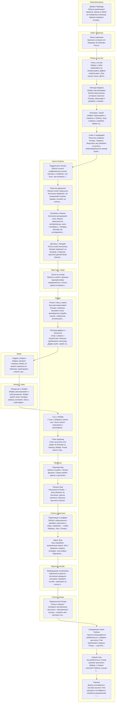

# Эпизод 41 — Колыбель: диаграмма событий

```mermaid
graph TD

    subgraph ep41_l1 [Трюм флагмана]
        ep41E01["Допрос Фархада<br/><i>Публий предлагает вернуть корону в обмен на подавление мятежа; Фархад требует остров...</i>"]
    end

    subgraph ep41_l2 [Трюм / переход]
        ep41E02["Рекап кампании<br/><i>Краткая история от Храморы до блокады Альсы.</i>"]
    end

    subgraph ep41_l3 [Лагерь у костра]
        ep41E03["Ночь у костра<br/><i>Игдрас у дуба наблюдает за дезертирами; Дафна хозяйничает; Эша сушит книги. Дети...</i>"]
        ep41E04["Легенда Игдраса<br/><i>Игдрас рассказывает детям героическую историю спасения Ригора, умалчивая о медведе и Лагаде....</i>"]
        ep41E05["Разговор с Эшей<br/><i>Игдрас спрашивает о Гиммоне и Публии; Эша плавала к кораблю. Намёк на...</i>"]
        ep41E06["Совет и недоверие<br/><i>Попытка собрать Ригора, Гиммона, Фалькона; все убегают «в кусты», недоговорённость между Эшей...</i>"]
        ep41E24["Отвержение плана Публия<br/><i>Группа отказывается разделяться и сдавать кристалл; Рэм предлагает прорыв, Ригор — изучить...</i>"]
        ep41E25["Новый план<br/><i>Не разделяться; Ригор изучает кристалл; Игдрас и Гиммон похитят Публия; письмо с...</i>"]
        ep41E26["Рассвет<br/><i>Дождь усиливается, костёр тухнет; Рэм смотрит на Игдраса с тяжёлым выражением —...</i>"]
    end

    subgraph ep41_l4 [Каюта Публия]
        ep41E07["Поддельное письмо<br/><i>Публий пишет шифрованное письмо матери и подделку «от Эши» про встречу с...</i>"]
        ep41E08["Попытка удушения<br/><i>Публий хочет задушить Антигону верёвкой; та показывает компас правды, встаёт на колени,...</i>"]
        ep41E09["Разговор о Ковене<br/><i>Антигона раскрывает сеть Ковена, зависимость императрицы, роль «четвёрки», Халдура, блокаду как инструмент;...</i>"]
        ep41E10["Договор с Лагадой<br/><i>После ухода Антигоны Лагада намекает на договор с Ковеном, прошлое Данай/Гвиду; Публий...</i>"]
    end

    subgraph ep41_l5 [Пристань / море]
        ep41E11["Плыв на остров<br/><i>Публий в лодке с флагом парламентёра направляется к Альсе; карта острова у...</i>"]
    end

    subgraph ep41_l6 [Лагерь]
        ep41E12["Ригор и Эша у камня<br/><i>Эша расспрашивает Ригора о ведьмах, призраке отца, артефактах (труба, компас, медальон); вспоминает...</i>"]
        ep41E13["Разговор Дафны и Фалькона<br/><i>Спор о замках и богатстве; Фалькон предлагает настойку, Дафна пьёт; намёк на...</i>"]
        ep41E16["Сны о Жабре<br/><i>У Эши и Игдраса схожие сны; Эша в ужасе, связывает с разговором...</i>"]
        ep41E17["План прорыва<br/><i>Спор: кристалл для удара по блокаде vs. помощь Жабре; Ригор видит знак...</i>"]
    end

    subgraph ep41_l7 [Берег]
        ep41E14["Игдрас у берега<br/><i>Игдрас находит Гиммона; демон не может связаться с Публием, предлагает спасти его...</i>"]
    end

    subgraph ep41_l8 [Лагерь / совет]
        ep41E15["Раскрытие о Жабре<br/><i>Игдрас рассказывает о подслушанном: Жабра везёт тело Халдура, ведьмы готовят «день», подставят...</i>"]
    end

    subgraph ep41_l9 [Пристань]
        ep41E18["Парламентёр<br/><i>Публий плывёт с белым флагом; Гиммон ведёт группу к пристани.</i>"]
        ep41E19["Паника Эши<br/><i>Начинается дождь — Эша убегает за доспехом, группа мечется; Фалькон приносит доспех.</i>"]
    end

    subgraph ep41_l10 [Скала у пристани]
        ep41E20["Переговоры в шифрах<br/><i>Публий «официально» требует кристалл и сдачу; намёками — побег Игдраса, Эши, Ригора...</i>"]
        ep41E21["Карта Эши<br/><i>Эша передаёт вымоченную карту: бой с Браулем, смерть Ангмара, план ведьм, Фернандо,...</i>"]
    end

    subgraph ep41_l11 [Верхняя палуба]
        ep41E22["Возвращение на флагман<br/><i>Кортезий в ярости; Антигона прикрыла сенсором, требует отчёт, намекает на «книгу о...</i>"]
    end

    subgraph ep41_l12 [Скала / лагерь]
        ep41E23["Пророчество Ригора<br/><i>Ригор в трансе: четвёрка наследников, кристалл, «бесцветный кузнец», сковать меч; смотрит на...</i>"]
    end

    ep41E01 --> ep41E02 --> ep41E03 --> ep41E04 --> ep41E05 --> ep41E06 --> ep41E07 --> ep41E08 --> ep41E09 --> ep41E10 --> ep41E11 --> ep41E12 --> ep41E13 --> ep41E14 --> ep41E15 --> ep41E16 --> ep41E17 --> ep41E18 --> ep41E19 --> ep41E20 --> ep41E21 --> ep41E22 --> ep41E23 --> ep41E24 --> ep41E25 --> ep41E26

```