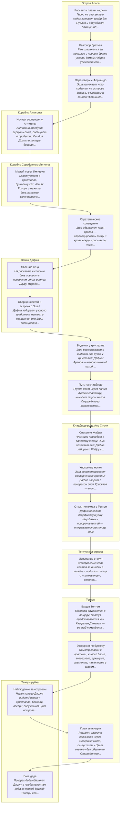

# Эпизод 42 — Кровь: диаграмма событий

```mermaid
graph TD

    subgraph ep42_l1 [Остров Альса]
        ep42E01["Рассвет и планы на день<br/><i>Герои на рассвете в садах готовят шифр для Публия и обсуждают похищение;...</i>"]
        ep42E02["Разговор братьев<br/><i>Рэм извиняется за прошлое и просит брата уехать домой; Игдрас убеждает его...</i>"]
        ep42E03["Переговоры с Фернандо<br/><i>Эша намекает, что события на острове связаны с Сезаром и войной; Фернандо...</i>"]
        ep42E06["Стратегическое совещание<br/><i>Эша объясняет план врагов — спровоцировать войну и кровь вокруг кристалла; пара...</i>"]
        ep42E09["Видения у кристалла<br/><i>Эша рассказывает о видении пар кукол у кристалла: Дафна/Аранда — неоднозначный исход,...</i>"]
        ep42E10["Путь на кладбище<br/><i>Группа идёт через линию духов к кладбищу; находят трупы магов Отражённого королевства;...</i>"]
    end

    subgraph ep42_l2 [Корабль Антигоны]
        ep42E04["Ночная аудиенция у Антигоны<br/><i>Антигона требует вернуть сына, сообщает о прибытии Овидия Догмы и потере доверия...</i>"]
    end

    subgraph ep42_l3 [Корабль Серебряного Легиона]
        ep42E05["Малый совет Империи<br/><i>Совет узнаёт о кристалле, бунтовщиках, детях Ригора и нежити; большинство склоняется к...</i>"]
    end

    subgraph ep42_l4 [Замок Дафны]
        ep42E07["Явление отца<br/><i>На рассвете в спальне дочь говорит с призраком отца: ритуал Дауру Мурада,...</i>"]
        ep42E08["Сбор ценностей и встреча с Эшей<br/><i>Дафна забирает у юного грабителя металл и украшения для Эши; сообщает о...</i>"]
    end

    subgraph ep42_l5 [Кладбище рода Аль Сиоли]
        ep42E11["Спасение Жабры<br/><i>Фахтунг приводит к раненому щенку; Эша исцеляет его; Дафна забирает Жабру с...</i>"]
        ep42E12["Упокоение могил<br/><i>Эша восстанавливает осквернённые крипты; Дафна спорит с призраком деда Хрискара — тот...</i>"]
        ep42E13["Открытие входа в Тентум<br/><i>Дафна находит дворфийскую урну «Карфаген», поворачивает её — открывается лестница вниз</i>"]
    end

    subgraph ep42_l6 [Тентум зал стража]
        ep42E14["Испытание статуи<br/><i>Статуя каменеет гостей за ошибки в загадках; подсказки отца о «самозванце»; ответы...</i>"]
    end

    subgraph ep42_l7 [Тентум]
        ep42E15["Вход в Тентум<br/><i>Комната опускается в пещеру; статуя представляется как Карфаген Дамания — вечный комендант...</i>"]
        ep42E16["Экскурсия по бункеру<br/><i>Осмотр гавани с вратами, жилого блока, энергозала, арканума, элемента, телепорта с шаром...</i>"]
        ep42E18["План эвакуации<br/><i>Решают завести союзников через Северный мост, отпустить «Цвет океана» без обвинения Отражённого...</i>"]
    end

    subgraph ep42_l8 [Тентум рубка]
        ep42E17["Наблюдение за островом<br/><i>Через кольцо Дафна видит Ригора у кристалла, блокаду, лагерь; обсуждают щит острова...</i>"]
        ep42E19["Гнев деда<br/><i>Призрак деда обвиняет Дафну в предательстве рода за привод друзей; Тентум его...</i>"]
    end

    ep42E01 --> ep42E02 --> ep42E03 --> ep42E04 --> ep42E05 --> ep42E06 --> ep42E07 --> ep42E08 --> ep42E09 --> ep42E10 --> ep42E11 --> ep42E12 --> ep42E13 --> ep42E14 --> ep42E15 --> ep42E16 --> ep42E17 --> ep42E18 --> ep42E19

```