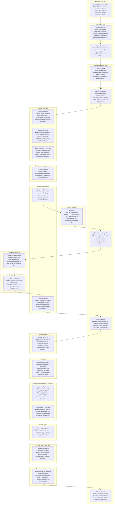

# Эпизод 43 — Крепость: диаграмма событий

```mermaid
graph TD

    subgraph ep43_l1 [Корабль блокады]
        ep43E01["План Публия на корабле<br/><i>Публий размышляет о кристалле, Ковене, Фархаде и Лоране; убеждает Селура выиграть время...</i>"]
    end

    subgraph ep43_l2 [Остров Альса]
        ep43E02["Игдрас у костра<br/><i>После безуспешного мозгового штурма Игдрас стирает планы на земле, замечает отплывающий корабль...</i>"]
        ep43E03["Совет Понтия<br/><i>Понтий сообщает, что Рэм и Фернандо планируют уйти ночью; Игдрас отпускает демона...</i>"]
    end

    subgraph ep43_l3 [Тентум Северный мост]
        ep43E04["Спуск в Тентум<br/><i>Лифт неожиданно опускает всю группу под землю; паника сменяется встречей с Карфагеном...</i>"]
    end

    subgraph ep43_l4 [Тентум]
        ep43E05["Приём беженцев<br/><i>Дафна закрывает опасные зоны, планирует эвакуацию в Сезар через Венеру; Рэм решает...</i>"]
        ep43E12["Экскурсия с Венерой<br/><i>Дафна проводит Венеру по бункеру; переосмысливает отношения после поцелуя; Венера хочет понять,...</i>"]
        ep43E16["Спор с дедом<br/><i>Призрак обвиняет внучку в приводе врагов; Дафна отвечает, что спасает наследие; упоминание...</i>"]
        ep43E24["Конец сессии<br/><i>Дафна возвращается в бункер навеселе после спирта Ризгана; остров по-прежнему в блокаде,...</i>"]
    end

    subgraph ep43_l5 [Гавань Тентума]
        ep43E06["Открытие гавани<br/><i>Ворота открываются: входит корабль с кристаллом; Карфаген втаскивает его; следом — невидимый...</i>"]
        ep43E07["Допрос Венеры<br/><i>Дафна требует знать, кому из волшебников можно доверять; угрожает убийством отца Венеры;...</i>"]
        ep43E08["Спор о дверях и поцелуй<br/><i>Венера напоминает о споре, кто откроет дверь; Дафна признаёт поражение и целует...</i>"]
    end

    subgraph ep43_l6 [Тентум элементум, кузня]
        ep43E09["Осмотр Тентума<br/><i>Ригор узнаёт дворфийскую работу; в дендрарии — портал на план Земли, в...</i>"]
    end

    subgraph ep43_l7 [Тентум библиотека]
        ep43E10["Уход в библиотеку<br/><i>Эша ищет рецепты правдивых зелий; Фалькон просит снотворное после смерти Ангмара</i>"]
        ep43E15["Порталы и союз<br/><i>Дафна читает о шифре Патролума; Венера предлагает связать Тентум с телепортом Отражённого...</i>"]
    end

    subgraph ep43_l8 [Тентум лазарет]
        ep43E11["Лазарет<br/><i>Эша перевязывает Игдраса, осматривает проклятую кровь и откушенный нос; укладывается рядом под...</i>"]
    end

    subgraph ep43_l9 [Тентум жилой блок]
        ep43E13["Общий сбор и правила<br/><i>Дафна кормит всех через Карфагена, вводит распорядок: не воровать, не шуметь, не...</i>"]
    end

    subgraph ep43_l10 [Тентум рубка, энергозал]
        ep43E14["Рубка и энергозал<br/><i>Дафна изучает систему наблюдения и блокировок; видит три диска кристалла Атарея; дед...</i>"]
    end

    subgraph ep43_l11 [Корабль трюм]
        ep43E17["Допрос Фархада<br/><i>Публий кормит короля, снимает кандалы, надевает поводок, требует список гвардейцев «Света океана»...</i>"]
    end

    subgraph ep43_l12 [Храморра]
        ep43E18["Прибытие в Храмору<br/><i>Корабль швартуется; Антигона предупреждает об опасности коллег и войне с Отражёнными королевствами</i>"]
    end

    subgraph ep43_l13 [Крепость Серебряного легиона]
        ep43E19["Допрос Лорана<br/><i>В антимагической камере Публий бьёт Лорана, утешает одеялом; Лоран рассказывает о снах-битвах;...</i>"]
        ep43E20["Переговоры с Аароном<br/><i>Аарон — король павшей Морры; хочет мести Империи, не жителям Храморы; кристалл...</i>"]
    end

    subgraph ep43_l14 [Тентум рубка]
        ep43E21["Ночное дежурство<br/><i>Дафна часами читает о порталах и следит за рунами; в Тентуме затишье,...</i>"]
    end

    subgraph ep43_l15 [Остров Альса пристань]
        ep43E22["Появление Ризгана<br/><i>Шлюпка с Ризганом Красным у северного моста; Дафна поднимается наверх и выходит...</i>"]
    end

    subgraph ep43_l16 [Пристань острова Альса]
        ep43E23["Переговоры под куполом<br/><i>Ризган требует секретных переговоров; спор о шпионах и Лотосе; выясняется, что Лотос...</i>"]
    end

    ep43E01 --> ep43E02 --> ep43E03 --> ep43E04 --> ep43E05 --> ep43E06 --> ep43E07 --> ep43E08 --> ep43E09 --> ep43E10 --> ep43E11 --> ep43E12 --> ep43E13 --> ep43E14 --> ep43E15 --> ep43E16 --> ep43E17 --> ep43E18 --> ep43E19 --> ep43E20 --> ep43E21 --> ep43E22 --> ep43E23 --> ep43E24

```