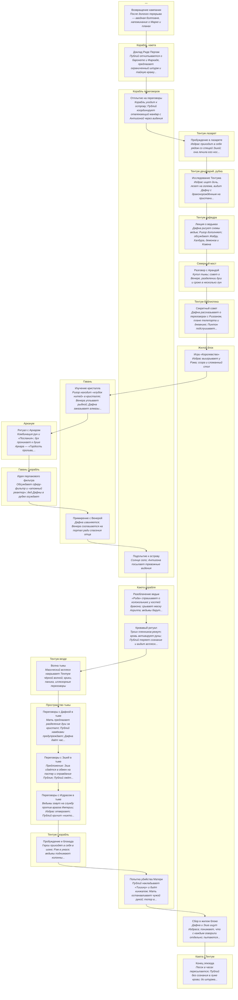

# Эпизод 44 — Тьма: диаграмма событий

```mermaid
graph TD

    subgraph ep44_l1 [—]
        ep44E01["Возвращение кампании<br/><i>После долгого перерыва — вводная болтовня, напоминание о Марке и планах</i>"]
    end

    subgraph ep44_l2 [Корабль, каюта]
        ep44E02["Доклад Риде Пергам<br/><i>Публий отчитывается о баронете и Фархаде, предлагает ограниченный штурм и тайную кражу...</i>"]
    end

    subgraph ep44_l3 [Корабль переговоров]
        ep44E03["Отплытие на переговоры<br/><i>Корабль уходит к острову; Публий координирует отвлекающий манёвр с Антигоной через видения</i>"]
        ep44E14["Подплытие к острову<br/><i>Солнце село; Антигона посылает тревожные видения</i>"]
    end

    subgraph ep44_l4 [Тентум лазарет]
        ep44E04["Пробуждение в лазарете<br/><i>Игдрас приходит в себя рядом со спящей Эшой; она лечила его нос...</i>"]
    end

    subgraph ep44_l5 [Тентум дендрарий, рубка]
        ep44E05["Исследование Тентума<br/><i>Игдрас ищет дичь, лезет на голема, видит Дафну с драконорождённым на пристани...</i>"]
    end

    subgraph ep44_l6 [Тентум кафедра]
        ep44E06["Лекция о ведьмах<br/><i>Дафна рисует схемы ведьм; Ригор дополняет; обсуждают Жабру, Халдура, демонов и Ковена</i>"]
    end

    subgraph ep44_l7 [Северный мост]
        ep44E07["Разговор с Арандой<br/><i>Купол тьмы; совет о Венере, разделении душ и сроке в несколько лун</i>"]
    end

    subgraph ep44_l8 [Тентум библиотека]
        ep44E08["Секретный совет<br/><i>Дафна рассказывает о переговорах с Ризганом, плане телепорта и дневнике; Пинтон подслушивает...</i>"]
    end

    subgraph ep44_l9 [Жилой блок]
        ep44E09["Игра «Королевство»<br/><i>Игдрас выигрывает у Рэма; ссора и сломанный стол</i>"]
        ep44E23["Сбор в жилом блоке<br/><i>Дафна и Эша ищут Игдраса; понимают, что с каждым говорили отдельно; пытаются...</i>"]
    end

    subgraph ep44_l10 [Гавань]
        ep44E10["Изучение кристалла<br/><i>Ригор находит «клубок нитей» в кристалле; Венера уплывает рыбкой; Дафна заказывает алмазы...</i>"]
        ep44E13["Примирение с Венерой<br/><i>Дафна извиняется; Венера соглашается на портал ради спасения отца</i>"]
    end

    subgraph ep44_l11 [Арканум]
        ep44E11["Ритуал с Архаром<br/><i>Комбинация рун и «Послания»; дух проникает к душе Архара — «Гордость пролива,...</i>"]
    end

    subgraph ep44_l12 [Гавань / корабль]
        ep44E12["Идея перлакового фильтра<br/><i>Обсуждают сферу-фильтр и «атомный реактор»; дед Дафны в рубке осуждает</i>"]
    end

    subgraph ep44_l13 [Каюта корабля]
        ep44E15["Разоблачение ведьм<br/><i>«Рида» спрашивает о колокольчике у костей дракона; срывает маску Агриппа; ведьмы берут...</i>"]
        ep44E16["Кровавый ритуал<br/><i>Троих пленников режут; кровь активирует руны; Публий теряет сознание и видит всплеск...</i>"]
        ep44E22["Попытка убийства Матери<br/><i>Публий накладывает «Тишину» и бьёт кинжалом; Мать останавливает чужой рукой; топор в...</i>"]
    end

    subgraph ep44_l14 [Тентум везде]
        ep44E17["Волна тьмы<br/><i>Магический всплеск накрывает Тентум чёрной волной; крики, паника, иллюзорные переговоры</i>"]
    end

    subgraph ep44_l15 [Пространство тьмы]
        ep44E18["Переговоры с Дафной в тьме<br/><i>Мать предлагает разделение душ за кристалл; Публий намёками предупреждает; Дафна даёт час...</i>"]
        ep44E19["Переговоры с Эшей в тьме<br/><i>Предложение: Эша сдаётся в обмен на паству и оправдание Публия; Публий лжёт...</i>"]
        ep44E20["Переговоры с Игдрасом в тьме<br/><i>Ведьмы зовут на службу против врагов Империи; Игдрас отвергает; Публий кричит «никто...</i>"]
    end

    subgraph ep44_l16 [Тентум / корабль]
        ep44E21["Пробуждение и блокада<br/><i>Герои приходят в себя в шоке; Рэм в ужасе; ведьмы поднимают колонны...</i>"]
    end

    subgraph ep44_l17 [Каюта / Тентум]
        ep44E24["Конец эпизода<br/><i>Песок в часах пересыпается; Публий без сознания в луже крови; до штурма...</i>"]
    end

    ep44E01 --> ep44E02 --> ep44E03 --> ep44E04 --> ep44E05 --> ep44E06 --> ep44E07 --> ep44E08 --> ep44E09 --> ep44E10 --> ep44E11 --> ep44E12 --> ep44E13 --> ep44E14 --> ep44E15 --> ep44E16 --> ep44E17 --> ep44E18 --> ep44E19 --> ep44E20 --> ep44E21 --> ep44E22 --> ep44E23 --> ep44E24

```