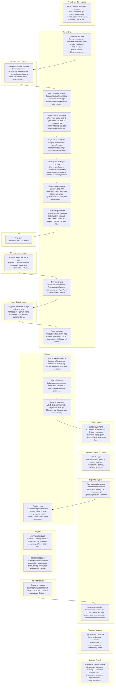

# Эпизод 45 — Тело: диаграмма событий

```mermaid
graph TD

    subgraph ep45_l1 [Кладбище Долгограда]
        ep45E01["Вступление и флешбек похорон<br/><i>Под маской эльфа Публий прощается с матерью; пьют наливку, снимает линзы на...</i>"]
    end

    subgraph ep45_l2 [Жилой блок]
        ep45E02["Паника в Тентуме<br/><i>После контакта с ведьмами дети кричат; Игдрас собирает «племя», Эша накладывает «Умиротворение»</i>"]
        ep45E04["Речь Дафны и Аранды<br/><i>Дафна признаёт страх и уважение к выбору; Аранда предупреждает о сделках с...</i>"]
        ep45E05["Спор о сдаче и штурме<br/><i>Песочные часы: час на решение; Фернандо склоняется к отступлению; Венера хочет немедленного...</i>"]
        ep45E06["Видение «розчерков»<br/><i>Игдрас вспоминает совет Публия; планирует вылазку и спасение заложников</i>"]
        ep45E07["Сообщение о смерти Публия<br/><i>Демон сообщает: Публий убит; ведьмы предлагают показать тело в обмен на уступки</i>"]
        ep45E08["Спор о воскрешении<br/><i>Эша: к моменту доставки тела обычное воскрешение не сработает без ритуала Пепельного...</i>"]
        ep45E09["Починка Франчески<br/><i>Находят щепку (Аранда вспоминает рюкзак); скрипка собрана, но нужны старые струны из...</i>"]
        ep45E12["Истечение часа<br/><i>Песочные часы тают; Ригор раскладывает карты; герои обсуждают обмен тела на проход...</i>"]
        ep45E14["Ложь о засаде<br/><i>Игдрас обманывает Эшу планом «засады», тайно протыкает ладонь о её коготь</i>"]
    end

    subgraph ep45_l3 [Жилой блок / гавань]
        ep45E03["Сбор сведений о сделках<br/><i>Дафна бежит к кристаллу; выясняется, что каждому обещали своё (кристалл, отца, разделение,...</i>"]
    end

    subgraph ep45_l4 [—]
        ep45E10["Перерыв<br/><i>Время на часах истекло</i>"]
    end

    subgraph ep45_l5 [Посмертная пустошь]
        ep45E11["Публий на посмертной реке<br/><i>Мёртвый Публий спорит с Дамой в лодке; она слаба без крови; вдали...</i>"]
    end

    subgraph ep45_l6 [Жилой блок транс]
        ep45E13["Видение на снежной горе<br/><i>Игдрас ловит падающего Публия, но не успевает — осознаёт смерть друга</i>"]
    end

    subgraph ep45_l7 [Гавань]
        ep45E15["«Перебежчик» Егимон<br/><i>Егимон объявляет о переходе на сторону ведьм; Фернандо в итоге остаётся</i>"]
        ep45E16["Выход Игдраса<br/><i>Игдрас выпрыгивает в воду; Эша плывёт за ним; он оглушает её веслом,...</i>"]
        ep45E17["Кольцо Ангмара<br/><i>Дафна просит Венеру передать кольцо Игдрасу; та бросает его совой в воду</i>"]
        ep45E21["Приём тела<br/><i>Дафна выгружает тело; затылок разрублен топором, лицо цело; Дафна повторяет: «Он поменял...</i>"]
    end

    subgraph ep45_l8 [Граница купола]
        ep45E18["Договор у купола<br/><i>Кровавое рукопожатие; Игдрас получает ошейник и обещание тела; падает на колени по...</i>"]
    end

    subgraph ep45_l9 [Граница купола → гавань]
        ep45E19["Тело в лодке<br/><i>Мать шагает по воде; лодка с трупом вплывает в гавань; Игдрас уходит...</i>"]
    end

    subgraph ep45_l10 [Корабль ведьм]
        ep45E20["Пир на корабле ведьм<br/><i>Игдраса заставляют есть человечину; он отказывается превращаться в медведя</i>"]
        ep45E25["Игдрас на корабле<br/><i>Подчинение ошейнику; подслушивает: ведьмы знают о предательстве, готовят запасной план</i>"]
    end

    subgraph ep45_l11 [Лазарет]
        ep45E22["Ловушка в сердце<br/><i>Егимон: в сердце камень из апострофа — взрыв; ведьмы уходят, через час...</i>"]
        ep45E23["Начало операции<br/><i>Эша накладывает «Маяк надежды», вскрывает грудь; Ригор освещает камень над телом</i>"]
    end

    subgraph ep45_l12 [Тентум / замок]
        ep45E24["Оборона и замок<br/><i>Дафна отвергает атаку из купола; идёт к деду за знаниями о Брауле;...</i>"]
    end

    subgraph ep45_l13 [Посмертная река]
        ep45E26["Путь Публия к вратам<br/><i>Тысячи фигур в балахонах останавливают течение; лодка замирает у врат</i>"]
    end

    subgraph ep45_l14 [Долина Теней]
        ep45E27["Встреча в Долине Теней<br/><i>Существо снимает накидку — бледный лунный эльф с знакомыми глазами; приглашает прогуляться;...</i>"]
    end

    ep45E01 --> ep45E02 --> ep45E03 --> ep45E04 --> ep45E05 --> ep45E06 --> ep45E07 --> ep45E08 --> ep45E09 --> ep45E10 --> ep45E11 --> ep45E12 --> ep45E13 --> ep45E14 --> ep45E15 --> ep45E16 --> ep45E17 --> ep45E18 --> ep45E19 --> ep45E20 --> ep45E21 --> ep45E22 --> ep45E23 --> ep45E24 --> ep45E25 --> ep45E26 --> ep45E27

```