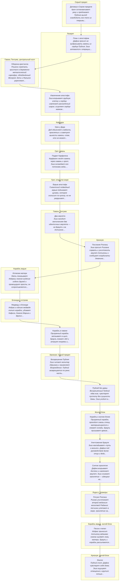

# Эпизод 46 — Пучина и пепел: диаграмма событий

```mermaid
graph TD

    subgraph ep46_l1 [Серый предел]
        ep46E01["Договор в Сером пределе<br/><i>Арон останавливает реку и предлагает Публию выход: освободить его тело из тюрьмы...</i>"]
    end

    subgraph ep46_l2 [Лазарет]
        ep46E02["План с апостофом<br/><i>Дафна просит не выбрасывать камень из сердца Публия; Эша готовится к операции,...</i>"]
        ep46E04["Извлечение апостофа<br/><i>Эша вскрывает грудную клетку и сердце, извлекает раскалённый шарик; исцеляет сердце маяком...</i>"]
    end

    subgraph ep46_l3 [Гавань Тентума, центральный холл]
        ep46E03["Оборона кристалла<br/><i>Решено спрятать кристалл в деревянно-металлический саркофаг, обледенённый Венерой; дети и Фалькон укрепляют...</i>"]
    end

    subgraph ep46_l4 [Кафедра]
        ep46E05["Урок у Деда<br/><i>Дед объясняет слабость проклятых и советует вынести камень «тем, кто не может...</i>"]
    end

    subgraph ep46_l5 [Грот, гавань]
        ep46E06["Подвиг Карфагена<br/><i>Карфаген несёт камень через гавань и грот; Эша охлаждает его потоками воды....</i>"]
    end

    subgraph ep46_l6 [Грот, открытое море]
        ep46E07["Взрыв апостофа<br/><i>Гигантский подводный взрыв поднимает цунами, которое скользит по куполу, но не разрушает...</i>"]
    end

    subgraph ep46_l7 [Гавань Тентума]
        ep46E08["Два амулета<br/><i>Эша находит заклинанием два идентичных амулета — на Брауле и на Антигоне....</i>"]
        ep46E12["Корабль в гавани<br/><i>Призрачный корабль заплывает в щит, Брауль ломает лёд и атакует якорями и...</i>"]
    end

    subgraph ep46_l8 [Арканум]
        ep46E09["Послание Ризгану<br/><i>Эша просит Ризгана сорвать и уничтожить амулет Антигоны и сообщает координаты дневника...</i>"]
        ep46E14["Публий без дамы<br/><i>Воскрешённый Публий едва жив, чувствует пустоту без сущности дамы; Эша уходит в...</i>"]
    end

    subgraph ep46_l9 [Корабль ведьм]
        ep46E10["Иллюзии матери<br/><i>Мать показывает Игдрасу ложное видение гибели друзей и провоцирует ярость; он сопротивляется,...</i>"]
    end

    subgraph ep46_l10 [Блокада у острова]
        ep46E11["Медведь в блокаде<br/><i>Игдрас в облике медведя топит корабли, убивает Кафиса, Кагала Марша и других;...</i>"]
    end

    subgraph ep46_l11 [Арканум, Серый предел]
        ep46E13["Воскрешение Публия<br/><i>Эша читает молитву Адригалу и применяет Возрождение. Публий возвращается по реке; часть...</i>"]
    end

    subgraph ep46_l12 [Жилой блок]
        ep46E15["Корабль в жилом блоке<br/><i>Призрачный корабль проходит сквозь стену, материализуется и ломает склады. Брауль призывает армию...</i>"]
        ep46E16["Уничтожение Брауля<br/><i>Эша накладывает «путь к могиле»; Дафна под руководством духов отца и деда...</i>"]
        ep46E17["Снятие проклятия<br/><i>Дафна вскрывает доспехи и извлекает амулет; Эша снимает проклятие — адмирал на...</i>"]
    end

    subgraph ep46_l13 [Лодка у Храморы]
        ep46E18["Ритуал Ризгана<br/><i>Ризган уничтожает второй медальон молитвой Радания; песчинки улетают в море, проклятие на...</i>"]
    end

    subgraph ep46_l14 [Корабль ведьм, жилой блок]
        ep46E19["Песок и пепел<br/><i>Игдрас приносит Антигону ведьмам; компас выдаёт ложь матери. Брауль и корабль рассыпаются...</i>"]
    end

    subgraph ep46_l15 [Арканум, жилой блок]
        ep46E20["Эпилог<br/><i>Публий спит; Дафна чувствует себя дома; Эша ощущает отмщение и крутит кольцо...</i>"]
    end

    ep46E01 --> ep46E02 --> ep46E03 --> ep46E04 --> ep46E05 --> ep46E06 --> ep46E07 --> ep46E08 --> ep46E09 --> ep46E10 --> ep46E11 --> ep46E12 --> ep46E13 --> ep46E14 --> ep46E15 --> ep46E16 --> ep46E17 --> ep46E18 --> ep46E19 --> ep46E20

```