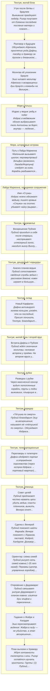

# Эпизод 47 — Ориентир: диаграмма событий

```mermaid
graph TD

    subgraph ep47_l1 [Тентум, жилой блок]
        ep47E01["Утро после битвы с Браулем<br/><i>Выжившие празднуют победу; Ригор получает от Егемона последнее послание матери и плачет....</i>"]
        ep47E02["Разговор о будущем<br/><i>Обсуждают Адрегала, проклятие рода Дафны, поездку в Храмору за Ароном и дневником;...</i>"]
        ep47E03["Молитва об упокоении Брауля<br/><i>Эша читает молитву Адрегалу о возвращении душ Брауля и команды на Великую...</i>"]
    end

    subgraph ep47_l2 [Море у Альсы]
        ep47E04["Игдрас у ведьм: рейд и побег<br/><i>Игдрас в медвежьем облике выбрасывает тело Антигоны за борт; внутри — ледяная...</i>"]
    end

    subgraph ep47_l3 [Море, штормовые острова]
        ep47E05["Путь к Лайда Маркенна<br/><i>Маленькая вызывает циклон; перламутровый дельфин (возможно, Лагада/Фортуна) следует за ними. Корабль разбивается...</i>"]
    end

    subgraph ep47_l4 [Лайда Маркенна, невидимое сооружение]
        ep47E06["Имя «Стужа»<br/><i>Игдрас нежно обнимает ведьму, пишет кровью «Стужа» на плитке; убивает чайку (вырвал...</i>"]
    end

    subgraph ep47_l5 [Тентум, подземелье]
        ep47E07["Воскрешение Публия<br/><i>Публий приходит в себя после операции, настраивает иллюзорный голос, находит виолу Виолу,...</i>"]
    end

    subgraph ep47_l6 [Тентум, дендрарий / коридоры]
        ep47E08["Анализ планов ведьм<br/><i>Публий сопоставляет сведения службы ведьм с рассказом демона: ковен играет в большую...</i>"]
    end

    subgraph ep47_l7 [Тентум, склад]
        ep47E09["Новый Карфаген<br/><i>Дафна активирует голема кольцом; узнаёт, что он последний. Просит починить Тентум, благодарит...</i>"]
    end

    subgraph ep47_l8 [Тентум, жилой блок / второй ярус]
        ep47E10["Встреча Дафны и Публия<br/><i>Публий ждёт окончания молитвы; неловкая встреча у проёма. На втором ярусе у...</i>"]
    end

    subgraph ep47_l9 [Тентум, рубка]
        ep47E11["Разведка с рубки<br/><i>Через магический сенсор видит потопленные корабли, трупы и лодки выживших, плывущие в...</i>"]
    end

    subgraph ep47_l10 [Тентум, коридор]
        ep47E12["«Тётушка по смерти»<br/><i>Публий благодарит Эшу за воскрешения; называет её «тётушкой по смерти». Обсуждают Игдраса...</i>"]
    end

    subgraph ep47_l11 [Тентум, телепортационные]
        ep47E13["Переговоры о телепорте<br/><i>Дафна одобряет портал в отражённое королевство (через остров Игдраса → портовый квартал)....</i>"]
    end

    subgraph ep47_l12 [Тентум, темница]
        ep47E14["Совет целей<br/><i>Публий предлагает честно назвать цели: убить ведьм, спасти пленников, выжить. Венера хочет...</i>"]
        ep47E15["Сделка с Венерой<br/><i>Публий поможет найти Фархада; Венера поможет с Лораном, паствой, Жаброй, Халдуром. Договор:...</i>"]
        ep47E16["Ориентир: схема семей<br/><i>Публий рисует сеть семей ковена (~25 лет назад): Пергамы (центр, управление городом),...</i>"]
        ep47E17["Откровение о Даурамарат<br/><i>Публий связывает ритуал Даурамарат с планом ковена: изъятие душ эльфов и переселение...</i>"]
        ep47E18["Гадание о Жабре и Халдуре<br/><i>Эша пересматривает видение: Жабра в льду — не убийство, а этап воскрешения...</i>"]
        ep47E19["План вылазки в Храмору<br/><i>Ждут готовности телепорта к ночи. Ригор остаётся изучать кристаллы. Группы: (1) Публий,...</i>"]
    end

    ep47E01 --> ep47E02 --> ep47E03 --> ep47E04 --> ep47E05 --> ep47E06 --> ep47E07 --> ep47E08 --> ep47E09 --> ep47E10 --> ep47E11 --> ep47E12 --> ep47E13 --> ep47E14 --> ep47E15 --> ep47E16 --> ep47E17 --> ep47E18 --> ep47E19

```