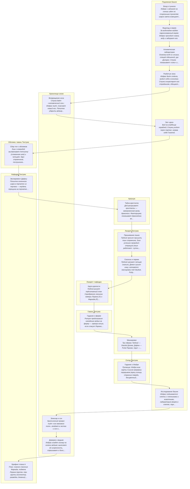

# Эпизод 48 — Обломок: диаграмма событий

```mermaid
graph TD

    subgraph ep48_l1 [Подземная башня]
        ep48E01["Вход в туннели<br/><i>Игдрас с ведьмой на плечах идёт по спиральным туннелям; шарик света освещает...</i>"]
        ep48E02["Водопад и моряк<br/><i>За водопадом найден парализованный моряк; Игдрас проходит сквозь воду и забирает его.</i>"]
        ep48E03["Алхимическая лаборатория<br/><i>Осмотр колб со слизью, спящей обезьяной, рук Долорес; Стужа показывает «соки» и...</i>"]
        ep48E04["Разбитые окна<br/><i>Игдрас бьёт стёкла, видит себя в осколках; Стужа сочувствует его страданиям, обещает...</i>"]
        ep48E06["Зал «дна»<br/><i>Вид на кладбище кораблей; Стужа уходит через портал, назвав себя Гикатой.</i>"]
        ep48E16["Исследование башни<br/><i>Игдрас поднимается: клетки с пленниками и животными, лаборатория (моряк в клетке, паук...</i>"]
    end

    subgraph ep48_l2 [Хранилище соков]
        ep48E05["Возвращение носа<br/><i>Стужа даёт «человеческий сок»; Игдрас пьёт, получает новый нос. Попытка ударить ведьму...</i>"]
        ep48E17["Эликсир и сон<br/><i>Критический провал: пьёт «сок макового поля», впадает в экстаз и сон о...</i>"]
        ep48E18["Доверие к ведьме<br/><i>Игдрас кладёт голову на колени ведьме; выясняет её искренность, спрашивает о боли;...</i>"]
    end

    subgraph ep48_l3 [Обломки, гавань Тентума]
        ep48E07["Сбор тел с обломков<br/><i>Эша с командой вылавливает Антигону (сломанная шея) и четырёх: двух стражников, послушника...</i>"]
    end

    subgraph ep48_l4 [Кафедра Тентума]
        ep48E08["Эксперимент Дафны<br/><i>Попытка огненного шара в перчатке из перлака — неудача, трещина на перчатке....</i>"]
        ep48E19["Брифинг плана А<br/><i>План: ложное спасение Фархада, подмена Лорана трупом, три группы (коллектор, разведка, дневник)....</i>"]
    end

    subgraph ep48_l5 [Арканум]
        ep48E09["Тайна кристалла<br/><i>Дед раскрывает: кристаллы — замороженная кровь драконов с Факториума; показывает драконёнка во...</i>"]
    end

    subgraph ep48_l6 [Лазарет Тентума]
        ep48E10["Пришивание языка<br/><i>Публий просит пришить язык стражника; Эша успешно проводит операцию (язык работает ~сутки,...</i>"]
        ep48E11["Скальпы и парики<br/><i>Публий срезает четыре скальпа, Демон сушит кожу; готовятся маскировки под Овидия, Риду...</i>"]
        ep48E14["Маскировки<br/><i>Три образа: Публий — Овидий Догма, Дафна — Рида Пергам, труп —...</i>"]
    end

    subgraph ep48_l7 [Лазарет / кафедра]
        ep48E12["Карта крепости<br/><i>Публий рисует трёхэтажный план Серебряного легиона: камеры Лорана (X) и Фархада (F),...</i>"]
    end

    subgraph ep48_l8 [Гавань Тентума]
        ep48E13["Гадание о ферме<br/><i>Ритуал предсказания: нападение ведьм на ферму — завтра ночью, если спасут Лорана;...</i>"]
    end

    subgraph ep48_l9 [Склад Тентума]
        ep48E15["Гадание о Жабре<br/><i>Пуговица: Жабра жив; карты Сигила прерваны перерывом (жрец солнца, странник тверди, бесцветный...</i>"]
    end

    ep48E01 --> ep48E02 --> ep48E03 --> ep48E04 --> ep48E05 --> ep48E06 --> ep48E07 --> ep48E08 --> ep48E09 --> ep48E10 --> ep48E11 --> ep48E12 --> ep48E13 --> ep48E14 --> ep48E15 --> ep48E16 --> ep48E17 --> ep48E18 --> ep48E19

```