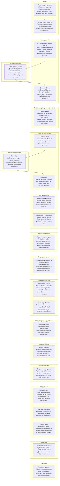

# Эпизод 49 — По ту сторону: диаграмма событий

```mermaid
graph TD

    subgraph ep49_l1 [Тентум]
        ep49E01["План перед отъездом<br/><i>Обсуждают спасение Лорана, кристалл, ферму и видения Эши; решают сначала идти в...</i>"]
        ep49E02["Отъезд через порталы<br/><i>Процессия у порталов; Рэм просит вести о брате; телепортация на остров поля...</i>"]
    end

    subgraph ep49_l2 [Остров поля боя]
        ep49E03["Встреча с Бенджамином Лобом<br/><i>Министр докладывает о бунте Авации, блокаде Империи, послах Валенгора и капитуле; целует...</i>"]
        ep49E05["«Смерть» Публия<br/><i>Под маской Овидия Публий убеждает министра, что беглец Публий мёртв, и получает...</i>"]
    end

    subgraph ep49_l3 [Королевская ложа]
        ep49E04["Совет Дафны Венере<br/><i>Дафна советует не казнить массово, выслушать послов, заявить об операции по спасению...</i>"]
    end

    subgraph ep49_l4 [Таверна, отражённое королевство]
        ep49E06["Кризис казны<br/><i>Венера возвращается бледной: Фархад опустошил сокровищницу; королеве придётся тянуть время без золота.</i>"]
    end

    subgraph ep49_l5 [Лаборатория Гекаты]
        ep49E07["Ритуал соков<br/><i>Ведьма ранит Игдраса; он пьёт жгучий сок, переживает рождение в буре «по...</i>"]
        ep49E09["Сок Фионы<br/><i>Игдрас пьёт сок из тела Фионы, переживает её жизнь, детство, Халдура; решает...</i>"]
    end

    subgraph ep49_l6 [Лаборатория / у воды]
        ep49E08["Паук и Лоун<br/><i>Игдрас ловит паука с «дельфиновыми» глазами; оборотень Лоун провоцирует драку и исчезает.</i>"]
    end

    subgraph ep49_l7 [Комната Венеры]
        ep49E10["Прибытие в Храмору<br/><i>Ночной город на ушах: осада, похороны Риды, пустой порт; послание вести в...</i>"]
        ep49E11["Маскировки и разделение<br/><i>Публий делает Дафне образ Джулии Петри; Фалькону — усы и парик; план:...</i>"]
    end

    subgraph ep49_l8 [Шумный переулок]
        ep49E12["Сцена с инспектором<br/><i>Публий под видом инспектора отвлекает стражу от «пьяного Джо» (Егемон); Эша разведывает...</i>"]
    end

    subgraph ep49_l9 [Улицы у коллектора]
        ep49E13["«Амфоры» Джулии Петри<br/><i>Дафна продаёт стражнику одну «амфору» за 70 золотых; отвлекает Вальфа обмороком, Фалькон...</i>"]
    end

    subgraph ep49_l10 [Симфония теплоты]
        ep49E14["Встреча с Ризганом<br/><i>Пьяный Ризган передаёт колокольчики; узнаёт о «медведе» Игдрасе; герои объясняют план дневника...</i>"]
        ep49E15["Ультиматум Ризгана<br/><i>Ризган требует ввести в курс дел; Публий раскрывает план спасения Фархада и...</i>"]
    end

    subgraph ep49_l11 [Лаборатория → другой мир]
        ep49E16["Переход Игдраса<br/><i>Игдрас и ведьма исчезают из лаборатории; хамелеон на колбе удивлённо наблюдает.</i>"]
    end

    subgraph ep49_l12 [Морское брюхо]
        ep49E17["Кража сундука<br/><i>Дафна пишет «рукобой» Бродерику, получает ключ от комнаты 19, выносит сундук под...</i>"]
    end

    subgraph ep49_l13 [Городской приют]
        ep49E18["Встреча в подворотне<br/><i>Группа воссоединяется; сундук с магическим замком-шестерёнками; код неизвестен.</i>"]
    end

    subgraph ep49_l14 [Подворотне]
        ep49E19["Код и дневник<br/><i>Эша связывается с Ригором; по подсказке открывают 6-1-8; внутри — дневник Антигоны...</i>"]
        ep49E20["Просмотр дневника<br/><i>На первой странице — девочка в цепях на корабле; в середине —...</i>"]
        ep49E21["Кольца связи<br/><i>Раздают кольца; проверяют ментальные образы; Эша показывает видение гибели фермы.</i>"]
    end

    subgraph ep49_l15 [Храморра]
        ep49E22["Финальное разделение<br/><i>Публий один идёт в «Гордость пролива»; Дафна и Фалькон с Егемоном —...</i>"]
    end

    subgraph ep49_l16 [Дом ведьм]
        ep49E23["Прибытие «домой»<br/><i>Игдрас открывает глаза в солнечном мире: цветущая башня, трава, молодая ведьма в...</i>"]
    end

    ep49E01 --> ep49E02 --> ep49E03 --> ep49E04 --> ep49E05 --> ep49E06 --> ep49E07 --> ep49E08 --> ep49E09 --> ep49E10 --> ep49E11 --> ep49E12 --> ep49E13 --> ep49E14 --> ep49E15 --> ep49E16 --> ep49E17 --> ep49E18 --> ep49E19 --> ep49E20 --> ep49E21 --> ep49E22 --> ep49E23

```