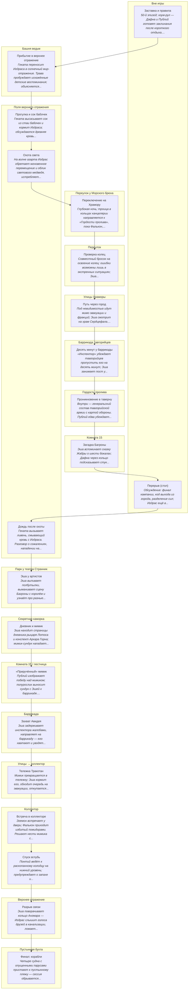

# Эпизод 50 — Лицо врага моего: диаграмма событий

```mermaid
graph TD

    subgraph ep50_l1 [Вне игры]
        ep50E01["Заставка и правила<br/><i>50-й эпизод; хоум-рул — Дафна и Публий готовят заклинания после короткого отдыха....</i>"]
        ep50E11["Перерыв (стол)<br/><i>Обсуждение: финал кампании, код выхода из города, разделение сил; Игдрас ещё в...</i>"]
    end

    subgraph ep50_l2 [Башня ведьм]
        ep50E02["Прибытие в верхнее отражение<br/><i>Геката переносит Игдраса в солнечный мир-отражение. Трава пробуждает искажённые детские воспоминания; объясняется...</i>"]
    end

    subgraph ep50_l3 [Поля верхнего отражения]
        ep50E03["Прогулка и сок бабочек<br/><i>Геката высасывает сок из стаи бабочек и кормит Игдраса; обсуждаются древняя кровь...</i>"]
        ep50E04["Охота света<br/><i>На волне азарта Игдрас обретает мгновенное перемещение и облик светового медведя, истребляет...</i>"]
        ep50E12["Дождь после охоты<br/><i>Геката вызывает ливень, смывающий кровь с Игдраса. Разговор о сожалениях, нападении на...</i>"]
    end

    subgraph ep50_l4 [Переулок у Морского брюха]
        ep50E05["Переключение на Храмору<br/><i>Глубокая ночь; троица в кольцах канцелярии направляется к «Гордости пролива», пока Фалькон,...</i>"]
    end

    subgraph ep50_l5 [Переулок]
        ep50E06["Проверка колец<br/><i>Совместный бросок на освоение колец: ошибки возможны лишь в экстренных ситуациях; Эша...</i>"]
    end

    subgraph ep50_l6 [Улицы Храморы]
        ep50E07["Путь через город<br/><i>Под невидимостью идут мимо эвакуации и фракций; Эша смотрит на храм Сердцефала....</i>"]
    end

    subgraph ep50_l7 [Баррикада тавгорийцев]
        ep50E08["Десять минут у баррикады<br/><i>«Инспектор» убеждает тавгорийцев пропустить его на десять минут; Эша занимает пост у...</i>"]
    end

    subgraph ep50_l8 [Гордость пролива]
        ep50E09["Проникновение в таверну<br/><i>Внутри — генеральский состав тавгорийской армии с картой обороны. Публий едва убеждает...</i>"]
    end

    subgraph ep50_l9 [Комната 15]
        ep50E10["Загадка Багроны<br/><i>Эша вспоминает сказку Жабры о шести бокалах; Дафна через кольцо подсказывает стук...</i>"]
    end

    subgraph ep50_l10 [Парк у театра Странник]
        ep50E13["Эша у артистов<br/><i>Эша выпивает полбутылки, выманивает сцену Багроны с королём и узнаёт про разные...</i>"]
    end

    subgraph ep50_l11 [Секретная каморка]
        ep50E14["Дневник и мимик<br/><i>Эша находит страницы дневника рыцаря Лотоса и конспект Архара Горна; мимик-сундук нападает...</i>"]
    end

    subgraph ep50_l12 [Комната 15 / лестница]
        ep50E15["«Приручённый» мимик<br/><i>Публий изображает победу над мимиком; полурослик выносит сундук с Эшей к баррикаде....</i>"]
    end

    subgraph ep50_l13 [Баррикада]
        ep50E16["Захват Авидея<br/><i>Эша задерживает инспектора жалобами, направляет на баррикаду — его хватают и уводят...</i>"]
    end

    subgraph ep50_l14 [Улицы → коллектор]
        ep50E17["Тележка Тракотан<br/><i>Мимик превращается в тележку; Эша кормит его, обходит очередь на эвакуации, откупается...</i>"]
    end

    subgraph ep50_l15 [Коллектор]
        ep50E18["Встреча в коллекторе<br/><i>Эгемон встречает у двери; Фалькон приходит избитый помидорами. Решают нести мимика с...</i>"]
        ep50E19["Спуск вглубь<br/><i>Понтий ведёт к раскопанному колодцу на нижний уровень; предупреждает о запахе и...</i>"]
    end

    subgraph ep50_l16 [Верхнее отражение]
        ep50E20["Разрыв связи<br/><i>Эша поворачивает кольцо Ангмара — Игдрас слышит голоса друзей в канализации, ломает...</i>"]
    end

    subgraph ep50_l17 [Пустынная бухта]
        ep50E21["Финал: корабли<br/><i>Четыре судна с опущенными парусами пристают к пустынному пляжу — сессия обрывается...</i>"]
    end

    ep50E01 --> ep50E02 --> ep50E03 --> ep50E04 --> ep50E05 --> ep50E06 --> ep50E07 --> ep50E08 --> ep50E09 --> ep50E10 --> ep50E11 --> ep50E12 --> ep50E13 --> ep50E14 --> ep50E15 --> ep50E16 --> ep50E17 --> ep50E18 --> ep50E19 --> ep50E20 --> ep50E21

```